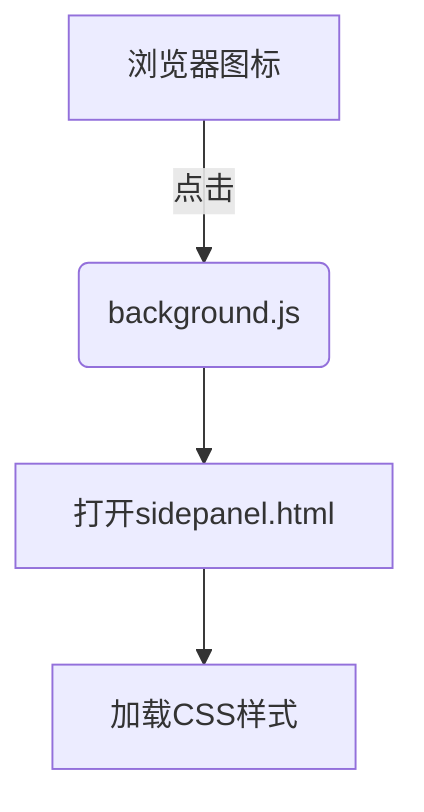

# Chrome扩展架构设计文档

## 项目结构
```
chrome_plus/
├── manifest.json        # 扩展配置文件
├── sidepanel.html       # 侧边栏主界面
├── sidepanel.css        # 侧边栏样式
├── background.js        # 后台服务脚本
└── images/              # 图标资源
    ├── icon-16.png
    ├── icon-48.png
    └── icon-128.png
```

## 核心组件

### 1. Manifest配置
- **manifest_version**: 3 (MV3规范)
- **权限声明**: `sidePanel` API
- **入口配置**:
  - 侧边栏默认路径: `sidepanel.html`
  - 后台服务: `background.js` (Service Worker)

### 2. 侧边栏系统


### 3. 扩展点设计
1. **通信机制**:
   - `chrome.runtime.sendMessage` 用于前后台通信
   - `chrome.storage` 用于数据持久化

2. **可扩展接口**:
```javascript
// 在background.js中添加
chrome.runtime.onMessage.addListener((request, sender, sendResponse) => {
  // 处理插件间通信
});
```

## 演进建议

### 功能扩展方向
1. 增加内容脚本(content scripts)与页面交互
2. 添加选项页面(options_page)用于配置
3. 实现侧边栏与后台的实时通信

### 性能优化
1. 使用动态导入懒加载资源
2. 添加Service Worker缓存策略
3. 图标资源优化为SVG格式

## 开发规范
1. 使用Chrome API Promise风格(async/await)
2. 错误处理统一使用`chrome.runtime.lastError`
3. 遵循MV3的安全规范