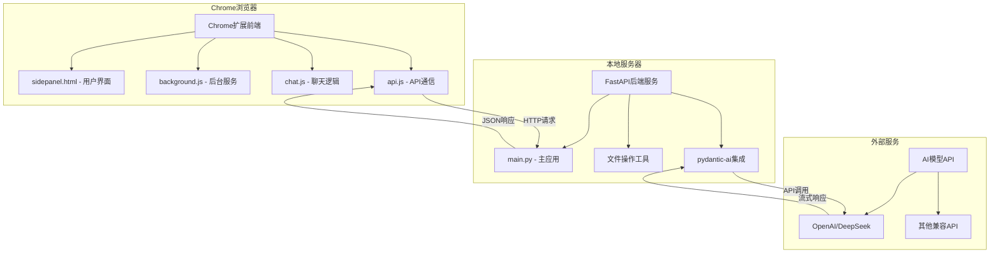
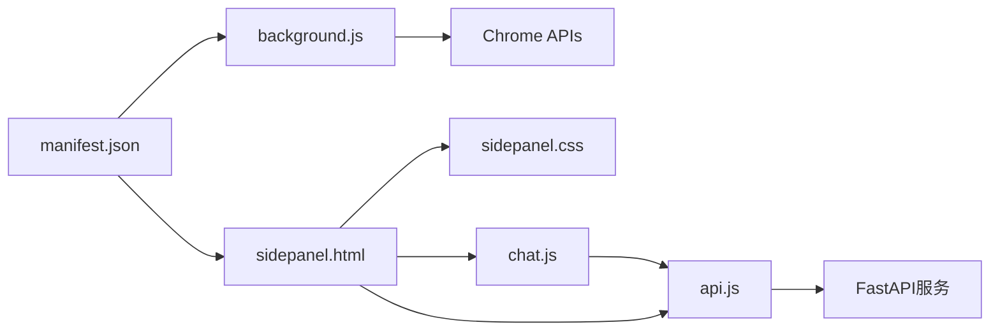
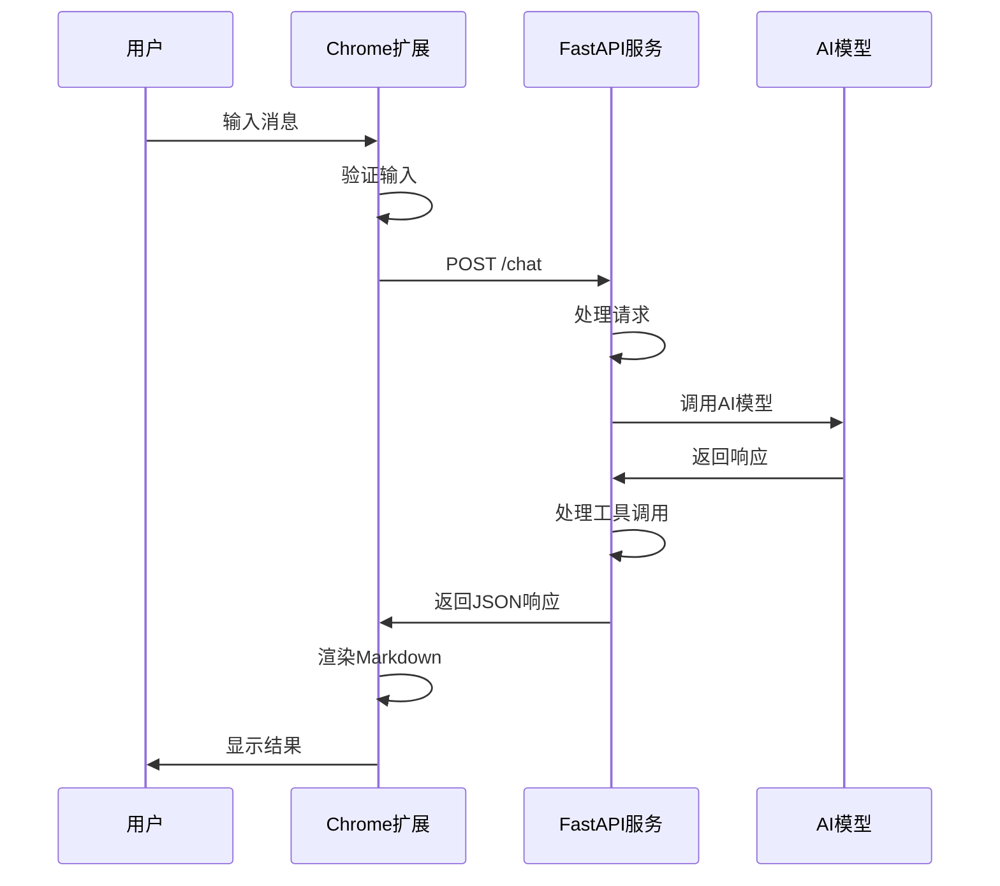

# Chrome扩展AI助手 - 开发者完整指南

## 📋 目录

1. [项目架构设计](#1-项目架构设计)
2. [开发环境安装指南](#2-开发环境安装指南)
3. [部署和使用说明](#3-部署和使用说明)
4. [开发者指南](#4-开发者指南)
5. [升级和维护指南](#5-升级和维护指南)

---

## 1. 项目架构设计

### 1.1 整体系统架构



### 1.2 前端Chrome扩展架构

#### 文件结构
```
chrome_plus/
├── manifest.json           # 扩展配置文件
├── sidepanel.html          # 侧边栏主界面
├── sidepanel.css           # 侧边栏样式
├── background.js           # 后台服务脚本
├── chat.js                 # 聊天界面逻辑
├── api.js                  # API通信封装
├── images/                 # 图标资源
│   ├── icon-16.png
│   ├── icon-48.png
│   └── icon-128.png
└── server/                 # 后端服务
    ├── main.py             # FastAPI主应用
    ├── config.py           # 配置文件
    ├── start_server.py     # 启动脚本
    └── test/               # 沙箱目录
```

#### 核心组件关系


### 1.3 后端FastAPI服务架构

#### 核心模块
- **main.py**: 主应用入口，包含路由定义
- **工具函数**: 文件操作、系统信息等功能
- **pydantic-ai集成**: AI模型调用和工具使用
- **配置管理**: 环境变量和设置管理

#### API设计
```python
# 主要端点
POST /chat
- 请求: {"message": "用户消息"}
- 响应: {"response": "AI回复"}

GET /docs
- Swagger UI文档

GET /redoc
- ReDoc文档
```

### 1.4 数据流和通信机制

#### 用户交互流程


#### 通信协议
- **协议**: HTTP/1.1
- **数据格式**: JSON
- **认证**: 基于API密钥
- **错误处理**: HTTP状态码 + 详细错误信息

---

## 2. 开发环境安装指南

### 2.1 系统要求

#### 必需软件
- **Chrome浏览器**: 版本 88+ (支持Manifest V3)
- **Python**: 3.10+
- **uv**: Python包管理器
- **Git**: 版本控制

#### 推荐工具
- **VS Code**: 代码编辑器
- **Chrome DevTools**: 调试工具
- **Postman**: API测试

### 2.2 环境安装步骤

#### 步骤1: 安装Python和uv
```bash
# macOS (使用Homebrew)
brew install python@3.10
curl -LsSf https://astral.sh/uv/install.sh | sh

# Windows (使用Chocolatey)
choco install python
powershell -c "irm https://astral.sh/uv/install.ps1 | iex"

# Linux (Ubuntu/Debian)
sudo apt update
sudo apt install python3.10 python3.10-venv
curl -LsSf https://astral.sh/uv/install.sh | sh
```

#### 步骤2: 克隆项目
```bash
git clone <repository-url>
cd chrome_plus
```

#### 步骤3: 安装后端依赖
```bash
cd server
uv sync
```

#### 步骤4: 配置环境变量
```bash
# 创建.env文件
cp .env.example .env

# 编辑.env文件，添加API密钥
DEEPSEEK_API_KEY=your_deepseek_api_key_here
TAVILY_API_KEY=your_tavily_api_key_here  # 可选
```

### 2.3 开发工具配置

#### VS Code配置
```json
// .vscode/settings.json
{
  "python.defaultInterpreterPath": "./server/.venv/bin/python",
  "python.linting.enabled": true,
  "python.linting.pylintEnabled": true,
  "files.associations": {
    "*.js": "javascript"
  }
}
```

#### Chrome扩展开发者模式
1. 打开Chrome浏览器
2. 访问 `chrome://extensions/`
3. 开启"开发者模式"
4. 点击"加载已解压的扩展程序"
5. 选择项目根目录

---

## 3. 部署和使用说明

### 3.1 Chrome扩展安装

#### 开发模式安装
```bash
# 1. 打开Chrome扩展管理页面
chrome://extensions/

# 2. 开启开发者模式
# 3. 点击"加载已解压的扩展程序"
# 4. 选择chrome_plus目录
# 5. 确认安装
```

#### 生产模式打包
```bash
# 创建发布包
zip -r chrome_plus_v1.0.zip . -x "server/*" "*.md" ".git/*"
```

### 3.2 FastAPI服务器启动

#### 开发模式启动
```bash
cd server
uv run python start_server.py
```

#### 生产模式启动
```bash
cd server
uv run uvicorn main:app --host 0.0.0.0 --port 5001
```

#### 服务验证
```bash
# 测试API端点
curl -X POST "http://127.0.0.1:5001/chat" \
  -H "Content-Type: application/json" \
  -d '{"message": "你好"}'

# 访问API文档
open http://127.0.0.1:5001/docs
```

### 3.3 环境变量配置

#### 必需配置
```bash
# .env文件
DEEPSEEK_API_KEY=sk-xxxxxxxxxxxxxxxx  # DeepSeek API密钥
```

#### 可选配置
```bash
# 可选的环境变量
TAVILY_API_KEY=tvly-xxxxxxxxxxxxxxxx  # 网络搜索API
SERVER_HOST=127.0.0.1                # 服务器地址
SERVER_PORT=5001                     # 服务器端口
DEBUG=true                           # 调试模式
```

#### API密钥获取
1. **DeepSeek API**: 访问 [DeepSeek官网](https://platform.deepseek.com/) 注册获取
2. **Tavily API**: 访问 [Tavily官网](https://tavily.com/) 注册获取（可选）

---

## 4. 开发者指南

### 4.1 代码结构说明

#### 前端文件组织
```javascript
// manifest.json - 扩展配置
{
  "manifest_version": 3,
  "permissions": ["sidePanel", "storage"],
  "host_permissions": ["http://localhost:5001/*"]
}

// background.js - 后台服务
chrome.runtime.onInstalled.addListener(() => {
  chrome.sidePanel.setPanelBehavior({openPanelOnActionClick: true});
});

// chat.js - 聊天逻辑
class ChatManager {
  constructor() {
    this.initializeEventListeners();
  }
  
  async sendMessage(message) {
    // 发送消息逻辑
  }
}

// api.js - API通信
class APIClient {
  constructor(baseURL = 'http://localhost:5001') {
    this.baseURL = baseURL;
  }
  
  async post(endpoint, data) {
    // HTTP请求封装
  }
}
```

#### 后端文件组织
```python
# main.py - 主应用
from fastapi import FastAPI, HTTPException
from pydantic import BaseModel

app = FastAPI()

class ChatRequest(BaseModel):
    message: str

@app.post("/chat")
async def chat(request: ChatRequest):
    # 聊天处理逻辑
    pass
```

### 4.2 关键功能模块实现

#### 消息处理流程
```javascript
// chat.js中的消息处理
async function handleUserMessage(message) {
  try {
    // 1. 验证输入
    if (!message.trim()) {
      throw new Error('消息不能为空');
    }
    
    // 2. 显示用户消息
    appendMessage('user', message);
    
    // 3. 发送到后端
    const response = await apiClient.post('/chat', {message});
    
    // 4. 处理响应
    if (response.response) {
      appendMessage('assistant', response.response);
    }
  } catch (error) {
    appendMessage('error', `错误: ${error.message}`);
  }
}
```

#### Markdown渲染
```javascript
// 渲染Markdown内容
function renderMarkdown(content) {
  // 使用marked.js渲染
  const html = marked.parse(content);
  
  // 应用代码高亮
  const tempDiv = document.createElement('div');
  tempDiv.innerHTML = html;
  
  tempDiv.querySelectorAll('pre code').forEach((block) => {
    hljs.highlightElement(block);
  });
  
  return tempDiv.innerHTML;
}
```

### 4.3 添加新功能

#### 添加新的API端点
```python
# 在main.py中添加新端点
@app.post("/new-feature")
async def new_feature(request: NewFeatureRequest):
    # 实现新功能逻辑
    return {"result": "success"}
```

#### 添加新的前端功能
```javascript
// 在chat.js中添加新功能
class ChatManager {
  addNewFeature() {
    // 添加新功能按钮
    const button = document.createElement('button');
    button.textContent = '新功能';
    button.onclick = this.handleNewFeature.bind(this);
    
    document.getElementById('header-buttons').appendChild(button);
  }
  
  async handleNewFeature() {
    // 处理新功能逻辑
  }
}
```

### 4.4 调试和测试方法

#### Chrome扩展调试
```javascript
// 在代码中添加调试信息
console.log('Debug info:', data);

// 使用Chrome DevTools
// 1. 右键点击扩展图标 -> "检查弹出内容"
// 2. 或访问 chrome://extensions/ -> 点击"背景页"
```

#### 后端API测试
```bash
# 使用pytest运行测试
cd server
uv run python -m pytest test_fastapi.py -v

# 手动测试
uv run python test_manual.py
```

#### 集成测试
```javascript
// 端到端测试示例
async function testChatFlow() {
  const testMessage = "测试消息";
  
  // 模拟用户输入
  document.getElementById('message-input').value = testMessage;
  document.getElementById('send-button').click();
  
  // 等待响应
  await new Promise(resolve => setTimeout(resolve, 2000));
  
  // 验证结果
  const messages = document.querySelectorAll('.message');
  console.assert(messages.length >= 2, '应该有用户消息和AI回复');
}
```

---

## 5. 升级和维护指南

### 5.1 版本管理策略

#### 语义化版本控制
```
主版本号.次版本号.修订号 (MAJOR.MINOR.PATCH)

例如: 1.2.3
- 1: 主版本号 (不兼容的API修改)
- 2: 次版本号 (向下兼容的功能性新增)
- 3: 修订号 (向下兼容的问题修正)
```

#### 发布流程
```bash
# 1. 更新版本号
# 修改manifest.json中的version字段
# 修改pyproject.toml中的version字段

# 2. 更新CHANGELOG.md
# 记录本次更新的内容

# 3. 创建Git标签
git tag -a v1.2.3 -m "Release version 1.2.3"
git push origin v1.2.3

# 4. 打包发布
./scripts/build.sh
```

### 5.2 依赖更新和兼容性

#### Python依赖更新
```bash
# 查看过期的包
cd server
uv pip list --outdated

# 更新特定包
uv add "fastapi>=0.104.0"

# 更新所有包
uv sync --upgrade
```

#### 前端依赖更新
```html
<!-- 更新CDN链接到最新版本 -->
<script src="https://cdn.jsdelivr.net/npm/marked@latest/marked.min.js"></script>
<link rel="stylesheet" href="https://cdnjs.cloudflare.com/ajax/libs/highlight.js/latest/styles/github-dark.min.css">
```

#### 兼容性检查清单
- [ ] Chrome扩展API兼容性
- [ ] Python版本兼容性
- [ ] FastAPI版本兼容性
- [ ] 第三方库兼容性
- [ ] 浏览器兼容性测试

### 5.3 常见问题排查

#### Chrome扩展问题
```javascript
// 问题1: 扩展无法加载
// 解决方案: 检查manifest.json语法
// 使用JSON验证器验证文件格式

// 问题2: 侧边栏无法打开
// 解决方案: 检查权限配置
if (!chrome.sidePanel) {
  console.error('sidePanel API不可用，请检查权限配置');
}

// 问题3: API请求失败
// 解决方案: 检查CORS和权限
fetch('http://localhost:5001/chat', {
  method: 'POST',
  headers: {'Content-Type': 'application/json'},
  body: JSON.stringify({message: 'test'})
}).catch(error => {
  console.error('API请求失败:', error);
  // 检查服务器是否运行
  // 检查host_permissions配置
});
```

#### 后端服务问题
```python
# 问题1: 服务启动失败
# 解决方案: 检查端口占用和依赖
import socket

def check_port(port):
    sock = socket.socket(socket.AF_INET, socket.SOCK_STREAM)
    result = sock.connect_ex(('127.0.0.1', port))
    sock.close()
    return result == 0

# 问题2: API密钥无效
# 解决方案: 验证环境变量
import os
from dotenv import load_dotenv

load_dotenv()
api_key = os.getenv('DEEPSEEK_API_KEY')
if not api_key:
    raise ValueError('DEEPSEEK_API_KEY未设置')

# 问题3: 异步事件循环冲突
# 解决方案: 使用线程池
import asyncio
import concurrent.futures

async def run_sync_in_thread(func, *args):
    loop = asyncio.get_event_loop()
    with concurrent.futures.ThreadPoolExecutor() as executor:
        return await loop.run_in_executor(executor, func, *args)
```

### 5.4 性能优化建议

#### 前端优化
```javascript
// 1. 消息渲染优化
class MessageRenderer {
  constructor() {
    this.renderQueue = [];
    this.isRendering = false;
  }
  
  async queueRender(message) {
    this.renderQueue.push(message);
    if (!this.isRendering) {
      await this.processQueue();
    }
  }
  
  async processQueue() {
    this.isRendering = true;
    while (this.renderQueue.length > 0) {
      const message = this.renderQueue.shift();
      await this.renderMessage(message);
    }
    this.isRendering = false;
  }
}

// 2. 内存管理
function cleanupOldMessages() {
  const messages = document.querySelectorAll('.message');
  if (messages.length > 100) {
    // 删除最旧的消息
    for (let i = 0; i < 50; i++) {
      messages[i].remove();
    }
  }
}
```

#### 后端优化
```python
# 1. 响应缓存
from functools import lru_cache
import hashlib

@lru_cache(maxsize=100)
def get_cached_response(message_hash: str):
    # 缓存常见问题的回复
    pass

# 2. 异步处理
import asyncio
from concurrent.futures import ThreadPoolExecutor

async def process_message_async(message: str):
    # 使用异步处理提高并发性能
    loop = asyncio.get_event_loop()
    with ThreadPoolExecutor() as executor:
        result = await loop.run_in_executor(
            executor, 
            sync_process_message, 
            message
        )
    return result

# 3. 资源监控
import psutil
import logging

def log_resource_usage():
    cpu_percent = psutil.cpu_percent()
    memory_percent = psutil.virtual_memory().percent
    
    if cpu_percent > 80 or memory_percent > 80:
        logging.warning(f"高资源使用: CPU {cpu_percent}%, 内存 {memory_percent}%")
```

#### 监控和日志
```python
# 配置结构化日志
import logging
import json
from datetime import datetime

class JSONFormatter(logging.Formatter):
    def format(self, record):
        log_entry = {
            'timestamp': datetime.utcnow().isoformat(),
            'level': record.levelname,
            'message': record.getMessage(),
            'module': record.module,
            'function': record.funcName,
            'line': record.lineno
        }
        return json.dumps(log_entry)

# 性能监控
import time
from functools import wraps

def monitor_performance(func):
    @wraps(func)
    async def wrapper(*args, **kwargs):
        start_time = time.time()
        try:
            result = await func(*args, **kwargs)
            return result
        finally:
            duration = time.time() - start_time
            logging.info(f"{func.__name__} 执行时间: {duration:.2f}秒")
    return wrapper
```

### 5.5 安全最佳实践

#### API密钥安全
```javascript
// 前端: 不要在代码中硬编码API密钥
// ❌ 错误做法
const API_KEY = 'sk-xxxxxxxxxxxxxxxx';

// ✅ 正确做法: 使用Chrome存储API
async function getAPIKey() {
  const result = await chrome.storage.sync.get(['apiKey']);
  return result.apiKey;
}

async function setAPIKey(apiKey) {
  await chrome.storage.sync.set({apiKey: apiKey});
}
```

```python
# 后端: 使用环境变量
import os
from dotenv import load_dotenv

load_dotenv()

# ✅ 从环境变量读取
API_KEY = os.getenv('DEEPSEEK_API_KEY')
if not API_KEY:
    raise ValueError('API密钥未配置')

# ❌ 不要硬编码
# API_KEY = 'sk-xxxxxxxxxxxxxxxx'
```

#### 输入验证和清理
```python
# 后端输入验证
from pydantic import BaseModel, validator
import re

class ChatRequest(BaseModel):
    message: str

    @validator('message')
    def validate_message(cls, v):
        if not v or not v.strip():
            raise ValueError('消息不能为空')

        if len(v) > 10000:
            raise ValueError('消息长度不能超过10000字符')

        # 清理潜在的恶意内容
        cleaned = re.sub(r'[<>"\']', '', v)
        return cleaned.strip()
```

```javascript
// 前端输入清理
function sanitizeInput(input) {
  // 移除HTML标签
  const div = document.createElement('div');
  div.textContent = input;
  return div.innerHTML;
}

function validateMessage(message) {
  if (!message || message.trim().length === 0) {
    throw new Error('消息不能为空');
  }

  if (message.length > 10000) {
    throw new Error('消息长度不能超过10000字符');
  }

  return sanitizeInput(message);
}
```

#### CORS和权限配置
```json
// manifest.json - 最小权限原则
{
  "permissions": [
    "sidePanel",
    "storage"
  ],
  "host_permissions": [
    "http://localhost:5001/*"
  ]
}
```

```python
# FastAPI CORS配置
from fastapi.middleware.cors import CORSMiddleware

app.add_middleware(
    CORSMiddleware,
    allow_origins=[
        "chrome-extension://*",
        "http://localhost:*",
        "http://127.0.0.1:*"
    ],
    allow_credentials=False,  # 不允许凭据
    allow_methods=["GET", "POST"],  # 限制HTTP方法
    allow_headers=["Content-Type"],  # 限制请求头
)
```

### 5.6 部署和分发

#### 开发环境部署
```bash
#!/bin/bash
# scripts/dev-setup.sh

set -e

echo "🚀 设置开发环境..."

# 检查依赖
command -v python3 >/dev/null 2>&1 || { echo "需要Python 3.10+"; exit 1; }
command -v uv >/dev/null 2>&1 || { echo "需要安装uv"; exit 1; }

# 安装后端依赖
echo "📦 安装后端依赖..."
cd server
uv sync

# 检查环境变量
if [ ! -f .env ]; then
    echo "⚠️  创建.env文件..."
    cp .env.example .env
    echo "请编辑.env文件添加API密钥"
fi

# 启动服务
echo "🔥 启动开发服务器..."
uv run python start_server.py &

echo "✅ 开发环境设置完成!"
echo "📖 访问API文档: http://127.0.0.1:5001/docs"
echo "🔧 在Chrome中加载扩展: chrome://extensions/"
```

#### 生产环境部署
```bash
#!/bin/bash
# scripts/deploy.sh

set -e

echo "🚀 部署到生产环境..."

# 构建后端
cd server
uv sync --frozen

# 运行测试
echo "🧪 运行测试..."
uv run python -m pytest test_fastapi.py -v

# 启动生产服务
echo "🔥 启动生产服务器..."
uv run uvicorn main:app --host 0.0.0.0 --port 5001 --workers 4

echo "✅ 部署完成!"
```

#### Chrome Web Store发布
```bash
#!/bin/bash
# scripts/build-extension.sh

echo "📦 构建Chrome扩展发布包..."

# 创建临时目录
mkdir -p dist
cp -r . dist/chrome_plus

# 清理不需要的文件
cd dist/chrome_plus
rm -rf server/
rm -rf .git/
rm -rf node_modules/
rm -f *.md
rm -f .env*
rm -f .gitignore

# 创建zip包
cd ..
zip -r chrome_plus_v$(grep '"version"' chrome_plus/manifest.json | cut -d'"' -f4).zip chrome_plus/

echo "✅ 发布包已创建: dist/chrome_plus_v*.zip"
echo "📤 可以上传到Chrome Web Store"
```

---

## 📚 附录

### A. 完整的配置文件示例

#### .env.example
```bash
# API配置
DEEPSEEK_API_KEY=sk-xxxxxxxxxxxxxxxxxxxxxxxxxxxxxxxx
TAVILY_API_KEY=tvly-xxxxxxxxxxxxxxxxxxxxxxxxxxxxxxxx

# 服务器配置
SERVER_HOST=127.0.0.1
SERVER_PORT=5001
DEBUG=true

# 日志配置
LOG_LEVEL=INFO
LOG_FILE=logs/app.log

# 安全配置
MAX_MESSAGE_LENGTH=10000
RATE_LIMIT_PER_MINUTE=60
```

#### docker-compose.yml (可选)
```yaml
version: '3.8'

services:
  chrome-plus-api:
    build: ./server
    ports:
      - "5001:5001"
    environment:
      - DEEPSEEK_API_KEY=${DEEPSEEK_API_KEY}
      - TAVILY_API_KEY=${TAVILY_API_KEY}
    volumes:
      - ./server/test:/app/test
      - ./server/logs:/app/logs
    restart: unless-stopped
    healthcheck:
      test: ["CMD", "curl", "-f", "http://localhost:5001/docs"]
      interval: 30s
      timeout: 10s
      retries: 3
```

### B. 故障排查检查清单

#### Chrome扩展问题
- [ ] 检查manifest.json语法是否正确
- [ ] 确认权限配置是否完整
- [ ] 验证文件路径是否正确
- [ ] 检查Chrome版本是否支持Manifest V3
- [ ] 查看Chrome扩展错误日志

#### 后端服务问题
- [ ] 确认Python版本 >= 3.10
- [ ] 检查依赖是否正确安装
- [ ] 验证环境变量是否设置
- [ ] 确认端口5001是否被占用
- [ ] 检查API密钥是否有效

#### 网络连接问题
- [ ] 确认服务器正在运行
- [ ] 检查防火墙设置
- [ ] 验证CORS配置
- [ ] 测试API端点可访问性

### C. 性能基准测试

#### 测试脚本
```python
# scripts/benchmark.py
import asyncio
import aiohttp
import time
import statistics

async def benchmark_api():
    """API性能基准测试"""
    url = "http://127.0.0.1:5001/chat"
    test_message = "这是一个性能测试消息"

    async with aiohttp.ClientSession() as session:
        # 预热
        await session.post(url, json={"message": test_message})

        # 性能测试
        times = []
        for i in range(50):
            start = time.time()
            async with session.post(url, json={"message": f"{test_message} {i}"}) as resp:
                await resp.json()
            end = time.time()
            times.append(end - start)

            if i % 10 == 0:
                print(f"完成 {i+1}/50 请求")

        # 统计结果
        avg_time = statistics.mean(times)
        median_time = statistics.median(times)
        min_time = min(times)
        max_time = max(times)

        print(f"\n性能测试结果:")
        print(f"平均响应时间: {avg_time:.2f}秒")
        print(f"中位数响应时间: {median_time:.2f}秒")
        print(f"最快响应时间: {min_time:.2f}秒")
        print(f"最慢响应时间: {max_time:.2f}秒")

if __name__ == "__main__":
    asyncio.run(benchmark_api())
```

### D. 相关文档链接

#### 官方文档
- [Chrome扩展开发文档](https://developer.chrome.com/docs/extensions/)
- [Manifest V3迁移指南](https://developer.chrome.com/docs/extensions/migrating/)
- [FastAPI官方文档](https://fastapi.tiangolo.com/)
- [pydantic-ai文档](https://ai.pydantic.dev/)
- [uv包管理器文档](https://docs.astral.sh/uv/)

#### 社区资源
- [Chrome扩展开发社区](https://groups.google.com/a/chromium.org/g/chromium-extensions)
- [FastAPI GitHub](https://github.com/tiangolo/fastapi)
- [Chrome扩展示例](https://github.com/GoogleChrome/chrome-extensions-samples)

#### 工具和库
- [marked.js - Markdown解析器](https://marked.js.org/)
- [highlight.js - 代码高亮](https://highlightjs.org/)
- [Chrome DevTools](https://developer.chrome.com/docs/devtools/)

### E. 许可证和贡献

#### 许可证
本项目采用 MIT 许可证，详见 LICENSE 文件。

#### 贡献指南
1. Fork 项目
2. 创建功能分支 (`git checkout -b feature/AmazingFeature`)
3. 提交更改 (`git commit -m 'Add some AmazingFeature'`)
4. 推送到分支 (`git push origin feature/AmazingFeature`)
5. 开启 Pull Request

#### 代码规范
- JavaScript: 使用 ESLint 和 Prettier
- Python: 使用 Black 和 isort
- 提交信息: 遵循 Conventional Commits

---

*最后更新: 2024年12月*
*版本: 1.0.0*
