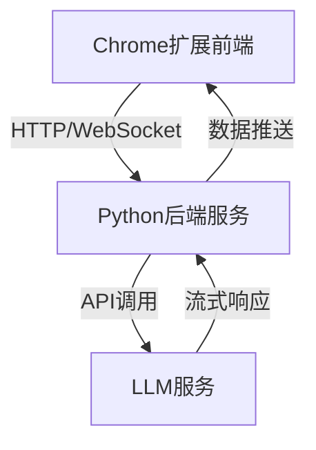

# LLM聊天程序设计方案

## 架构概览


## 核心组件

### 1. Chrome扩展改造
- **新增文件**:
  - `chat.js`: 处理聊天界面交互逻辑
  - `api.js`: 封装与Python后端的通信

- **manifest.json更新**:
```json
{
  "permissions": ["storage", "http://localhost:5000/*"],
  "host_permissions": ["http://localhost:5000/*"]
}
```

### 2. Python后端服务
```python
# app.py 示例
from flask import Flask, request, jsonify
import your_llm_module

app = Flask(__name__)

@app.route('/chat', methods=['POST'])
def chat():
    user_input = request.json.get('message')
    llm_response = your_llm_module.generate_response(user_input)
    return jsonify({'response': llm_response})
```

### 3. 通信协议设计
| 要素 | 前端 | 后端 |
|------|------|------|
| 协议 | HTTP/WebSocket | REST API |
| 数据格式 | JSON | JSON |
| 认证 | API密钥 | JWT令牌 |

## 实现步骤

1. **Python服务化**:
   - 使用Flask/FastAPI暴露API端点
   - 处理跨域请求(CORS)
   - 实现请求限流

2. **前端改造**:
```javascript
// chat.js示例
async function sendMessage() {
  const response = await fetch('http://localhost:5000/chat', {
    method: 'POST',
    headers: {'Content-Type': 'application/json'},
    body: JSON.stringify({message: userInput})
  });
  // 处理响应...
}
```

3. **增强功能**:
- 对话历史管理
- 流式响应处理
- 错误恢复机制

## 演进路线
1. 基础版: 简单问答功能
2. 增强版: 支持多轮对话
3. 高级版: 集成知识库检索