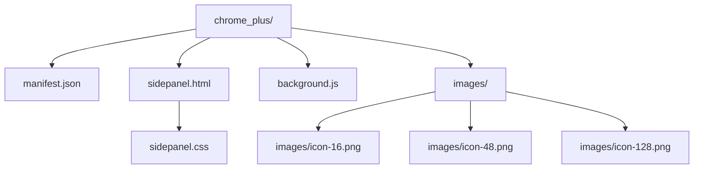

# Chrome Manifest V3 Side Panel扩展计划

**目标**: 创建一个Chrome Manifest V3扩展，该扩展使用Side Panel API在侧边面板中显示“Hello, Chrome Extension!”。

### 文件结构:

### 步骤:

1.  **创建 `manifest.json`**:
    *   定义Manifest V3版本。
    *   设置扩展名称、版本和描述。
    *   声明 `sidePanel` 权限。
    *   配置 `side_panel` 的 `default_path` 为 `sidepanel.html`。
    *   配置 `action` 以允许通过点击工具栏图标打开侧边面板。

2.  **创建 `sidepanel.html`**:
    *   创建一个基本的HTML文件。
    *   在 `<body>` 中添加一个 `<h1>` 标签，显示“Hello, Chrome Extension!”。
    *   链接 `sidepanel.css` 文件。

3.  **创建 `sidepanel.css`**:
    *   添加一些基本的CSS样式，使文本居中并设置字体大小。

4.  **创建 `background.js`**:
    *   监听 `chrome.runtime.onInstalled` 事件。
    *   在事件触发时，使用 `chrome.sidePanel.setPanelBehavior({ openPanelOnActionClick: true })` 来配置侧边面板行为。

5.  **创建图标文件**:
    *   创建 `images` 目录。
    *   在 `images` 目录下创建 `icon-16.png`、`icon-48.png` 和 `icon-128.png` 的占位符文件（实际开发中需要提供真实的图标）。

### 验证:

*   用户将手动加载扩展到Chrome浏览器中。
*   用户将点击扩展图标，验证侧边面板是否打开并显示“Hello, Chrome Extension!”。