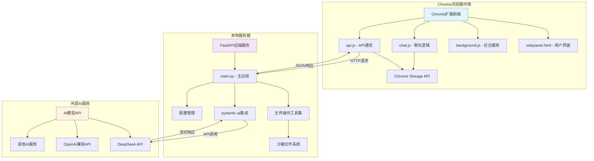
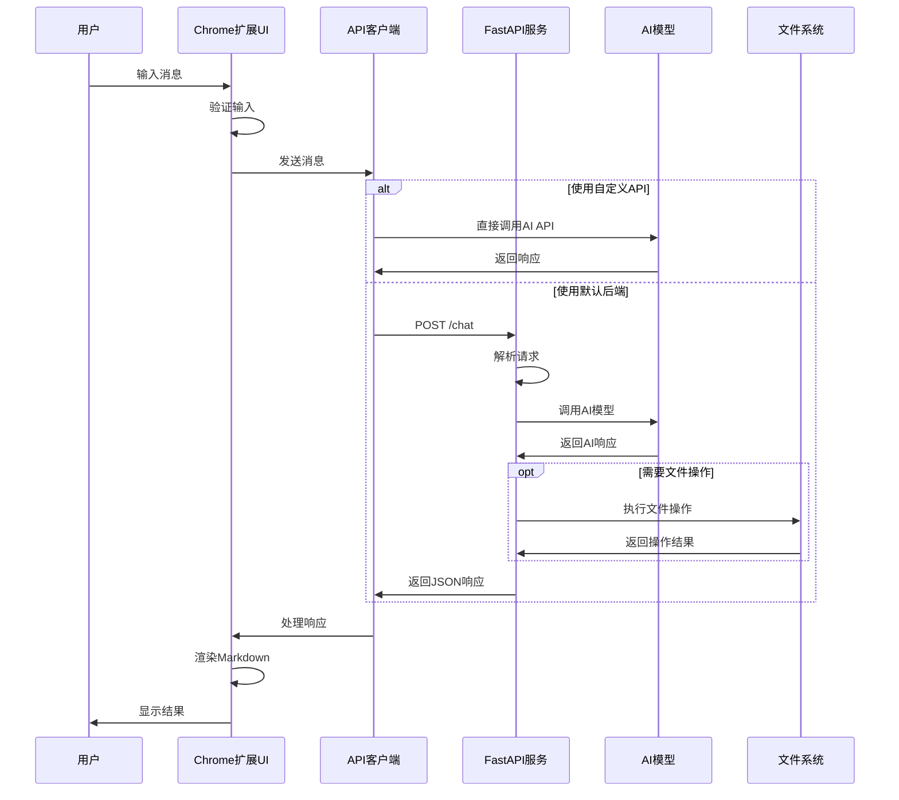
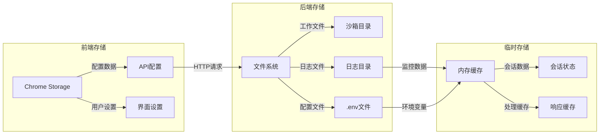

# Chrome扩展AI助手 - 完整项目文档

## 📋 目录

1. [项目概述](#1-项目概述)
2. [开发设计文档](#2-开发设计文档)
3. [安装和配置指南](#3-安装和配置指南)
4. [使用文档](#4-使用文档)
5. [开发指南](#5-开发指南)
6. [部署和维护](#6-部署和维护)

---

## 1. 项目概述

### 1.1 项目目的和功能描述

Chrome扩展AI助手是一个功能强大的浏览器扩展，旨在为用户提供便捷的AI助手服务。该项目集成了现代化的AI模型，支持智能对话、文件操作、Markdown渲染和代码高亮等功能。

#### 核心功能特性

**🤖 智能对话功能**
- 集成DeepSeek AI模型，支持多轮智能对话
- 兼容OpenAI API格式，支持多种AI模型切换
- 实时流式响应，提供流畅的对话体验
- 支持自定义API端点和模型参数配置

**📁 文件操作能力**
- 在安全沙箱环境中进行文件管理
- 支持文件创建、读取、修改、删除等基本操作
- 提供目录浏览、文件搜索、内容替换等高级功能
- 支持文件备份、归档压缩、解压等实用工具

**📝 内容渲染功能**
- 完整支持Markdown格式显示和渲染
- 多种编程语言语法高亮显示
- 代码块复制功能，提升开发效率
- 响应式设计，支持暗色主题

**⚙️ 灵活配置系统**
- 支持自定义API端点配置
- API密钥安全存储和管理
- 模型参数个性化设置
- 连接测试和验证功能

### 1.2 技术栈和架构概览

#### 前端技术栈
- **Chrome Extension API**: 基于Manifest V3最新标准
- **JavaScript ES6+**: 现代化JavaScript语法和特性
- **CSS3**: 响应式设计和暗色主题支持
- **marked.js**: 高性能Markdown解析和渲染
- **highlight.js**: 多语言代码语法高亮

#### 后端技术栈
- **FastAPI**: 现代化Python Web框架，提供高性能异步API服务
- **pydantic-ai**: AI模型集成和工具调用框架
- **uvicorn**: ASGI服务器，支持异步处理
- **pydantic**: 数据验证和序列化
- **python-dotenv**: 环境变量管理

#### AI集成技术
- **DeepSeek API**: 主要AI模型服务提供商
- **OpenAI兼容API**: 支持多种AI模型接入
- **流式响应**: 实时对话体验优化
- **工具调用**: 支持文件操作等扩展功能

### 1.3 项目结构和目录说明

```
chrome_plus/
├── 📄 manifest.json              # Chrome扩展配置文件
├── 🎨 sidepanel.html             # 侧边栏主界面HTML
├── 💅 sidepanel.css              # 侧边栏样式文件
├── ⚙️ background.js              # 后台服务脚本
├── 💬 chat.js                    # 聊天界面逻辑
├── 🔌 api.js                     # API通信封装
├── 🖼️ images/                    # 图标资源目录
│   ├── icon-16.png               # 16x16 图标
│   ├── icon-48.png               # 48x48 图标
│   └── icon-128.png              # 128x128 图标
├── 🚀 scripts/                   # 构建和部署脚本
│   ├── dev-setup.sh              # 开发环境设置脚本
│   └── build-extension.sh        # 扩展打包脚本
├── 🖥️ server/                    # 后端服务目录
│   ├── main.py                   # FastAPI主应用
│   ├── config.py                 # 配置管理
│   ├── start_server.py           # 服务启动脚本
│   ├── pyproject.toml            # Python项目配置
│   ├── requirements.txt          # 依赖列表
│   ├── uv.lock                   # 依赖锁定文件
│   ├── test/                     # 沙箱测试目录
│   ├── test_fastapi.py           # 自动化测试
│   └── test_manual.py            # 手动测试脚本
└── 📚 docs/                      # 项目文档
    ├── README.md                 # 项目说明
    ├── ARCHITECTURE.md           # 架构设计文档
    ├── DEVELOPER_GUIDE.md        # 开发者指南
    ├── QUICK_START.md            # 快速开始指南
    └── CHANGELOG.md              # 版本更新日志
```

#### 核心文件说明

**前端核心文件**
- `manifest.json`: Chrome扩展的配置文件，定义权限、入口点和基本信息
- `sidepanel.html`: 侧边栏的主界面，包含聊天界面和设置模态框
- `sidepanel.css`: 样式文件，实现响应式设计和暗色主题
- `background.js`: 后台服务脚本，处理扩展的生命周期事件
- `chat.js`: 聊天界面的核心逻辑，处理消息渲染和用户交互
- `api.js`: API通信封装，支持多种API端点配置

**后端核心文件**
- `main.py`: FastAPI主应用，包含所有API端点和业务逻辑
- `config.py`: 配置管理模块，处理环境变量和设置
- `start_server.py`: 服务启动脚本，配置服务器参数
- `pyproject.toml`: Python项目配置，定义依赖和项目元数据

**工具和脚本**
- `scripts/dev-setup.sh`: 自动化开发环境设置脚本
- `scripts/build-extension.sh`: 扩展打包和发布脚本
- `test_fastapi.py`: 自动化测试套件
- `test_manual.py`: 手动测试脚本

### 1.4 安全特性

**🔒 数据安全**
- API密钥采用Chrome存储API加密存储
- 所有文件操作限制在安全沙箱目录内
- 输入验证和清理，防止恶意代码注入
- 严格的CORS策略，限制跨域访问

**🛡️ 权限控制**
- 最小权限原则，仅申请必要的Chrome API权限
- 文件操作路径验证，防止目录遍历攻击
- API访问控制，支持密钥验证和速率限制

**🚧 沙箱隔离**
- 文件操作严格限制在指定的test目录内
- 路径验证机制，防止访问系统敏感文件
- 错误处理和异常捕获，确保系统稳定性

### 1.5 技术亮点

**现代化架构**
- 采用Chrome Manifest V3最新标准
- FastAPI异步框架，提供高性能API服务
- 模块化设计，便于扩展和维护

**用户体验优化**
- 响应式设计，适配不同屏幕尺寸
- 暗色主题支持，减少视觉疲劳
- 实时消息渲染，流畅的交互体验
- 代码高亮和复制功能，提升开发效率

**开发友好**
- 完整的测试覆盖，包括自动化和手动测试
- 详细的API文档，支持Swagger UI和ReDoc
- 自动化部署脚本，简化开发和部署流程
- 丰富的错误处理和日志记录

---

## 2. 开发设计文档

### 2.1 系统架构设计图

#### 整体系统架构



#### 前端组件架构

```mermaid
graph LR
    subgraph "Chrome扩展组件"
        M[manifest.json] --> BG[background.js]
        M --> SP[sidepanel.html]
        
        SP --> CSS[sidepanel.css]
        SP --> CHAT[chat.js]
        SP --> API[api.js]
        
        CHAT --> RENDER[消息渲染]
        CHAT --> EVENT[事件处理]
        CHAT --> STORAGE[存储管理]
        
        API --> HTTP[HTTP客户端]
        API --> CONFIG[配置管理]
        API --> ERROR[错误处理]
        
        BG --> LIFECYCLE[生命周期管理]
        BG --> SIDEPANEL[侧边栏控制]
    end
    
    subgraph "外部依赖"
        MARKED[marked.js]
        HIGHLIGHT[highlight.js]
        CHROME[Chrome APIs]
    end
    
    RENDER --> MARKED
    RENDER --> HIGHLIGHT
    STORAGE --> CHROME
    SIDEPANEL --> CHROME
    
    style M fill:#ffcdd2
    style SP fill:#c8e6c9
    style CHAT fill:#bbdefb
    style API fill:#f8bbd9
```



### 2.2 核心模块和组件说明

#### 前端核心模块

**1. 消息管理模块 (chat.js)**
```javascript
class MessageManager {
    constructor() {
        this.chatBox = document.getElementById('chat-box');
        this.messageInput = document.getElementById('message-input');
        this.initializeEventListeners();
    }
    
    // 消息渲染：支持Markdown和代码高亮
    appendMessage(sender, message) {
        // Markdown渲染逻辑
        // 代码高亮处理
        // 复制按钮添加
    }
    
    // 消息发送：验证和API调用
    async sendMessage() {
        // 输入验证
        // API调用
        // 错误处理
    }
}
```

**2. API通信模块 (api.js)**
```javascript
class APIClient {
    constructor() {
        this.baseURL = 'http://localhost:5001';
    }
    
    // 支持多种API配置
    async sendMessageToBackend(message) {
        // 检查自定义配置
        // 构建请求
        // 处理响应
        // 错误处理
    }
}
```

**3. 设置管理模块**
```javascript
class SettingsManager {
    // Chrome存储API集成
    async loadSettings() {
        return new Promise((resolve) => {
            chrome.storage.sync.get(['apiEndpoint', 'apiKey', 'modelName'], resolve);
        });
    }
    
    // 设置保存和验证
    async saveSettings(settings) {
        // 验证设置
        // 保存到Chrome存储
        // 连接测试
    }
}
```

#### 后端核心模块

**1. FastAPI应用主模块 (main.py)**
```python
# 应用初始化
app = FastAPI(
    title="ShellAI API",
    description="AI助手API，支持文件操作和聊天功能",
    version="1.0.0"
)

# CORS中间件配置
app.add_middleware(
    CORSMiddleware,
    allow_origins=["chrome-extension://*", "http://localhost:*"],
    allow_credentials=True,
    allow_methods=["*"],
    allow_headers=["*"],
)

# 主要API端点
@app.post("/chat", response_model=ChatResponse)
async def chat(request: ChatRequest) -> ChatResponse:
    # 消息处理逻辑
    # AI模型调用
    # 工具函数执行
    # 响应返回
```

**2. 文件操作工具集**
```python
# 安全路径验证
def _validate_path(target_path: Path, check_existence=False, expect_dir=False, expect_file=False):
    # 路径安全检查
    # 沙箱边界验证
    # 权限检查
    
# 文件操作函数
def read_file(name: str) -> str:
def write_file(name: str, content: str, mode: str = 'w') -> str:
def list_files(path: str = ".") -> list[str]:
def create_directory(name: str) -> str:
def delete_file(name: str) -> str:
# ... 更多文件操作函数
```

**3. AI模型集成模块**
```python
# pydantic-ai Agent配置
agent = Agent(
    model=model,
    system_prompt=BASE_SYSTEM_PROMPT,
    tools=agent_tools
)

# 异步消息处理
async def process_message(message: str):
    # 线程池执行同步代码
    loop = asyncio.get_event_loop()
    with concurrent.futures.ThreadPoolExecutor() as executor:
        resp = await loop.run_in_executor(executor, run_agent_sync)
    return resp.output
```

### 2.3 数据流和业务逻辑

#### 用户交互流程



#### 数据处理流程

**1. 消息处理管道**
```
用户输入 → 输入验证 → 消息发送 → 后端处理 → AI模型调用 → 工具执行 → 响应生成 → 前端渲染 → 用户显示
```

**2. 文件操作流程**
```
AI指令解析 → 路径验证 → 权限检查 → 文件操作执行 → 结果返回 → 状态更新
```

**3. 配置管理流程**
```
用户设置 → 输入验证 → Chrome存储 → 配置加载 → API调用 → 连接测试 → 状态反馈
```

### 2.4 API接口设计

#### RESTful API端点

**POST /chat**
- **功能**: 处理用户聊天消息
- **请求格式**:
```json
{
    "message": "用户消息内容"
}
```
- **响应格式**:
```json
{
    "response": "AI助手回复内容"
}
```
- **错误响应**:
```json
{
    "error": "错误描述信息"
}
```

**GET /docs**
- **功能**: Swagger UI API文档
- **响应**: HTML页面

**GET /redoc**
- **功能**: ReDoc API文档
- **响应**: HTML页面

**GET /openapi.json**
- **功能**: OpenAPI规范文档
- **响应**: JSON格式的API规范

#### 数据模型定义

```python
class ChatRequest(BaseModel):
    """聊天请求模型"""
    message: str
    
    class Config:
        json_schema_extra = {
            "example": {
                "message": "你好，请帮我创建一个文件"
            }
        }

class ChatResponse(BaseModel):
    """聊天响应模型"""
    response: str
    
    class Config:
        json_schema_extra = {
            "example": {
                "response": "你好！我可以帮你创建文件。请告诉我文件名和内容。"
            }
        }

class ErrorResponse(BaseModel):
    """错误响应模型"""
    error: str
    
    class Config:
        json_schema_extra = {
            "example": {
                "error": "请求处理失败"
            }
        }
```

### 2.5 数据库设计

本项目采用文件系统作为主要存储方式，不使用传统数据库。数据存储策略如下：

#### 存储架构

**1. Chrome扩展存储**
- 使用Chrome Storage API存储用户配置
- 数据类型：API端点、密钥、模型设置
- 存储位置：浏览器同步存储

**2. 文件系统存储**
- 沙箱目录：`server/test/`
- 用途：AI助手文件操作的工作空间
- 安全限制：路径验证和权限控制

**3. 日志存储**
- 应用日志：结构化JSON格式
- 交互历史：Markdown格式（可选）
- 存储位置：服务器本地文件系统

#### 数据流转



---

## 3. 安装和配置指南

### 3.1 环境要求和依赖

#### 系统要求

**操作系统支持**
- Windows 10/11 (x64)
- macOS 10.15+ (Intel/Apple Silicon)
- Linux (Ubuntu 18.04+, CentOS 7+, Debian 10+)

**浏览器要求**
- Google Chrome 88+ (支持Manifest V3)
- Microsoft Edge 88+ (Chromium内核)
- 其他Chromium内核浏览器

**硬件要求**
- CPU: 双核2.0GHz以上
- 内存: 4GB RAM以上
- 存储: 500MB可用空间
- 网络: 稳定的互联网连接

#### 必需软件依赖

**Python环境**
```bash
# Python版本要求
Python 3.10+

# 推荐使用pyenv管理Python版本
curl https://pyenv.run | bash
pyenv install 3.10.12
pyenv global 3.10.12
```

**uv包管理器**
```bash
# macOS/Linux安装
curl -LsSf https://astral.sh/uv/install.sh | sh

# Windows安装 (PowerShell)
powershell -c "irm https://astral.sh/uv/install.ps1 | iex"

# 验证安装
uv --version
```

**Git版本控制**
```bash
# Ubuntu/Debian
sudo apt update && sudo apt install git

# CentOS/RHEL
sudo yum install git

# macOS (使用Homebrew)
brew install git

# Windows
# 下载并安装 Git for Windows
```

#### 可选工具推荐

**开发工具**
- **VS Code**: 推荐的代码编辑器
- **Chrome DevTools**: 扩展调试工具
- **Postman**: API测试工具
- **curl**: 命令行HTTP客户端

**监控工具**
- **htop**: 系统资源监控
- **jq**: JSON数据处理
- **tree**: 目录结构显示

### 3.2 安装步骤

#### 方法一：自动化安装（推荐）

**1. 克隆项目**
```bash
git clone https://github.com/your-username/chrome_plus.git
cd chrome_plus
```

**2. 运行自动安装脚本**
```bash
chmod +x scripts/dev-setup.sh
./scripts/dev-setup.sh
```

**3. 配置API密钥**
```bash
# 编辑环境变量文件
nano server/.env

# 添加以下内容
DEEPSEEK_API_KEY=sk-your-actual-api-key-here
TAVILY_API_KEY=tvly-your-tavily-key-here  # 可选
```

**4. 启动开发环境**
```bash
./start-dev.sh
```

#### 方法二：手动安装

**1. 克隆和准备**
```bash
git clone https://github.com/your-username/chrome_plus.git
cd chrome_plus
```

**2. 安装后端依赖**
```bash
cd server
uv sync
```

**3. 创建配置文件**
```bash
# 复制示例配置
cp .env.example .env

# 编辑配置文件
vim .env
```

**4. 验证安装**
```bash
# 运行测试
uv run python -m pytest test_fastapi.py -v

# 启动服务器
uv run python start_server.py
```

**5. 安装Chrome扩展**
```bash
# 打开Chrome浏览器
# 访问 chrome://extensions/
# 开启开发者模式
# 点击"加载已解压的扩展程序"
# 选择项目根目录
```

### 3.3 配置文件说明

#### 环境变量配置 (.env)

```bash
# ===========================================
# API配置 - 必需设置
# ===========================================

# DeepSeek API密钥 (必需)
DEEPSEEK_API_KEY=sk-xxxxxxxxxxxxxxxxxxxxxxxxxxxxxxxx

# Tavily搜索API密钥 (可选，用于网络搜索功能)
TAVILY_API_KEY=tvly-xxxxxxxxxxxxxxxxxxxxxxxxxxxxxxxx

# ===========================================
# 服务器配置
# ===========================================

# 服务器监听地址
SERVER_HOST=127.0.0.1

# 服务器端口
SERVER_PORT=5001

# 调试模式 (开发环境设为true，生产环境设为false)
DEBUG=true

# ===========================================
# 日志配置
# ===========================================

# 日志级别 (DEBUG, INFO, WARNING, ERROR, CRITICAL)
LOG_LEVEL=INFO

# 日志文件路径
LOG_FILE=logs/app.log

# 是否启用结构化日志
STRUCTURED_LOGGING=true

# ===========================================
# 安全配置
# ===========================================

# 最大消息长度限制
MAX_MESSAGE_LENGTH=10000

# 速率限制 (每分钟请求数)
RATE_LIMIT_PER_MINUTE=60

# 允许的CORS源
CORS_ORIGINS=chrome-extension://*,http://localhost:*

# ===========================================
# AI模型配置
# ===========================================

# 默认AI模型
DEFAULT_MODEL=deepseek-chat

# API超时时间 (秒)
API_TIMEOUT=30

# 最大重试次数
MAX_RETRIES=3
```

#### Chrome扩展配置 (manifest.json)

```json
{
  "manifest_version": 3,
  "name": "AI助手 Plus",
  "version": "1.0.0",
  "description": "智能AI助手Chrome扩展，支持多种AI模型，提供便捷的侧边栏聊天界面。",

  "icons": {
    "16": "images/icon-16.png",
    "48": "images/icon-48.png",
    "128": "images/icon-128.png"
  },

  "permissions": [
    "sidePanel",    // 侧边栏API
    "storage"       // 存储API
  ],

  "host_permissions": [
    "http://localhost:5001/*"  // 本地API访问权限
  ],

  "side_panel": {
    "default_path": "sidepanel.html"
  },

  "action": {
    "default_title": "打开AI助手"
  },

  "background": {
    "service_worker": "background.js"
  }
}
```

#### Python项目配置 (pyproject.toml)

```toml
[project]
name = "chrome-plus-server"
version = "1.0.0"
description = "Chrome扩展AI助手后端服务"
readme = "README.md"
requires-python = ">=3.10"

dependencies = [
    "fastapi>=0.104.0,<0.116.0",
    "uvicorn>=0.34.0",
    "pydantic>=2.11.0",
    "pydantic-ai[tavily]>=0.3.3",
    "python-dotenv>=1.1.0",
    "psutil>=5.9.0",
    "aiohttp>=3.11.0",
    "httpx>=0.28.0",
    "pytest>=8.4.0"
]

[build-system]
requires = ["hatchling"]
build-backend = "hatchling.build"

[tool.pytest.ini_options]
testpaths = ["tests"]
python_files = ["test_*.py"]
python_classes = ["Test*"]
python_functions = ["test_*"]

[tool.black]
line-length = 88
target-version = ['py310']

[tool.isort]
profile = "black"
line_length = 88
```

### 3.4 环境变量设置

#### API密钥获取

**DeepSeek API密钥**
1. 访问 [DeepSeek官网](https://platform.deepseek.com/)
2. 注册账号并登录
3. 进入API管理页面
4. 创建新的API密钥
5. 复制密钥到`.env`文件

**Tavily API密钥（可选）**
1. 访问 [Tavily官网](https://tavily.com/)
2. 注册账号并登录
3. 获取API密钥
4. 添加到`.env`文件

#### 环境变量验证

**验证脚本**
```bash
#!/bin/bash
# scripts/verify-env.sh

echo "🔍 验证环境配置..."

# 检查Python版本
python_version=$(python3 -c "import sys; print(f'{sys.version_info.major}.{sys.version_info.minor}')")
echo "Python版本: $python_version"

# 检查uv安装
if command -v uv >/dev/null 2>&1; then
    echo "✅ uv已安装: $(uv --version)"
else
    echo "❌ uv未安装"
    exit 1
fi

# 检查环境变量
cd server
if [ -f .env ]; then
    echo "✅ 找到.env文件"

    # 检查必需的环境变量
    source .env

    if [ -n "$DEEPSEEK_API_KEY" ]; then
        echo "✅ DEEPSEEK_API_KEY已设置"
    else
        echo "⚠️  DEEPSEEK_API_KEY未设置"
    fi

    if [ -n "$TAVILY_API_KEY" ]; then
        echo "✅ TAVILY_API_KEY已设置"
    else
        echo "ℹ️  TAVILY_API_KEY未设置（可选）"
    fi
else
    echo "❌ 未找到.env文件"
    exit 1
fi

# 测试依赖安装
echo "🧪 测试依赖安装..."
if uv run python -c "import fastapi, pydantic, uvicorn; print('依赖检查通过')"; then
    echo "✅ 所有依赖已正确安装"
else
    echo "❌ 依赖安装有问题"
    exit 1
fi

echo "🎉 环境配置验证完成！"
```

#### 配置最佳实践

**安全配置**
```bash
# 设置.env文件权限
chmod 600 server/.env

# 添加到.gitignore
echo "server/.env" >> .gitignore
echo "server/.env.local" >> .gitignore
```

**开发环境配置**
```bash
# 开发环境变量
export CHROME_PLUS_ENV=development
export DEBUG=true
export LOG_LEVEL=DEBUG

# 生产环境变量
export CHROME_PLUS_ENV=production
export DEBUG=false
export LOG_LEVEL=INFO
```

**配置验证命令**
```bash
# 验证配置
./scripts/verify-env.sh

# 测试API连接
curl -X POST "http://127.0.0.1:5001/chat" \
  -H "Content-Type: application/json" \
  -d '{"message": "配置测试"}'

# 检查服务状态
curl -f http://127.0.0.1:5001/docs || echo "服务未启动"
```

## 4. 使用文档

### 4.1 功能使用说明

#### 基础聊天功能

**启动AI助手**
1. 确保后端服务正在运行
2. 点击Chrome工具栏中的AI助手图标
3. 侧边栏将自动打开，显示欢迎界面

**发送消息**
```
方法一：输入框输入 + 点击发送按钮
方法二：输入框输入 + 按Enter键
方法三：使用快捷键 Ctrl+Enter（快速发送）
```

**消息类型支持**
- 普通文本对话
- 代码相关问题
- 文件操作指令
- 技术问题咨询
- 创意写作协助

#### 文件操作功能

**创建文件**
```
示例指令：
"请创建一个名为hello.py的文件，内容是打印Hello World"
"创建一个README.md文件，包含项目介绍"
"新建一个config.json配置文件"
```

**读取文件**
```
示例指令：
"请读取hello.py文件的内容"
"显示README.md的内容"
"查看当前目录下的所有文件"
```

**修改文件**
```
示例指令：
"在hello.py文件中添加一个新函数"
"修改config.json中的端口配置"
"替换README.md中的项目名称"
```

**文件管理**
```
示例指令：
"列出当前目录的所有文件"
"创建一个名为docs的目录"
"删除临时文件temp.txt"
"备份重要文件important.py"
```

#### 高级功能

**代码分析和生成**
```
示例指令：
"分析这段Python代码的性能问题"
"生成一个FastAPI的CRUD接口"
"优化这个SQL查询语句"
"解释这个正则表达式的含义"
```

**文档生成**
```
示例指令：
"为这个函数生成文档注释"
"创建API接口文档"
"生成项目的README文件"
"写一个安装指南"
```

**问题诊断**
```
示例指令：
"这个错误信息是什么意思？"
"如何解决Python导入模块的问题？"
"Chrome扩展无法加载怎么办？"
"API请求失败的可能原因"
```

### 4.2 操作流程和示例

#### 完整工作流程示例

**场景：创建一个简单的Web项目**

**步骤1：项目初始化**
```
用户输入：
"帮我创建一个简单的Web项目结构，包含HTML、CSS和JavaScript文件"

AI助手回复：
我来帮你创建一个简单的Web项目结构。

[执行文件操作]
✅ 创建目录 'web-project'
✅ 创建文件 'web-project/index.html'
✅ 创建文件 'web-project/style.css'
✅ 创建文件 'web-project/script.js'

项目结构已创建完成：
web-project/
├── index.html
├── style.css
└── script.js
```

**步骤2：添加内容**
```
用户输入：
"在index.html中添加一个简单的页面结构"

AI助手回复：
我来为你添加HTML页面结构。

[执行文件操作]
✅ 更新文件 'web-project/index.html'

已添加包含以下内容的HTML结构：
- 标准的HTML5文档结构
- 响应式meta标签
- 链接到CSS和JavaScript文件
- 基本的页面内容区域
```

**步骤3：样式设计**
```
用户输入：
"为页面添加一些基础的CSS样式"

AI助手回复：
我来添加基础的CSS样式。

[执行文件操作]
✅ 更新文件 'web-project/style.css'

已添加的样式包括：
- 页面重置样式
- 响应式布局
- 现代化的颜色方案
- 基础的组件样式
```

#### 配置管理流程

**自定义API配置**

**步骤1：打开设置**
1. 点击AI助手界面右上角的设置按钮 ⚙️
2. 设置模态框将打开

**步骤2：配置API端点**
```
API端点示例：
- OpenAI: https://api.openai.com
- DeepSeek: https://api.deepseek.com
- 自定义: https://your-api.example.com
```

**步骤3：设置API密钥**
```
密钥格式示例：
- OpenAI: sk-xxxxxxxxxxxxxxxxxxxxxxxxxxxxxxxx
- DeepSeek: sk-xxxxxxxxxxxxxxxxxxxxxxxxxxxxxxxx
```

**步骤4：选择模型**
```
常用模型：
- gpt-3.5-turbo
- gpt-4
- deepseek-chat
- claude-3-sonnet
```

**步骤5：测试连接**
1. 点击"测试连接"按钮
2. 系统将发送测试请求验证配置
3. 显示连接结果和状态信息

**步骤6：保存设置**
1. 确认配置无误后点击"保存设置"
2. 设置将保存到Chrome存储中
3. 后续对话将使用新的配置

### 4.3 常见问题和解决方案

#### 安装和配置问题

**Q1: Chrome扩展无法加载**
```
问题现象：
- 扩展在chrome://extensions/页面显示错误
- 点击扩展图标没有反应
- 侧边栏无法打开

解决方案：
1. 检查manifest.json语法是否正确
2. 确认Chrome版本支持Manifest V3 (88+)
3. 检查文件路径是否正确
4. 查看Chrome扩展错误日志
5. 重新加载扩展

验证命令：
# 检查manifest.json语法
cat manifest.json | jq .

# 验证文件存在
ls -la sidepanel.html background.js
```

**Q2: 后端服务启动失败**
```
问题现象：
- 运行start_server.py报错
- 端口5001被占用
- 依赖包导入失败

解决方案：
1. 检查Python版本 >= 3.10
2. 验证依赖安装完整性
3. 检查端口占用情况
4. 确认环境变量设置

验证命令：
# 检查Python版本
python3 --version

# 检查依赖
uv run python -c "import fastapi, pydantic, uvicorn"

# 检查端口占用
lsof -i :5001

# 测试服务启动
cd server && uv run python start_server.py
```

**Q3: API密钥配置问题**
```
问题现象：
- API调用返回401错误
- 提示密钥无效
- 连接测试失败

解决方案：
1. 确认API密钥格式正确
2. 检查密钥是否过期
3. 验证API端点URL
4. 确认账户余额充足

验证命令：
# 测试API密钥
curl -X POST "https://api.deepseek.com/v1/chat/completions" \
  -H "Authorization: Bearer YOUR_API_KEY" \
  -H "Content-Type: application/json" \
  -d '{"model":"deepseek-chat","messages":[{"role":"user","content":"test"}]}'
```

#### 使用过程问题

**Q4: 消息发送失败**
```
问题现象：
- 点击发送按钮无反应
- 显示网络错误
- 响应超时

解决方案：
1. 检查网络连接
2. 确认后端服务运行状态
3. 查看浏览器控制台错误
4. 验证CORS配置

调试步骤：
1. 打开Chrome DevTools (F12)
2. 查看Console标签页的错误信息
3. 检查Network标签页的请求状态
4. 验证API端点可访问性
```

**Q5: Markdown渲染异常**
```
问题现象：
- 代码块显示不正确
- 格式化失效
- 特殊字符显示异常

解决方案：
1. 检查marked.js库加载
2. 验证highlight.js配置
3. 确认CSS样式正确
4. 检查内容编码

调试方法：
# 在浏览器控制台检查
console.log(typeof marked);
console.log(typeof hljs);
```

**Q6: 文件操作权限问题**
```
问题现象：
- 无法创建文件
- 路径访问被拒绝
- 文件操作失败

解决方案：
1. 确认操作在沙箱目录内
2. 检查文件路径格式
3. 验证目录权限
4. 确认磁盘空间充足

验证命令：
# 检查沙箱目录
ls -la server/test/

# 检查权限
ls -ld server/test/

# 检查磁盘空间
df -h
```

#### 性能优化问题

**Q7: 响应速度慢**
```
问题现象：
- AI回复延迟较长
- 界面卡顿
- 内存占用过高

优化方案：
1. 检查网络延迟
2. 优化消息长度
3. 清理浏览器缓存
4. 重启后端服务

监控命令：
# 检查服务器资源
top -p $(pgrep -f "python.*start_server")

# 检查网络延迟
ping api.deepseek.com

# 监控内存使用
ps aux | grep python
```

**Q8: 内存泄漏问题**
```
问题现象：
- 长时间使用后变慢
- 浏览器内存占用增加
- 系统响应迟缓

解决方案：
1. 定期清理聊天历史
2. 重新加载扩展
3. 重启浏览器
4. 检查代码中的内存泄漏

预防措施：
- 限制聊天历史长度
- 及时清理DOM元素
- 使用弱引用避免循环引用
- 定期监控内存使用
```

## 5. 开发指南

### 5.1 代码结构和规范

#### 前端代码规范

**JavaScript代码风格**
```javascript
// 使用ES6+语法
class MessageManager {
    constructor() {
        this.chatBox = document.getElementById('chat-box');
        this.messageInput = document.getElementById('message-input');
        this.initializeEventListeners();
    }

    // 使用async/await处理异步操作
    async sendMessage() {
        try {
            const message = this.validateInput();
            const response = await this.apiClient.post('/chat', {message});
            this.renderResponse(response);
        } catch (error) {
            this.handleError(error);
        }
    }

    // 使用箭头函数绑定this
    initializeEventListeners() {
        this.sendButton.addEventListener('click', () => this.sendMessage());
        this.messageInput.addEventListener('keypress', (e) => {
            if (e.key === 'Enter') this.sendMessage();
        });
    }
}

// 常量使用大写命名
const API_BASE_URL = 'http://localhost:5001';
const MAX_MESSAGE_LENGTH = 10000;

// 使用模块化导出
export { MessageManager, API_BASE_URL };
```

**CSS代码规范**
```css
/* 使用BEM命名规范 */
.chat-container {
    display: flex;
    flex-direction: column;
    height: 100vh;
}

.chat-container__header {
    padding: 1rem;
    border-bottom: 1px solid var(--border-color);
}

.chat-container__messages {
    flex: 1;
    overflow-y: auto;
    padding: 1rem;
}

/* 使用CSS变量 */
:root {
    --primary-color: #007bff;
    --secondary-color: #6c757d;
    --success-color: #28a745;
    --danger-color: #dc3545;
    --border-color: #dee2e6;
    --border-radius: 0.375rem;
}

/* 响应式设计 */
@media (max-width: 768px) {
    .chat-container {
        font-size: 0.875rem;
    }
}
```

**HTML结构规范**
```html
<!DOCTYPE html>
<html lang="zh-CN">
<head>
    <meta charset="UTF-8">
    <meta name="viewport" content="width=device-width, initial-scale=1.0">
    <title>AI助手</title>
    <!-- 外部依赖 -->
    <script src="https://cdn.jsdelivr.net/npm/marked/marked.min.js"></script>
    <!-- 本地样式 -->
    <link rel="stylesheet" href="sidepanel.css">
</head>
<body>
    <!-- 语义化HTML结构 -->
    <main id="chat-container" class="chat-container">
        <header class="chat-container__header">
            <h1>AI助手</h1>
            <nav class="header-buttons">
                <button id="settings-button" type="button" aria-label="设置">⚙️</button>
            </nav>
        </header>

        <section id="chat-box" class="chat-container__messages" role="log" aria-live="polite">
            <!-- 消息内容 -->
        </section>

        <footer class="chat-container__input">
            <form id="message-form" class="input-form">
                <input type="text" id="message-input" placeholder="输入你的消息..." required>
                <button type="submit" id="send-button">发送</button>
            </form>
        </footer>
    </main>

    <!-- 本地脚本 -->
    <script src="api.js"></script>
    <script src="chat.js"></script>
</body>
</html>
```

#### 后端代码规范

**Python代码风格**
```python
#!/usr/bin/env python3
# -*- coding: utf-8 -*-
"""
Chrome扩展AI助手后端服务

提供AI聊天和文件操作功能的FastAPI服务。
"""

import os
import asyncio
from pathlib import Path
from typing import Optional, List, Dict, Any
from datetime import datetime

from fastapi import FastAPI, HTTPException, Depends
from fastapi.middleware.cors import CORSMiddleware
from pydantic import BaseModel, Field, validator
import uvicorn

# 常量定义
API_VERSION = "1.0.0"
MAX_MESSAGE_LENGTH = 10000
DEFAULT_PORT = 5001

class ChatRequest(BaseModel):
    """聊天请求模型"""
    message: str = Field(..., min_length=1, max_length=MAX_MESSAGE_LENGTH)

    @validator('message')
    def validate_message(cls, v: str) -> str:
        """验证消息内容"""
        if not v.strip():
            raise ValueError('消息不能为空')
        return v.strip()

class ChatResponse(BaseModel):
    """聊天响应模型"""
    response: str
    timestamp: datetime = Field(default_factory=datetime.now)

# 应用初始化
app = FastAPI(
    title="Chrome扩展AI助手API",
    description="提供AI聊天和文件操作功能",
    version=API_VERSION,
    docs_url="/docs",
    redoc_url="/redoc"
)

# 中间件配置
app.add_middleware(
    CORSMiddleware,
    allow_origins=["chrome-extension://*", "http://localhost:*"],
    allow_credentials=True,
    allow_methods=["GET", "POST"],
    allow_headers=["*"],
)

@app.post("/chat", response_model=ChatResponse)
async def chat_endpoint(request: ChatRequest) -> ChatResponse:
    """
    处理聊天请求

    Args:
        request: 聊天请求对象

    Returns:
        ChatResponse: 聊天响应对象

    Raises:
        HTTPException: 请求处理失败时抛出
    """
    try:
        # 处理消息逻辑
        response_text = await process_message(request.message)
        return ChatResponse(response=response_text)
    except Exception as e:
        raise HTTPException(status_code=500, detail=str(e))

async def process_message(message: str) -> str:
    """
    处理用户消息

    Args:
        message: 用户输入的消息

    Returns:
        str: AI助手的回复
    """
    # 实现消息处理逻辑
    pass

if __name__ == "__main__":
    uvicorn.run(
        app,
        host="127.0.0.1",
        port=DEFAULT_PORT,
        log_level="info"
    )
```

**文档字符串规范**
```python
def validate_path(target_path: Path, check_existence: bool = False) -> tuple[bool, str]:
    """
    验证文件路径的安全性

    Args:
        target_path: 要验证的路径对象
        check_existence: 是否检查路径存在性

    Returns:
        tuple[bool, str]: (是否有效, 错误信息)

    Raises:
        ValueError: 路径格式无效时抛出

    Examples:
        >>> validate_path(Path("test.txt"))
        (True, "")

        >>> validate_path(Path("../etc/passwd"))
        (False, "路径超出允许范围")
    """
    pass
```

### 5.2 开发环境搭建

#### IDE配置

**VS Code配置**
```json
// .vscode/settings.json
{
    "python.defaultInterpreterPath": "./server/.venv/bin/python",
    "python.linting.enabled": true,
    "python.linting.pylintEnabled": true,
    "python.linting.flake8Enabled": true,
    "python.formatting.provider": "black",
    "python.sortImports.args": ["--profile", "black"],

    "javascript.preferences.quoteStyle": "single",
    "typescript.preferences.quoteStyle": "single",

    "files.associations": {
        "*.js": "javascript",
        "*.json": "jsonc"
    },

    "editor.formatOnSave": true,
    "editor.codeActionsOnSave": {
        "source.organizeImports": true
    },

    "emmet.includeLanguages": {
        "javascript": "javascriptreact"
    }
}
```

**推荐扩展**
```json
// .vscode/extensions.json
{
    "recommendations": [
        "ms-python.python",
        "ms-python.black-formatter",
        "ms-python.isort",
        "ms-python.pylint",
        "bradlc.vscode-tailwindcss",
        "esbenp.prettier-vscode",
        "ms-vscode.vscode-json",
        "redhat.vscode-yaml",
        "ms-vscode.chrome-debug"
    ]
}
```

#### 开发工具配置

**Git配置**
```bash
# 配置Git钩子
cat > .git/hooks/pre-commit << 'EOF'
#!/bin/bash
# 运行代码格式化和检查

echo "🔍 运行代码检查..."

# Python代码检查
cd server
if ! uv run black --check .; then
    echo "❌ Python代码格式不符合规范，请运行: uv run black ."
    exit 1
fi

if ! uv run isort --check-only .; then
    echo "❌ Python导入排序不符合规范，请运行: uv run isort ."
    exit 1
fi

# JavaScript代码检查
cd ..
if command -v prettier >/dev/null 2>&1; then
    if ! prettier --check "*.js" "*.css" "*.html"; then
        echo "❌ 前端代码格式不符合规范，请运行: prettier --write ."
        exit 1
    fi
fi

echo "✅ 代码检查通过"
EOF

chmod +x .git/hooks/pre-commit
```

**代码格式化配置**
```toml
# pyproject.toml
[tool.black]
line-length = 88
target-version = ['py310']
include = '\.pyi?$'
extend-exclude = '''
/(
  # directories
  \.eggs
  | \.git
  | \.hg
  | \.mypy_cache
  | \.tox
  | \.venv
  | build
  | dist
)/
'''

[tool.isort]
profile = "black"
multi_line_output = 3
line_length = 88
include_trailing_comma = true
force_grid_wrap = 0
use_parentheses = true
ensure_newline_before_comments = true

[tool.pylint.messages_control]
disable = "C0330, C0326"

[tool.pylint.format]
max-line-length = "88"
```

```json
// .prettierrc
{
  "semi": true,
  "trailingComma": "es5",
  "singleQuote": true,
  "printWidth": 80,
  "tabWidth": 2,
  "useTabs": false
}
```

### 5.3 调试和测试方法

#### 前端调试

**Chrome扩展调试**
```javascript
// 调试工具函数
const DEBUG = true;

function debugLog(message, data = null) {
    if (DEBUG) {
        console.log(`[AI助手] ${message}`, data);
    }
}

function debugError(message, error = null) {
    if (DEBUG) {
        console.error(`[AI助手错误] ${message}`, error);
    }
}

// 使用示例
class MessageManager {
    async sendMessage() {
        debugLog('开始发送消息');

        try {
            const response = await this.apiClient.post('/chat', {message});
            debugLog('收到响应', response);
        } catch (error) {
            debugError('发送消息失败', error);
        }
    }
}
```

**浏览器调试技巧**
```javascript
// 1. 检查扩展状态
chrome.management.getSelf((info) => {
    console.log('扩展信息:', info);
});

// 2. 监控存储变化
chrome.storage.onChanged.addListener((changes, namespace) => {
    console.log('存储变化:', changes, namespace);
});

// 3. 网络请求监控
const originalFetch = window.fetch;
window.fetch = function(...args) {
    console.log('Fetch请求:', args);
    return originalFetch.apply(this, args)
        .then(response => {
            console.log('Fetch响应:', response);
            return response;
        });
};

// 4. 性能监控
function measurePerformance(name, fn) {
    return async function(...args) {
        const start = performance.now();
        const result = await fn.apply(this, args);
        const end = performance.now();
        console.log(`${name} 执行时间: ${end - start}ms`);
        return result;
    };
}
```

#### 后端调试

**FastAPI调试配置**
```python
import logging
from fastapi import FastAPI, Request
from fastapi.middleware.cors import CORSMiddleware
import time

# 配置日志
logging.basicConfig(
    level=logging.DEBUG,
    format='%(asctime)s - %(name)s - %(levelname)s - %(message)s',
    handlers=[
        logging.FileHandler('logs/debug.log'),
        logging.StreamHandler()
    ]
)

logger = logging.getLogger(__name__)

app = FastAPI(debug=True)

# 请求日志中间件
@app.middleware("http")
async def log_requests(request: Request, call_next):
    start_time = time.time()

    # 记录请求
    logger.info(f"请求开始: {request.method} {request.url}")
    logger.debug(f"请求头: {dict(request.headers)}")

    response = await call_next(request)

    # 记录响应
    process_time = time.time() - start_time
    logger.info(f"请求完成: {response.status_code} - {process_time:.2f}s")

    return response

# 异常处理
@app.exception_handler(Exception)
async def global_exception_handler(request: Request, exc: Exception):
    logger.error(f"未处理的异常: {exc}", exc_info=True)
    return {"error": "内部服务器错误"}
```

**调试工具函数**
```python
import functools
import time
from typing import Any, Callable

def debug_timer(func: Callable) -> Callable:
    """装饰器：测量函数执行时间"""
    @functools.wraps(func)
    async def wrapper(*args, **kwargs) -> Any:
        start = time.time()
        try:
            result = await func(*args, **kwargs)
            return result
        finally:
            end = time.time()
            logger.debug(f"{func.__name__} 执行时间: {end - start:.2f}s")
    return wrapper

def debug_params(func: Callable) -> Callable:
    """装饰器：记录函数参数和返回值"""
    @functools.wraps(func)
    async def wrapper(*args, **kwargs) -> Any:
        logger.debug(f"{func.__name__} 调用参数: args={args}, kwargs={kwargs}")
        result = await func(*args, **kwargs)
        logger.debug(f"{func.__name__} 返回值: {result}")
        return result
    return wrapper

# 使用示例
@debug_timer
@debug_params
async def process_message(message: str) -> str:
    # 处理逻辑
    return "处理结果"
```

#### 自动化测试

**前端测试**
```javascript
// test/frontend.test.js
describe('AI助手前端测试', () => {
    let messageManager;

    beforeEach(() => {
        // 设置测试环境
        document.body.innerHTML = `
            <div id="chat-box"></div>
            <input id="message-input" />
            <button id="send-button">发送</button>
        `;
        messageManager = new MessageManager();
    });

    test('消息发送功能', async () => {
        // 模拟用户输入
        const input = document.getElementById('message-input');
        input.value = '测试消息';

        // 模拟API响应
        jest.spyOn(messageManager.apiClient, 'post')
            .mockResolvedValue({response: '测试回复'});

        // 执行发送
        await messageManager.sendMessage();

        // 验证结果
        const messages = document.querySelectorAll('.message');
        expect(messages).toHaveLength(2); // 用户消息 + AI回复
    });

    test('输入验证', () => {
        expect(() => messageManager.validateInput('')).toThrow('消息不能为空');
        expect(() => messageManager.validateInput('a'.repeat(10001))).toThrow('消息过长');
    });
});
```

**后端测试**
```python
# test_api.py
import pytest
from fastapi.testclient import TestClient
from main import app

client = TestClient(app)

class TestChatAPI:
    """聊天API测试"""

    def test_chat_endpoint_success(self):
        """测试成功的聊天请求"""
        response = client.post("/chat", json={"message": "你好"})
        assert response.status_code == 200

        data = response.json()
        assert "response" in data
        assert isinstance(data["response"], str)
        assert len(data["response"]) > 0

    def test_chat_endpoint_empty_message(self):
        """测试空消息请求"""
        response = client.post("/chat", json={"message": ""})
        assert response.status_code == 400

    def test_chat_endpoint_long_message(self):
        """测试过长消息请求"""
        long_message = "a" * 10001
        response = client.post("/chat", json={"message": long_message})
        assert response.status_code == 422

    @pytest.mark.asyncio
    async def test_file_operations(self):
        """测试文件操作功能"""
        # 测试文件创建
        response = client.post("/chat", json={
            "message": "创建一个名为test.txt的文件，内容是Hello World"
        })
        assert response.status_code == 200

        # 验证文件是否创建
        from pathlib import Path
        test_file = Path("server/test/test.txt")
        assert test_file.exists()
        assert test_file.read_text() == "Hello World"

        # 清理测试文件
        test_file.unlink()

# 性能测试
class TestPerformance:
    """性能测试"""

    def test_response_time(self):
        """测试响应时间"""
        import time

        start = time.time()
        response = client.post("/chat", json={"message": "简单测试"})
        end = time.time()

        assert response.status_code == 200
        assert (end - start) < 5.0  # 响应时间应小于5秒

    def test_concurrent_requests(self):
        """测试并发请求"""
        import concurrent.futures
        import threading

        def make_request():
            return client.post("/chat", json={"message": f"并发测试 {threading.current_thread().ident}"})

        with concurrent.futures.ThreadPoolExecutor(max_workers=10) as executor:
            futures = [executor.submit(make_request) for _ in range(10)]
            results = [future.result() for future in futures]

        # 所有请求都应该成功
        for result in results:
            assert result.status_code == 200
```

**测试运行脚本**
```bash
#!/bin/bash
# scripts/run-tests.sh

echo "🧪 运行完整测试套件..."

# 后端测试
echo "📋 运行后端测试..."
cd server
uv run python -m pytest test_fastapi.py -v --cov=main --cov-report=html

# 前端测试（如果配置了Jest）
echo "🌐 运行前端测试..."
cd ..
if command -v npm >/dev/null 2>&1; then
    npm test
fi

# 集成测试
echo "🔗 运行集成测试..."
cd server
uv run python test_manual.py

# 性能测试
echo "⚡ 运行性能测试..."
uv run python scripts/benchmark.py

echo "✅ 测试完成！"
```

### 5.4 贡献指南

#### 贡献流程

**1. 准备工作**
```bash
# Fork项目到个人账户
# 克隆Fork的仓库
git clone https://github.com/YOUR_USERNAME/chrome_plus.git
cd chrome_plus

# 添加上游仓库
git remote add upstream https://github.com/ORIGINAL_OWNER/chrome_plus.git

# 创建开发分支
git checkout -b feature/your-feature-name
```

**2. 开发规范**
```bash
# 遵循提交信息规范 (Conventional Commits)
git commit -m "feat: 添加新的AI模型支持"
git commit -m "fix: 修复消息渲染问题"
git commit -m "docs: 更新API文档"
git commit -m "test: 添加文件操作测试"
git commit -m "refactor: 重构消息处理逻辑"

# 提交类型说明：
# feat: 新功能
# fix: 修复bug
# docs: 文档更新
# style: 代码格式调整
# refactor: 代码重构
# test: 测试相关
# chore: 构建过程或辅助工具的变动
```

**3. 代码审查清单**
- [ ] 代码符合项目规范
- [ ] 添加了必要的测试
- [ ] 更新了相关文档
- [ ] 通过了所有测试
- [ ] 没有引入新的安全问题
- [ ] 性能没有明显下降

**4. 提交Pull Request**
```markdown
## 变更描述
简要描述本次变更的内容和目的。

## 变更类型
- [ ] 新功能
- [ ] Bug修复
- [ ] 文档更新
- [ ] 性能优化
- [ ] 代码重构

## 测试
- [ ] 添加了新的测试
- [ ] 所有测试通过
- [ ] 手动测试通过

## 检查清单
- [ ] 代码符合项目规范
- [ ] 更新了相关文档
- [ ] 没有破坏现有功能
```

#### 开发最佳实践

**代码质量**
```python
# 1. 使用类型注解
def process_message(message: str, max_length: int = 1000) -> str:
    """处理用户消息"""
    if len(message) > max_length:
        raise ValueError(f"消息长度不能超过{max_length}字符")
    return message.strip()

# 2. 异常处理
try:
    result = await api_call()
except APIError as e:
    logger.error(f"API调用失败: {e}")
    raise HTTPException(status_code=500, detail="服务暂时不可用")
except Exception as e:
    logger.exception("未知错误")
    raise

# 3. 资源管理
async with aiohttp.ClientSession() as session:
    async with session.post(url, json=data) as response:
        return await response.json()
```

**安全考虑**
```python
# 1. 输入验证
def validate_file_path(path: str) -> Path:
    """验证文件路径安全性"""
    clean_path = Path(path).resolve()
    if not str(clean_path).startswith(str(SAFE_DIR)):
        raise ValueError("路径不安全")
    return clean_path

# 2. 敏感信息处理
def log_request(request_data: dict) -> None:
    """记录请求日志，隐藏敏感信息"""
    safe_data = request_data.copy()
    if 'api_key' in safe_data:
        safe_data['api_key'] = '***'
    logger.info(f"请求数据: {safe_data}")

# 3. 速率限制
from functools import wraps
import time

def rate_limit(max_calls: int, time_window: int):
    def decorator(func):
        calls = []

        @wraps(func)
        async def wrapper(*args, **kwargs):
            now = time.time()
            calls[:] = [call_time for call_time in calls if now - call_time < time_window]

            if len(calls) >= max_calls:
                raise HTTPException(status_code=429, detail="请求过于频繁")

            calls.append(now)
            return await func(*args, **kwargs)
        return wrapper
    return decorator
```

---

## 6. 部署和维护

### 6.1 部署流程

#### 开发环境部署

**快速部署脚本**
```bash
#!/bin/bash
# scripts/deploy-dev.sh

set -e

echo "🚀 部署开发环境..."

# 检查依赖
command -v python3 >/dev/null 2>&1 || { echo "需要Python 3.10+"; exit 1; }
command -v uv >/dev/null 2>&1 || { echo "需要安装uv"; exit 1; }

# 安装后端依赖
echo "📦 安装依赖..."
cd server
uv sync

# 检查配置
if [ ! -f .env ]; then
    echo "⚠️  创建配置文件..."
    cat > .env << EOF
DEEPSEEK_API_KEY=your_api_key_here
SERVER_HOST=127.0.0.1
SERVER_PORT=5001
DEBUG=true
LOG_LEVEL=DEBUG
EOF
    echo "请编辑 server/.env 文件添加真实的API密钥"
fi

# 创建必要目录
mkdir -p test logs

# 运行测试
echo "🧪 运行测试..."
uv run python -m pytest test_fastapi.py -v

# 启动服务
echo "🔥 启动开发服务器..."
uv run python start_server.py &
SERVER_PID=$!

echo "✅ 开发环境部署完成!"
echo "📖 API文档: http://127.0.0.1:5001/docs"
echo "🛑 停止服务: kill $SERVER_PID"
```

#### 生产环境部署

**Docker部署**
```dockerfile
# Dockerfile
FROM python:3.10-slim

WORKDIR /app

# 安装系统依赖
RUN apt-get update && apt-get install -y \
    curl \
    && rm -rf /var/lib/apt/lists/*

# 安装uv
RUN curl -LsSf https://astral.sh/uv/install.sh | sh
ENV PATH="/root/.cargo/bin:$PATH"

# 复制项目文件
COPY server/ .

# 安装Python依赖
RUN uv sync --frozen

# 创建非root用户
RUN useradd -m -u 1000 appuser && chown -R appuser:appuser /app
USER appuser

# 创建必要目录
RUN mkdir -p test logs

# 暴露端口
EXPOSE 5001

# 健康检查
HEALTHCHECK --interval=30s --timeout=10s --start-period=5s --retries=3 \
    CMD curl -f http://localhost:5001/docs || exit 1

# 启动命令
CMD ["uv", "run", "uvicorn", "main:app", "--host", "0.0.0.0", "--port", "5001"]
```

```yaml
# docker-compose.yml
version: '3.8'

services:
  chrome-plus-api:
    build:
      context: .
      dockerfile: Dockerfile
    ports:
      - "5001:5001"
    environment:
      - DEEPSEEK_API_KEY=${DEEPSEEK_API_KEY}
      - TAVILY_API_KEY=${TAVILY_API_KEY}
      - DEBUG=false
      - LOG_LEVEL=INFO
    volumes:
      - ./server/test:/app/test
      - ./server/logs:/app/logs
    restart: unless-stopped
    healthcheck:
      test: ["CMD", "curl", "-f", "http://localhost:5001/docs"]
      interval: 30s
      timeout: 10s
      retries: 3
      start_period: 40s

  nginx:
    image: nginx:alpine
    ports:
      - "80:80"
      - "443:443"
    volumes:
      - ./nginx.conf:/etc/nginx/nginx.conf
      - ./ssl:/etc/nginx/ssl
    depends_on:
      - chrome-plus-api
    restart: unless-stopped
```

**Nginx配置**
```nginx
# nginx.conf
events {
    worker_connections 1024;
}

http {
    upstream chrome_plus_api {
        server chrome-plus-api:5001;
    }

    server {
        listen 80;
        server_name your-domain.com;

        # 重定向到HTTPS
        return 301 https://$server_name$request_uri;
    }

    server {
        listen 443 ssl http2;
        server_name your-domain.com;

        ssl_certificate /etc/nginx/ssl/cert.pem;
        ssl_certificate_key /etc/nginx/ssl/key.pem;

        # 安全头
        add_header X-Frame-Options DENY;
        add_header X-Content-Type-Options nosniff;
        add_header X-XSS-Protection "1; mode=block";

        location / {
            proxy_pass http://chrome_plus_api;
            proxy_set_header Host $host;
            proxy_set_header X-Real-IP $remote_addr;
            proxy_set_header X-Forwarded-For $proxy_add_x_forwarded_for;
            proxy_set_header X-Forwarded-Proto $scheme;

            # CORS配置
            add_header Access-Control-Allow-Origin "chrome-extension://*";
            add_header Access-Control-Allow-Methods "GET, POST, OPTIONS";
            add_header Access-Control-Allow-Headers "Content-Type, Authorization";
        }
    }
}
```

#### 云平台部署

**AWS部署**
```yaml
# aws-deploy.yml
AWSTemplateFormatVersion: '2010-09-09'
Description: 'Chrome扩展AI助手部署'

Parameters:
  DeepSeekAPIKey:
    Type: String
    NoEcho: true
    Description: DeepSeek API密钥

Resources:
  ECSCluster:
    Type: AWS::ECS::Cluster
    Properties:
      ClusterName: chrome-plus-cluster

  TaskDefinition:
    Type: AWS::ECS::TaskDefinition
    Properties:
      Family: chrome-plus-task
      NetworkMode: awsvpc
      RequiresCompatibilities:
        - FARGATE
      Cpu: 256
      Memory: 512
      ExecutionRoleArn: !Ref ExecutionRole
      ContainerDefinitions:
        - Name: chrome-plus-api
          Image: your-account.dkr.ecr.region.amazonaws.com/chrome-plus:latest
          PortMappings:
            - ContainerPort: 5001
          Environment:
            - Name: DEEPSEEK_API_KEY
              Value: !Ref DeepSeekAPIKey
            - Name: DEBUG
              Value: false
          LogConfiguration:
            LogDriver: awslogs
            Options:
              awslogs-group: !Ref LogGroup
              awslogs-region: !Ref AWS::Region
              awslogs-stream-prefix: ecs

  Service:
    Type: AWS::ECS::Service
    Properties:
      Cluster: !Ref ECSCluster
      TaskDefinition: !Ref TaskDefinition
      DesiredCount: 2
      LaunchType: FARGATE
      NetworkConfiguration:
        AwsvpcConfiguration:
          SecurityGroups:
            - !Ref SecurityGroup
          Subnets:
            - !Ref PrivateSubnet1
            - !Ref PrivateSubnet2
      LoadBalancers:
        - ContainerName: chrome-plus-api
          ContainerPort: 5001
          TargetGroupArn: !Ref TargetGroup
```

### 6.2 监控和日志

#### 日志配置

**结构化日志**
```python
# logging_config.py
import logging
import json
from datetime import datetime
from typing import Any, Dict

class JSONFormatter(logging.Formatter):
    """JSON格式日志格式化器"""

    def format(self, record: logging.LogRecord) -> str:
        log_entry = {
            'timestamp': datetime.utcnow().isoformat(),
            'level': record.levelname,
            'logger': record.name,
            'message': record.getMessage(),
            'module': record.module,
            'function': record.funcName,
            'line': record.lineno
        }

        # 添加异常信息
        if record.exc_info:
            log_entry['exception'] = self.formatException(record.exc_info)

        # 添加自定义字段
        if hasattr(record, 'user_id'):
            log_entry['user_id'] = record.user_id
        if hasattr(record, 'request_id'):
            log_entry['request_id'] = record.request_id

        return json.dumps(log_entry, ensure_ascii=False)

def setup_logging(log_level: str = "INFO", log_file: str = "logs/app.log"):
    """配置日志系统"""

    # 创建日志目录
    import os
    os.makedirs(os.path.dirname(log_file), exist_ok=True)

    # 配置根日志器
    root_logger = logging.getLogger()
    root_logger.setLevel(getattr(logging, log_level.upper()))

    # 文件处理器 - JSON格式
    file_handler = logging.FileHandler(log_file, encoding='utf-8')
    file_handler.setFormatter(JSONFormatter())
    root_logger.addHandler(file_handler)

    # 控制台处理器 - 简单格式
    console_handler = logging.StreamHandler()
    console_formatter = logging.Formatter(
        '%(asctime)s - %(name)s - %(levelname)s - %(message)s'
    )
    console_handler.setFormatter(console_formatter)
    root_logger.addHandler(console_handler)

    return root_logger
```

**应用日志集成**
```python
# main.py
import logging
from fastapi import FastAPI, Request
import uuid
import time

logger = logging.getLogger(__name__)

@app.middleware("http")
async def logging_middleware(request: Request, call_next):
    """请求日志中间件"""
    request_id = str(uuid.uuid4())
    start_time = time.time()

    # 记录请求开始
    logger.info(
        "请求开始",
        extra={
            'request_id': request_id,
            'method': request.method,
            'url': str(request.url),
            'client_ip': request.client.host
        }
    )

    response = await call_next(request)

    # 记录请求完成
    process_time = time.time() - start_time
    logger.info(
        "请求完成",
        extra={
            'request_id': request_id,
            'status_code': response.status_code,
            'process_time': process_time
        }
    )

    return response
```

#### 监控指标

**性能监控**
```python
# monitoring.py
import psutil
import time
from typing import Dict, Any
from dataclasses import dataclass

@dataclass
class SystemMetrics:
    """系统指标"""
    cpu_percent: float
    memory_percent: float
    disk_usage: float
    network_io: Dict[str, int]
    timestamp: float

class MetricsCollector:
    """指标收集器"""

    def __init__(self):
        self.start_time = time.time()
        self.request_count = 0
        self.error_count = 0
        self.response_times = []

    def collect_system_metrics(self) -> SystemMetrics:
        """收集系统指标"""
        return SystemMetrics(
            cpu_percent=psutil.cpu_percent(),
            memory_percent=psutil.virtual_memory().percent,
            disk_usage=psutil.disk_usage('/').percent,
            network_io=psutil.net_io_counters()._asdict(),
            timestamp=time.time()
        )

    def record_request(self, response_time: float, status_code: int):
        """记录请求指标"""
        self.request_count += 1
        self.response_times.append(response_time)

        if status_code >= 400:
            self.error_count += 1

    def get_application_metrics(self) -> Dict[str, Any]:
        """获取应用指标"""
        uptime = time.time() - self.start_time
        avg_response_time = sum(self.response_times) / len(self.response_times) if self.response_times else 0

        return {
            'uptime': uptime,
            'request_count': self.request_count,
            'error_count': self.error_count,
            'error_rate': self.error_count / self.request_count if self.request_count > 0 else 0,
            'avg_response_time': avg_response_time,
            'requests_per_second': self.request_count / uptime if uptime > 0 else 0
        }

# 全局指标收集器
metrics_collector = MetricsCollector()

# 监控端点
@app.get("/metrics")
async def get_metrics():
    """获取监控指标"""
    system_metrics = metrics_collector.collect_system_metrics()
    app_metrics = metrics_collector.get_application_metrics()

    return {
        'system': system_metrics,
        'application': app_metrics,
        'timestamp': time.time()
    }
```

**健康检查**
```python
# health.py
from fastapi import HTTPException
import aiohttp
import asyncio
from typing import Dict, Any

class HealthChecker:
    """健康检查器"""

    async def check_database(self) -> bool:
        """检查数据库连接"""
        # 这里是文件系统检查
        try:
            from pathlib import Path
            test_dir = Path("test")
            return test_dir.exists() and test_dir.is_dir()
        except Exception:
            return False

    async def check_external_api(self) -> bool:
        """检查外部API连接"""
        try:
            async with aiohttp.ClientSession() as session:
                async with session.get("https://api.deepseek.com", timeout=5) as response:
                    return response.status == 200
        except Exception:
            return False

    async def check_disk_space(self) -> bool:
        """检查磁盘空间"""
        try:
            import shutil
            total, used, free = shutil.disk_usage("/")
            usage_percent = (used / total) * 100
            return usage_percent < 90  # 磁盘使用率小于90%
        except Exception:
            return False

    async def get_health_status(self) -> Dict[str, Any]:
        """获取健康状态"""
        checks = {
            'filesystem': await self.check_database(),
            'external_api': await self.check_external_api(),
            'disk_space': await self.check_disk_space()
        }

        overall_health = all(checks.values())

        return {
            'status': 'healthy' if overall_health else 'unhealthy',
            'checks': checks,
            'timestamp': time.time()
        }

health_checker = HealthChecker()

@app.get("/health")
async def health_check():
    """健康检查端点"""
    health_status = await health_checker.get_health_status()

    if health_status['status'] == 'unhealthy':
        raise HTTPException(status_code=503, detail=health_status)

    return health_status
```

### 6.3 升级和迁移指南

#### 版本升级流程

**语义化版本管理**
```
版本格式: MAJOR.MINOR.PATCH
例如: 1.2.3

MAJOR: 不兼容的API修改
MINOR: 向下兼容的功能性新增
PATCH: 向下兼容的问题修正
```

**升级前检查清单**
- [ ] 备份当前配置和数据
- [ ] 检查依赖兼容性
- [ ] 阅读版本更新日志
- [ ] 在测试环境验证
- [ ] 准备回滚方案

**自动升级脚本**
```bash
#!/bin/bash
# scripts/upgrade.sh

set -e

CURRENT_VERSION=$(grep '"version"' manifest.json | cut -d'"' -f4)
TARGET_VERSION=$1

if [ -z "$TARGET_VERSION" ]; then
    echo "用法: $0 <目标版本>"
    echo "当前版本: $CURRENT_VERSION"
    exit 1
fi

echo "🔄 升级从 $CURRENT_VERSION 到 $TARGET_VERSION"

# 1. 备份当前版本
echo "📦 创建备份..."
BACKUP_DIR="backups/v$CURRENT_VERSION-$(date +%Y%m%d-%H%M%S)"
mkdir -p "$BACKUP_DIR"
cp -r . "$BACKUP_DIR/" 2>/dev/null || true

# 2. 拉取新版本
echo "⬇️  下载新版本..."
git fetch origin
git checkout "v$TARGET_VERSION"

# 3. 更新依赖
echo "📦 更新依赖..."
cd server
uv sync

# 4. 运行迁移脚本
echo "🔄 执行迁移..."
if [ -f "scripts/migrate-$TARGET_VERSION.sh" ]; then
    bash "scripts/migrate-$TARGET_VERSION.sh"
fi

# 5. 运行测试
echo "🧪 运行测试..."
uv run python -m pytest test_fastapi.py -v

# 6. 重启服务
echo "🔄 重启服务..."
pkill -f "python.*start_server" || true
sleep 2
uv run python start_server.py &

echo "✅ 升级完成!"
echo "📁 备份位置: $BACKUP_DIR"
```

#### 数据迁移

**配置文件迁移**
```python
# scripts/migrate_config.py
import json
import os
from pathlib import Path
from typing import Dict, Any

class ConfigMigrator:
    """配置文件迁移器"""

    def __init__(self, old_version: str, new_version: str):
        self.old_version = old_version
        self.new_version = new_version

    def migrate_env_file(self, env_path: Path) -> None:
        """迁移.env文件"""
        if not env_path.exists():
            return

        # 读取现有配置
        config = {}
        with open(env_path, 'r') as f:
            for line in f:
                if '=' in line and not line.startswith('#'):
                    key, value = line.strip().split('=', 1)
                    config[key] = value

        # 应用迁移规则
        config = self._apply_env_migrations(config)

        # 写回文件
        with open(env_path, 'w') as f:
            f.write("# Chrome扩展AI助手配置文件\n")
            f.write(f"# 迁移版本: {self.old_version} -> {self.new_version}\n\n")

            for key, value in config.items():
                f.write(f"{key}={value}\n")

    def _apply_env_migrations(self, config: Dict[str, str]) -> Dict[str, str]:
        """应用环境变量迁移规则"""
        migrations = {
            '1.0.0': {
                # v1.0.0的迁移规则
                'renames': {
                    'API_KEY': 'DEEPSEEK_API_KEY',
                    'SERVER_URL': 'SERVER_HOST'
                },
                'additions': {
                    'LOG_LEVEL': 'INFO',
                    'MAX_MESSAGE_LENGTH': '10000'
                },
                'removals': ['OLD_CONFIG_KEY']
            }
        }

        if self.new_version in migrations:
            rules = migrations[self.new_version]

            # 重命名
            for old_key, new_key in rules.get('renames', {}).items():
                if old_key in config:
                    config[new_key] = config.pop(old_key)

            # 添加新配置
            for key, default_value in rules.get('additions', {}).items():
                if key not in config:
                    config[key] = default_value

            # 删除废弃配置
            for key in rules.get('removals', []):
                config.pop(key, None)

        return config

    def migrate_manifest(self, manifest_path: Path) -> None:
        """迁移manifest.json文件"""
        if not manifest_path.exists():
            return

        with open(manifest_path, 'r') as f:
            manifest = json.load(f)

        # 更新版本号
        manifest['version'] = self.new_version

        # 应用manifest迁移规则
        manifest = self._apply_manifest_migrations(manifest)

        with open(manifest_path, 'w') as f:
            json.dump(manifest, f, indent=2, ensure_ascii=False)

    def _apply_manifest_migrations(self, manifest: Dict[str, Any]) -> Dict[str, Any]:
        """应用manifest迁移规则"""
        # 示例：添加新权限
        if self.new_version >= '1.1.0':
            if 'activeTab' not in manifest.get('permissions', []):
                manifest.setdefault('permissions', []).append('activeTab')

        return manifest

def run_migration(old_version: str, new_version: str):
    """运行迁移"""
    migrator = ConfigMigrator(old_version, new_version)

    # 迁移配置文件
    migrator.migrate_env_file(Path('server/.env'))
    migrator.migrate_manifest(Path('manifest.json'))

    print(f"✅ 配置迁移完成: {old_version} -> {new_version}")

if __name__ == "__main__":
    import sys
    if len(sys.argv) != 3:
        print("用法: python migrate_config.py <旧版本> <新版本>")
        sys.exit(1)

    run_migration(sys.argv[1], sys.argv[2])
```

#### 回滚方案

**自动回滚脚本**
```bash
#!/bin/bash
# scripts/rollback.sh

set -e

BACKUP_DIR=$1

if [ -z "$BACKUP_DIR" ] || [ ! -d "$BACKUP_DIR" ]; then
    echo "用法: $0 <备份目录>"
    echo "可用备份:"
    ls -la backups/ 2>/dev/null || echo "没有找到备份"
    exit 1
fi

echo "🔄 回滚到备份: $BACKUP_DIR"

# 1. 停止当前服务
echo "🛑 停止服务..."
pkill -f "python.*start_server" || true

# 2. 备份当前状态（以防回滚失败）
CURRENT_BACKUP="backups/pre-rollback-$(date +%Y%m%d-%H%M%S)"
mkdir -p "$CURRENT_BACKUP"
cp -r . "$CURRENT_BACKUP/" 2>/dev/null || true

# 3. 恢复文件
echo "📁 恢复文件..."
rsync -av --delete "$BACKUP_DIR/" ./ --exclude=backups/

# 4. 恢复依赖
echo "📦 恢复依赖..."
cd server
uv sync

# 5. 验证回滚
echo "🧪 验证回滚..."
if uv run python -c "import main; print('导入成功')"; then
    echo "✅ 回滚验证成功"
else
    echo "❌ 回滚验证失败"
    exit 1
fi

# 6. 重启服务
echo "🔄 重启服务..."
uv run python start_server.py &

echo "✅ 回滚完成!"
echo "📁 当前状态备份: $CURRENT_BACKUP"
```

#### 故障排查

**常见升级问题**

**问题1: 依赖冲突**
```bash
# 症状: uv sync失败，依赖版本冲突
# 解决方案:
cd server

# 清理依赖缓存
uv cache clean

# 重新生成锁文件
rm uv.lock
uv sync

# 如果仍有问题，检查pyproject.toml中的版本约束
```

**问题2: 配置文件格式变更**
```bash
# 症状: 服务启动失败，配置解析错误
# 解决方案:
cd server

# 检查配置文件格式
python -c "
import os
from dotenv import load_dotenv
load_dotenv()
print('配置加载成功')
"

# 手动运行迁移脚本
python ../scripts/migrate_config.py 1.0.0 1.1.0
```

**问题3: Chrome扩展加载失败**
```bash
# 症状: 扩展在Chrome中显示错误
# 解决方案:

# 检查manifest.json语法
cat manifest.json | jq .

# 检查文件权限
ls -la *.js *.html *.css

# 重新加载扩展
# 在chrome://extensions/页面点击刷新按钮
```

**问题4: API兼容性问题**
```bash
# 症状: 前端无法连接后端
# 解决方案:

# 检查API端点
curl -f http://127.0.0.1:5001/docs

# 检查CORS配置
curl -H "Origin: chrome-extension://test" \
     -H "Access-Control-Request-Method: POST" \
     -H "Access-Control-Request-Headers: Content-Type" \
     -X OPTIONS \
     http://127.0.0.1:5001/chat

# 查看服务器日志
tail -f server/logs/app.log
```

#### 维护最佳实践

**定期维护任务**
```bash
#!/bin/bash
# scripts/maintenance.sh

echo "🔧 执行定期维护..."

# 1. 清理日志文件
echo "🗑️  清理旧日志..."
find server/logs -name "*.log" -mtime +30 -delete

# 2. 清理临时文件
echo "🗑️  清理临时文件..."
find server/test -name "*.tmp" -delete
find server/test -name "__pycache__" -type d -exec rm -rf {} + 2>/dev/null || true

# 3. 更新依赖
echo "📦 检查依赖更新..."
cd server
uv pip list --outdated

# 4. 运行健康检查
echo "🏥 运行健康检查..."
curl -f http://127.0.0.1:5001/health || echo "健康检查失败"

# 5. 备份配置
echo "💾 备份配置..."
BACKUP_DIR="backups/maintenance-$(date +%Y%m%d)"
mkdir -p "$BACKUP_DIR"
cp .env "$BACKUP_DIR/" 2>/dev/null || true
cp ../manifest.json "$BACKUP_DIR/" 2>/dev/null || true

# 6. 性能检查
echo "⚡ 性能检查..."
curl -s http://127.0.0.1:5001/metrics | jq .

echo "✅ 维护完成!"
```

**监控告警**
```python
# scripts/monitor.py
import requests
import smtplib
from email.mime.text import MIMEText
import time
import logging

class AlertManager:
    """告警管理器"""

    def __init__(self, smtp_server: str, smtp_port: int, email: str, password: str):
        self.smtp_server = smtp_server
        self.smtp_port = smtp_port
        self.email = email
        self.password = password
        self.logger = logging.getLogger(__name__)

    def send_alert(self, subject: str, message: str, to_email: str):
        """发送告警邮件"""
        try:
            msg = MIMEText(message)
            msg['Subject'] = subject
            msg['From'] = self.email
            msg['To'] = to_email

            with smtplib.SMTP(self.smtp_server, self.smtp_port) as server:
                server.starttls()
                server.login(self.email, self.password)
                server.send_message(msg)

            self.logger.info(f"告警邮件已发送: {subject}")
        except Exception as e:
            self.logger.error(f"发送告警邮件失败: {e}")

    def check_service_health(self, url: str) -> bool:
        """检查服务健康状态"""
        try:
            response = requests.get(f"{url}/health", timeout=10)
            return response.status_code == 200
        except Exception as e:
            self.logger.error(f"健康检查失败: {e}")
            return False

    def monitor_loop(self, service_url: str, alert_email: str, check_interval: int = 300):
        """监控循环"""
        consecutive_failures = 0
        max_failures = 3

        while True:
            if self.check_service_health(service_url):
                consecutive_failures = 0
                self.logger.info("服务健康检查通过")
            else:
                consecutive_failures += 1
                self.logger.warning(f"服务健康检查失败 ({consecutive_failures}/{max_failures})")

                if consecutive_failures >= max_failures:
                    self.send_alert(
                        "Chrome扩展AI助手服务告警",
                        f"服务连续{consecutive_failures}次健康检查失败，请立即检查！",
                        alert_email
                    )
                    consecutive_failures = 0  # 重置计数器，避免重复告警

            time.sleep(check_interval)

if __name__ == "__main__":
    import os
    from dotenv import load_dotenv

    load_dotenv()

    alert_manager = AlertManager(
        smtp_server=os.getenv('SMTP_SERVER', 'smtp.gmail.com'),
        smtp_port=int(os.getenv('SMTP_PORT', '587')),
        email=os.getenv('ALERT_EMAIL'),
        password=os.getenv('ALERT_PASSWORD')
    )

    alert_manager.monitor_loop(
        service_url='http://127.0.0.1:5001',
        alert_email=os.getenv('ADMIN_EMAIL'),
        check_interval=300  # 5分钟检查一次
    )
```

---

## 📚 附录

### A. 完整配置文件示例

#### .env.example
```bash
# ===========================================
# Chrome扩展AI助手配置文件
# ===========================================

# API配置 - 必需设置
DEEPSEEK_API_KEY=sk-xxxxxxxxxxxxxxxxxxxxxxxxxxxxxxxx
TAVILY_API_KEY=tvly-xxxxxxxxxxxxxxxxxxxxxxxxxxxxxxxx

# 服务器配置
SERVER_HOST=127.0.0.1
SERVER_PORT=5001
DEBUG=true

# 日志配置
LOG_LEVEL=INFO
LOG_FILE=logs/app.log
STRUCTURED_LOGGING=true

# 安全配置
MAX_MESSAGE_LENGTH=10000
RATE_LIMIT_PER_MINUTE=60
CORS_ORIGINS=chrome-extension://*,http://localhost:*

# AI模型配置
DEFAULT_MODEL=deepseek-chat
API_TIMEOUT=30
MAX_RETRIES=3

# 监控配置
ENABLE_METRICS=true
METRICS_PORT=9090

# 邮件告警配置
SMTP_SERVER=smtp.gmail.com
SMTP_PORT=587
ALERT_EMAIL=your-email@example.com
ALERT_PASSWORD=your-app-password
ADMIN_EMAIL=admin@example.com
```

### B. 故障排查检查清单

#### Chrome扩展问题
- [ ] 检查manifest.json语法是否正确
- [ ] 确认权限配置是否完整
- [ ] 验证文件路径是否正确
- [ ] 检查Chrome版本是否支持Manifest V3
- [ ] 查看Chrome扩展错误日志
- [ ] 确认侧边栏API是否可用
- [ ] 检查存储API权限

#### 后端服务问题
- [ ] 确认Python版本 >= 3.10
- [ ] 检查依赖是否正确安装
- [ ] 验证环境变量是否设置
- [ ] 确认端口5001是否被占用
- [ ] 检查API密钥是否有效
- [ ] 验证文件系统权限
- [ ] 检查日志文件是否有错误

#### 网络连接问题
- [ ] 确认服务器正在运行
- [ ] 检查防火墙设置
- [ ] 验证CORS配置
- [ ] 测试API端点可访问性
- [ ] 检查DNS解析
- [ ] 验证SSL证书（如果使用HTTPS）

### C. 性能优化建议

#### 前端优化
- 使用虚拟滚动处理大量消息
- 实现消息懒加载
- 优化Markdown渲染性能
- 减少DOM操作频率
- 使用Web Workers处理重计算

#### 后端优化
- 实现响应缓存
- 使用连接池
- 优化数据库查询
- 实现异步处理
- 添加速率限制

#### 系统优化
- 配置反向代理
- 启用Gzip压缩
- 使用CDN加速
- 实现负载均衡
- 监控资源使用

### D. 安全最佳实践

#### API安全
- 使用HTTPS传输
- 实现API密钥轮换
- 添加请求签名验证
- 实现IP白名单
- 监控异常访问

#### 数据安全
- 加密敏感数据
- 实现数据备份
- 定期安全审计
- 最小权限原则
- 安全日志记录

### E. 相关资源链接

#### 官方文档
- [Chrome扩展开发文档](https://developer.chrome.com/docs/extensions/)
- [FastAPI官方文档](https://fastapi.tiangolo.com/)
- [pydantic-ai文档](https://ai.pydantic.dev/)
- [uv包管理器文档](https://docs.astral.sh/uv/)

#### 社区资源
- [Chrome扩展开发社区](https://groups.google.com/a/chromium.org/g/chromium-extensions)
- [FastAPI GitHub](https://github.com/tiangolo/fastapi)
- [Chrome扩展示例](https://github.com/GoogleChrome/chrome-extensions-samples)

#### 工具和库
- [marked.js](https://marked.js.org/)
- [highlight.js](https://highlightjs.org/)
- [Chrome DevTools](https://developer.chrome.com/docs/devtools/)

---

**📝 文档版本**: 1.0.0
**📅 最后更新**: 2024年12月
**👥 维护团队**: Chrome扩展AI助手开发团队

如果您在使用过程中遇到问题或有改进建议，请通过以下方式联系我们：
- 🐛 **问题报告**: [GitHub Issues](https://github.com/your-repo/issues)
- 💬 **讨论交流**: [GitHub Discussions](https://github.com/your-repo/discussions)
- 📧 **邮件联系**: support@example.com

感谢您使用Chrome扩展AI助手！🚀

---

