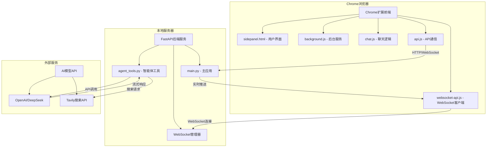

# Chrome Plus V2.0 开发设计文档

## 📋 文档信息

| 项目名称 | Chrome Plus V2.0 |
|---------|------------------|
| 版本 | 2.0.0 |
| 文档类型 | 开发设计文档 |
| 目标受众 | 开发人员、架构师、技术负责人 |
| 最后更新 | 2024-12 |

## 📖 目录

1. [项目概述](#1-项目概述)
2. [系统架构设计](#2-系统架构设计)
3. [核心模块详解](#3-核心模块详解)
4. [API接口文档](#4-api接口文档)
5. [开发环境搭建](#5-开发环境搭建)
6. [代码结构说明](#6-代码结构说明)
7. [测试策略](#7-测试策略)
8. [部署指南](#8-部署指南)
9. [二次开发指南](#9-二次开发指南)
10. [故障排除](#10-故障排除)

---

## 1. 项目概述

### 1.1 项目简介

Chrome Plus V2.0是一款现代化的智能AI助手Chrome扩展，基于Chrome Manifest V3标准开发，集成了文件操作工具、网络搜索和实时通信功能。项目采用前后端分离架构，支持WebSocket实时通信和智能体工具调用。

### 1.2 核心特性

#### 🚀 **实时通信体验**
- **WebSocket实时通信**: 双向实时消息传输，支持流式响应
- **智能降级机制**: WebSocket不可用时自动切换到HTTP模式
- **连接状态监控**: 实时显示连接状态和通信模式
- **自动重连**: 网络中断时自动重新连接

#### 🤖 **强大的AI功能**
- **多模型支持**: 支持DeepSeek、OpenAI等多种AI模型
- **智能体架构**: 集成文件操作、网络搜索等工具
- **流式响应**: 实时显示AI生成过程，提升交互体验
- **上下文理解**: 支持连续对话和复杂任务处理

#### 🛠️ **丰富的工具集**
- **文件操作**: 安全沙箱环境中的文件管理
- **网络搜索**: 集成Tavily搜索API
- **代码高亮**: 多种编程语言语法高亮显示
- **Markdown渲染**: 完整支持Markdown格式显示

#### 🎨 **优秀的用户体验**
- **侧边栏设计**: 不干扰正常浏览，随时可用
- **响应式界面**: 适配不同屏幕尺寸
- **主题支持**: 支持明暗主题切换
- **一键复制**: 支持消息内容快速复制

### 1.3 技术栈

#### 前端技术栈
- **Chrome Extension API**: Manifest V3标准，支持侧边栏和后台服务
- **JavaScript ES6+**: 现代语法，支持异步处理和模块化
- **WebSocket Client**: 实时通信客户端，支持自动重连
- **CSS3**: 响应式设计，支持主题切换
- **marked.js**: Markdown渲染库，支持代码块和表格
- **highlight.js**: 代码语法高亮，支持多种编程语言

#### 后端技术栈
- **FastAPI**: 现代Python Web框架，支持WebSocket和异步处理
- **智能体架构**: 基于工具调用的AI助手系统
- **Uvicorn**: 高性能ASGI服务器
- **Pydantic**: 数据验证和序列化
- **Python 3.10+**: 现代Python特性支持

#### 开发工具栈
- **uv**: 现代Python包管理器，快速依赖解析
- **Docker**: 容器化部署，环境一致性保证
- **pytest**: 单元测试框架
- **Git**: 版本控制系统
- **Chrome DevTools**: 扩展调试工具

---

## 2. 系统架构设计

### 2.1 整体架构

Chrome Plus V2.0采用前后端分离的架构设计，支持WebSocket实时通信和智能体工具调用。



### 2.2 数据流设计

#### 基本通信流程
1. **用户输入** → Chrome扩展接收用户消息
2. **连接建立** → WebSocket/HTTP连接到FastAPI服务
3. **消息处理** → 智能体工具处理用户请求
4. **AI调用** → 调用外部AI模型API
5. **结果返回** → 实时推送处理结果到前端
6. **界面更新** → 实时显示AI响应内容

#### WebSocket通信协议
```json
{
  "type": "message|result|error|status",
  "data": {
    "message": "用户消息内容",
    "response": "AI响应内容",
    "channel_id": "通信频道ID"
  },
  "timestamp": "2024-12-01T10:00:00Z"
}
```

### 2.3 架构特点

#### 设计原则
- **简洁高效**: 避免过度设计，专注核心功能
- **实时响应**: WebSocket支持流式AI响应
- **工具集成**: 智能体架构支持多种工具调用
- **易于部署**: 支持Docker容器化和本地开发

#### 技术优势
- **实时通信**: WebSocket双向通信，支持流式响应
- **智能降级**: WebSocket不可用时自动切换HTTP模式
- **工具扩展**: 基于智能体架构，易于添加新工具
- **开发友好**: 支持热重载和快速调试

---

## 3. 核心模块详解

### 3.1 Chrome扩展前端模块

#### 3.1.1 Manifest配置 (manifest.json)

扩展配置文件定义了Chrome Plus V2.0的基本信息、权限和入口点。

<augment_code_snippet path="manifest.json" mode="EXCERPT">
```json
{
  "manifest_version": 3,
  "name": "Chrome Plus V2.0",
  "version": "2.0.0",
  "description": "Chrome Plus V2.0 - 智能AI助手扩展",
  "permissions": ["sidePanel", "storage", "activeTab"],
  "host_permissions": [
    "http://localhost:5001/*",
    "ws://localhost:5001/*",
    "https://api.openai.com/*",
    "https://api.deepseek.com/*"
  ],
  "side_panel": {
    "default_path": "sidepanel.html"
  },
  "background": {
    "service_worker": "background.js"
  }
}
```
</augment_code_snippet>

**关键配置说明：**
- `manifest_version: 3`: 使用最新的Manifest V3标准
- `sidePanel`: 启用侧边栏功能
- `host_permissions`: 允许访问本地服务器和AI API
- `content_security_policy`: 配置WebSocket连接安全策略

#### 3.1.2 后台服务 (background.js)

后台服务脚本负责扩展的生命周期管理和侧边栏控制。

<augment_code_snippet path="background.js" mode="EXCERPT">
```javascript
chrome.runtime.onInstalled.addListener(() => {
  chrome.sidePanel.setPanelBehavior({ openPanelOnActionClick: true })
    .catch((error) => console.error("Error setting panel behavior:", error));
});
```
</augment_code_snippet>

**主要功能：**
- 扩展安装时自动配置侧边栏行为
- 处理扩展图标点击事件
- 管理扩展的全局状态

#### 3.1.3 WebSocket客户端 (websocket-api.js)

WebSocket客户端提供实时通信功能，支持自动重连和降级处理。

<augment_code_snippet path="websocket-api.js" mode="EXCERPT">
```javascript
class WebSocketAPIClient {
    constructor() {
        this.ws = null;
        this.isConnected = false;
        this.channelId = null;
        this.reconnectAttempts = 0;
        this.maxReconnectAttempts = 5;
    }

    async connect() {
        const wsUrl = 'ws://localhost:5001/ws';
        this.ws = new WebSocket(wsUrl);
        // 连接处理逻辑
    }
}
```
</augment_code_snippet>

**核心特性：**
- 自动重连机制
- 连接状态管理
- 消息队列处理
- 错误处理和降级

#### 3.1.4 聊天界面 (chat.js)

聊天界面管理用户交互、消息显示和状态更新。

**主要功能：**
- 实时消息显示和滚动
- Markdown渲染和代码高亮
- 连接状态指示器
- 消息复制功能
  - 代码高亮
  - 连接状态指示
  - 自动重连机制

### 3.2 FastAPI后端服务

#### 3.2.1 应用配置 (main.py)

FastAPI应用提供HTTP和WebSocket API，支持智能体工具调用。

<augment_code_snippet path="server/main.py" mode="EXCERPT">
```python
app = FastAPI(
    title="Chrome Plus V2.0 API",
    description="AI助手API，支持WebSocket实时通信和智能体工具",
    version="2.0.0"
)

# CORS配置
app.add_middleware(
    CORSMiddleware,
    allow_origins=["chrome-extension://*", "http://localhost:*"],
    allow_credentials=True,
    allow_methods=["*"],
    allow_headers=["*"],
)
```
</augment_code_snippet>

#### 3.2.2 WebSocket连接管理

WebSocket管理器负责维护客户端连接和消息分发。

<augment_code_snippet path="server/main.py" mode="EXCERPT">
```python
class ConnectionManager:
    def __init__(self):
        self.active_connections: Dict[str, WebSocket] = {}

    async def connect(self, websocket: WebSocket) -> str:
        await websocket.accept()
        channel_id = str(uuid.uuid4())
        self.active_connections[channel_id] = websocket
        return channel_id

    async def send_personal_message(self, message: dict, channel_id: str):
        if channel_id in self.active_connections:
            await self.active_connections[channel_id].send_json(message)
```
</augment_code_snippet>

#### 3.2.3 API端点设计

**主要端点：**
- `GET /`: 服务状态页面
- `POST /chat`: HTTP聊天接口（兼容模式）
- `WebSocket /ws`: WebSocket实时通信
- `GET /health`: 健康检查接口

**文件操作端点：**
- `GET /files`: 列出文件
- `POST /files`: 创建文件
- `PUT /files/{filename}`: 更新文件
- `DELETE /files/{filename}`: 删除文件

### 3.3 智能体工具模块

#### 3.3.1 智能体架构 (agent_tools.py)

智能体工具模块提供文件操作、网络搜索等功能。

<augment_code_snippet path="server/agent_tools.py" mode="EXCERPT">
```python
def create_intelligent_agent(proxy_config=None):
    """创建智能体实例"""
    agent = Agent(
        model=get_model(),
        tools=[
            list_files, read_file, write_file, delete_file,
            create_directory, search_web
        ],
        system_prompt="""你是一个智能助手，可以帮助用户进行文件操作和信息搜索。"""
    )
    return agent
```
</augment_code_snippet>

#### 3.3.2 文件操作工具

提供安全的文件系统操作功能。

**主要工具：**
- `list_files()`: 列出目录文件
- `read_file(filename)`: 读取文件内容
- `write_file(filename, content)`: 写入文件
- `delete_file(filename)`: 删除文件
- `create_directory(dirname)`: 创建目录

#### 3.3.3 网络搜索工具

集成Tavily搜索API，提供实时网络搜索功能。

<augment_code_snippet path="server/agent_tools.py" mode="EXCERPT">
```python
def search_web(query: str) -> str:
    """使用Tavily API搜索网络信息"""
    try:
        client = TavilyClient(api_key=TAVILY_API_KEY)
        response = client.search(query=query, max_results=5)
        return format_search_results(response)
    except Exception as e:
        return f"搜索失败: {str(e)}"
```
</augment_code_snippet>
---

## 4. API接口文档

### 4.1 HTTP API接口

#### 4.1.1 聊天接口

**POST /chat**

发送聊天消息并获取AI响应。

**请求格式：**
```json
{
  "message": "用户消息内容",
  "api_config": {
    "api_key": "your-api-key",
    "model": "deepseek-chat",
    "base_url": "https://api.deepseek.com"
  },
  "proxy_config": {
    "http_proxy": "http://proxy:port",
    "https_proxy": "https://proxy:port"
  }
}
```

**响应格式：**
```json
{
  "response": "AI响应内容",
  "success": true,
  "timestamp": "2024-12-01T10:00:00Z"
}
```

#### 4.1.2 健康检查接口

**GET /health**

检查服务运行状态。

**响应格式：**
```json
{
  "status": "healthy",
  "version": "2.0.0",
  "timestamp": "2024-12-01T10:00:00Z"
}
```

### 4.2 WebSocket API接口

#### 4.2.1 连接建立

**WebSocket /ws**

建立WebSocket连接进行实时通信。

**连接流程：**
1. 客户端连接到 `ws://localhost:5001/ws`
2. 服务器返回唯一的 `channel_id`
3. 客户端使用 `channel_id` 进行后续通信

#### 4.2.2 消息格式

**发送消息：**
```json
{
  "type": "chat",
  "data": {
    "message": "用户消息内容",
    "user_id": "chrome_extension_user",
    "api_config": {
      "api_key": "your-api-key",
      "model": "deepseek-chat"
    }
  }
}
```

**接收消息：**
```json
{
  "type": "result",
  "data": {
    "response": "AI响应内容",
    "success": true
  },
  "timestamp": "2024-12-01T10:00:00Z"
}
```

### 4.3 文件操作API

#### 4.3.1 文件列表

**GET /files**

获取沙箱目录中的文件列表。

**响应格式：**
```json
{
  "files": [
    {
      "name": "example.txt",
      "size": 1024,
      "modified": "2024-12-01T10:00:00Z",
      "type": "file"
    }
  ]
}
```

#### 4.3.2 文件操作

**POST /files** - 创建文件
**PUT /files/{filename}** - 更新文件
**DELETE /files/{filename}** - 删除文件

**请求格式（创建/更新）：**
```json
{
  "content": "文件内容",
  "encoding": "utf-8"
}
```

---

## 5. 开发环境搭建

### 5.1 前置要求

#### 5.1.1 系统要求
- **操作系统**: Windows 10+, macOS 10.15+, Ubuntu 18.04+
- **Python**: 3.10 或更高版本
- **Chrome浏览器**: 88+ (支持Manifest V3)
- **Docker**: 可选，用于容器化部署

#### 5.1.2 开发工具
- **代码编辑器**: VS Code (推荐) 或其他支持JavaScript/Python的编辑器
- **Git**: 版本控制工具
- **uv**: Python包管理器 (推荐)

### 5.2 快速开始

#### 5.2.1 克隆项目
```bash
git clone <repository-url>
cd chrome_plus
```

#### 5.2.2 安装Python依赖
```bash
# 使用uv (推荐)
cd server
uv sync

# 或使用pip
pip install -r requirements.txt
```

#### 5.2.3 配置环境变量
创建 `server/.env` 文件：
```env
# AI API配置
OPENAI_API_KEY=your-openai-api-key
DEEPSEEK_API_KEY=your-deepseek-api-key

# 搜索API配置
TAVILY_API_KEY=your-tavily-api-key

# 服务配置
ENVIRONMENT=development
LOG_LEVEL=INFO
```

#### 5.2.4 启动后端服务
```bash
# 开发模式启动
cd server
python main.py

# 或使用uvicorn
uvicorn main:app --host 127.0.0.1 --port 5001 --reload
```

#### 5.2.5 安装Chrome扩展
1. 打开Chrome浏览器
2. 访问 `chrome://extensions/`
3. 开启"开发者模式"
4. 点击"加载已解压的扩展程序"
5. 选择项目根目录

---

## 6. 代码结构说明

### 6.1 项目目录结构

```
chrome_plus/
├── 📄 manifest.json              # Chrome扩展配置文件
├── 🎨 sidepanel.html             # 侧边栏主界面
├── 💅 sidepanel.css              # 界面样式文件
├── ⚙️ background.js              # 后台服务脚本
├── 💬 chat.js                    # 聊天界面逻辑
├── 🔌 api.js                     # HTTP API通信
├── 🌐 websocket-api.js           # WebSocket客户端
├── 🖼️ images/                    # 扩展图标资源
│   ├── icon-16.png               # 16x16 图标
│   ├── icon-48.png               # 48x48 图标
│   ├── icon-128.png              # 128x128 图标
│   └── icon.jpg                  # 原始图标
├── 📚 lib/                       # 第三方库文件
│   ├── marked/                   # Markdown渲染库
│   └── highlight/                # 代码语法高亮库
├── 🚀 scripts/                   # 构建和开发脚本
│   ├── build-extension.sh        # 扩展打包脚本
│   ├── dev-setup.sh              # 开发环境设置
│   └── docker-dev.sh             # Docker开发脚本
├── 📚 docs/                      # 项目文档目录
│   ├── COMPREHENSIVE_TECHNICAL_DESIGN.md  # 开发设计文档
│   ├── USER_MANUAL.md            # 用户使用手册
│   ├── DEVELOPMENT_GUIDE.md      # 开发指南
│   └── DEPLOYMENT_GUIDE.md       # 部署指南
├── 🧪 测试文件                    # 各种测试脚本
│   ├── quick_test.py             # 快速验证脚本
│   ├── test_chrome_plus_v2.py    # 综合测试
│   ├── test_chrome_extension.py  # 扩展测试
│   └── test_integration.py       # 集成测试
├── 🐳 docker-compose.yml         # Docker服务编排
├── 🚀 start-v2.sh                # V2.0快速启动脚本
└── 🖥️ server/                    # 后端服务目录
    ├── main.py                   # FastAPI主应用
    ├── agent_tools.py            # 智能体工具模块
    ├── config.py                 # 配置管理
    ├── tasks.py                  # 任务处理模块
    ├── pyproject.toml            # uv项目配置
    ├── requirements.txt          # Python依赖列表
    ├── uv.lock                   # uv锁定文件
    ├── Dockerfile                # 容器构建配置
    ├── test/                     # 文件操作沙箱
    └── __pycache__/              # Python缓存目录
```

### 6.2 核心文件说明

#### 6.2.1 前端核心文件
- **manifest.json**: 扩展配置，定义权限和入口点
- **sidepanel.html**: 侧边栏界面，包含聊天窗口和设置
- **chat.js**: 聊天逻辑，处理用户交互和消息显示
- **api.js**: API通信层，支持HTTP和WebSocket
- **websocket-api.js**: WebSocket客户端，实现实时通信

#### 6.2.2 后端核心文件
- **main.py**: FastAPI应用主入口，定义路由和WebSocket处理
- **agent_tools.py**: 智能体工具模块，提供文件操作和搜索功能
- **config.py**: 配置管理，处理环境变量和设置

---

## 7. 测试策略

### 7.1 测试类型

#### 7.1.1 单元测试
- **前端测试**: JavaScript函数和组件测试
- **后端测试**: Python函数和API端点测试
- **工具测试**: 智能体工具功能测试

#### 7.1.2 集成测试
- **API集成测试**: HTTP和WebSocket接口测试
- **扩展集成测试**: Chrome扩展与后端服务集成
- **端到端测试**: 完整用户流程测试

### 7.2 测试工具

#### 7.2.1 后端测试
```bash
# 运行所有测试
cd server
python -m pytest

# 运行特定测试
python test_fastapi.py
python test_manual.py
```

#### 7.2.2 扩展测试
```bash
# Chrome扩展测试
python test_chrome_extension.py

# 集成测试
python test_integration.py
```

### 7.3 测试覆盖

#### 7.3.1 关键测试场景
- WebSocket连接建立和断开
- 消息发送和接收
- 文件操作功能
- 错误处理和降级
- API配置和代理设置

---

## 8. 部署指南

### 8.1 开发环境部署

#### 8.1.1 本地开发
```bash
# 1. 启动后端服务
cd server
python main.py

# 2. 安装Chrome扩展
# 在Chrome中加载项目根目录
```

#### 8.1.2 Docker开发
```bash
# 使用Docker Compose
docker-compose up -d

# 查看服务状态
docker-compose ps
```

### 8.2 生产环境部署

#### 8.2.1 服务器部署
```bash
# 1. 安装依赖
cd server
uv sync --frozen

# 2. 配置环境变量
cp .env.example .env
# 编辑.env文件

# 3. 启动服务
uvicorn main:app --host 0.0.0.0 --port 5001
```

#### 8.2.2 容器化部署
```bash
# 构建镜像
docker build -t chrome-plus-v2 ./server

# 运行容器
docker run -d -p 5001:5001 \
  -e OPENAI_API_KEY=your-key \
  chrome-plus-v2
```
    <meta charset="utf-8">
    <title>Chrome Plus V2.0</title>
    <link rel="stylesheet" href="sidepanel.css">
    <link rel="stylesheet" href="lib/highlight/styles/default.css">
</head>
<body>
    <div id="app">
        <div id="header">
            <h1>Chrome Plus V2.0</h1>
            <div id="connection-status">
                <span id="status-indicator">●</span>
                <span id="status-text">连接中...</span>
            </div>
        </div>
        <div id="chat-container">
            <div id="messages"></div>
        </div>
        <div id="input-container">
            <textarea id="message-input" placeholder="输入消息..."></textarea>
            <button id="send-button">发送</button>
        </div>
    </div>

    <script src="lib/marked/marked.min.js"></script>
    <script src="lib/highlight/highlight.min.js"></script>
    <script src="websocket-api.js"></script>
    <script src="api.js"></script>
    <script src="chat.js"></script>
</body>
</html>
```

---

## 9. 二次开发指南

### 9.1 添加新的AI模型

#### 9.1.1 配置新模型
在 `server/config.py` 中添加新的模型配置：

```python
# 添加新的AI模型配置
SUPPORTED_MODELS = {
    "deepseek-chat": {
        "base_url": "https://api.deepseek.com",
        "model_name": "deepseek-chat"
    },
    "new-model": {
        "base_url": "https://api.newmodel.com",
        "model_name": "new-model-name"
    }
}
```

#### 9.1.2 更新前端配置
在 `chat.js` 中添加新模型选项：

```javascript
const modelOptions = [
    { value: 'deepseek-chat', label: 'DeepSeek Chat' },
    { value: 'new-model', label: 'New Model' }
];
```

### 9.2 添加新的智能体工具

#### 9.2.1 创建工具函数
在 `server/agent_tools.py` 中添加新工具：

```python
def new_tool_function(param: str) -> str:
    """新工具功能描述"""
    try:
        # 工具实现逻辑
        result = process_param(param)
        return f"处理结果: {result}"
    except Exception as e:
        return f"工具执行失败: {str(e)}"
```

#### 9.2.2 注册工具到智能体
```python
def create_intelligent_agent(proxy_config=None):
    agent = Agent(
        model=get_model(),
        tools=[
            # 现有工具
            list_files, read_file, write_file,
            # 新添加的工具
            new_tool_function
        ],
        system_prompt="""更新的系统提示词"""
    )
    return agent
```

### 9.3 扩展前端功能

#### 9.3.1 添加新的UI组件
在 `sidepanel.html` 中添加新元素：

```html
<div id="new-feature-container">
    <button id="new-feature-button">新功能</button>
</div>
```

#### 9.3.2 添加事件处理
在 `chat.js` 中添加事件监听：

```javascript
document.getElementById('new-feature-button').addEventListener('click', () => {
    // 新功能处理逻辑
    handleNewFeature();
});
```

### 9.4 自定义配置

#### 9.4.1 环境变量配置
在 `server/.env` 中添加新配置：

```env
# 新功能配置
NEW_FEATURE_ENABLED=true
NEW_FEATURE_API_KEY=your-api-key
```

#### 9.4.2 代码中使用配置
```python
import os
from config import get_env_var

NEW_FEATURE_ENABLED = get_env_var('NEW_FEATURE_ENABLED', 'false').lower() == 'true'
```

---

## 10. 故障排除

### 10.1 常见问题

#### 10.1.1 WebSocket连接失败
**问题**: 前端无法建立WebSocket连接

**解决方案**:
1. 检查后端服务是否正常运行
2. 确认端口5001未被占用
3. 检查防火墙设置
4. 查看浏览器控制台错误信息

```bash
# 检查端口占用
lsof -i :5001

# 重启后端服务
cd server
python main.py
```

#### 10.1.2 AI API调用失败
**问题**: AI模型无法正常响应

**解决方案**:
1. 检查API密钥配置
2. 确认网络连接正常
3. 检查代理设置
4. 查看后端日志

```bash
# 检查环境变量
echo $OPENAI_API_KEY
echo $DEEPSEEK_API_KEY

# 测试API连接
curl -H "Authorization: Bearer $OPENAI_API_KEY" \
     https://api.openai.com/v1/models
```

#### 10.1.3 文件操作权限错误
**问题**: 无法创建或修改文件

**解决方案**:
1. 检查沙箱目录权限
2. 确认文件路径正确
3. 检查磁盘空间

```bash
# 检查目录权限
ls -la server/test/

# 修复权限
chmod 755 server/test/
```

### 10.2 调试技巧

#### 10.2.1 前端调试
1. 打开Chrome开发者工具
2. 查看Console面板的错误信息
3. 使用Network面板检查API请求
4. 在Sources面板设置断点

#### 10.2.2 后端调试
1. 查看服务器日志输出
2. 使用Python调试器
3. 添加日志记录

```python
import logging
logging.basicConfig(level=logging.DEBUG)
logger = logging.getLogger(__name__)

# 添加调试日志
logger.debug(f"处理消息: {message}")
```

### 10.3 性能优化

#### 10.3.1 前端优化
- 减少不必要的DOM操作
- 使用防抖处理用户输入
- 优化WebSocket消息处理

#### 10.3.2 后端优化
- 使用异步处理提升并发性能
- 添加请求缓存机制
- 优化AI API调用频率

---

## 总结

Chrome Plus V2.0是一个现代化的智能AI助手Chrome扩展，采用前后端分离架构，支持WebSocket实时通信和智能体工具调用。项目具有以下特点：

### 技术亮点
- **实时通信**: WebSocket双向通信，支持流式AI响应
- **智能体架构**: 集成文件操作、网络搜索等多种工具
- **开发友好**: 支持热重载、容器化部署和快速调试
- **扩展性强**: 模块化设计，易于添加新功能和工具

### 开发优势
- **标准化**: 遵循Chrome Manifest V3和现代Web开发规范
- **可测试**: 完整的测试策略和工具链
- **可维护**: 清晰的代码结构和详细的文档
- **可扩展**: 基于智能体架构，支持功能扩展

本文档为开发人员提供了完整的技术参考，包括架构设计、模块详解、开发指南、测试策略和部署方案，是进行二次开发和维护的重要参考资料。
