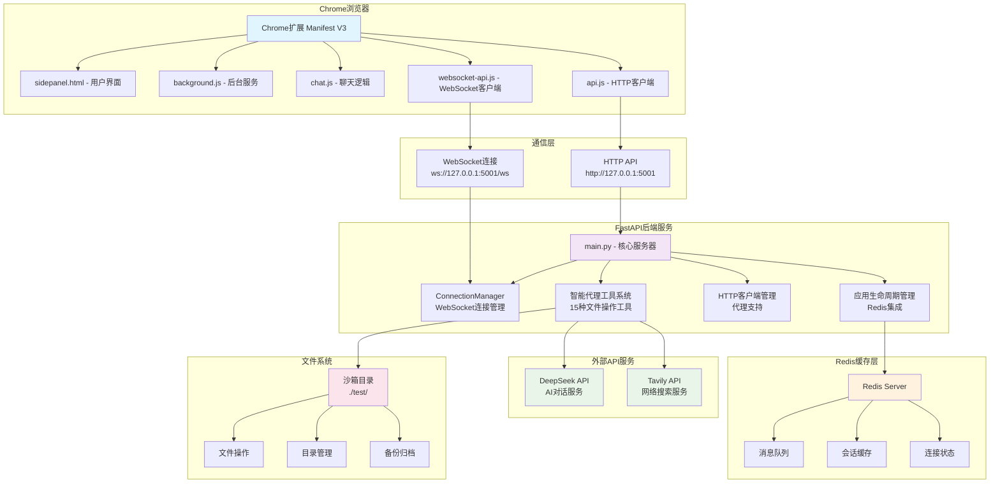
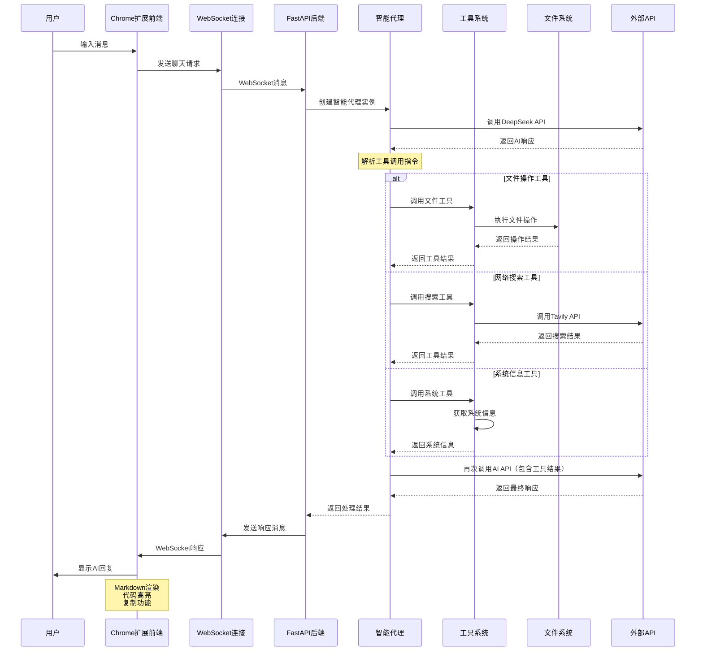

# Chrome Plus V2.0 开发设计文档

## 📋 文档信息

| 项目名称 | Chrome Plus V2.1.1 |
|---------|------------------|
| 版本 | 2.1.1 |
| 文档类型 | 开发设计文档 |
| 目标受众 | 开发人员、架构师、测试人员 |
| 最后更新 | 2025-01-04 |
| 用途 | 测试调试、二次开发、架构理解 |

## 🎯 文档目的

本文档为Chrome Plus V2.1.1项目的核心开发设计文档，提供：
- **系统架构设计**：完整的技术架构和组件关系
- **代码结构分析**：模块划分和实现细节
- **API接口规范**：HTTP和WebSocket接口文档
- **测试调试指南**：测试策略和调试方法
- **二次开发指南**：扩展开发和自定义方法

## 📖 目录

1. [系统架构设计](#1-系统架构设计)
2. [核心模块分析](#2-核心模块分析)
3. [API接口规范](#3-api接口规范)
4. [数据模型设计](#4-数据模型设计)
5. [安全性设计](#5-安全性设计)
6. [性能优化策略](#6-性能优化策略)
7. [测试调试指南](#7-测试调试指南)
8. [二次开发指南](#8-二次开发指南)
9. [部署运维指南](#9-部署运维指南)
10. [故障排除手册](#10-故障排除手册)

---

## 1. 系统架构设计

### 1.1 整体架构

Chrome Plus V2.1.1采用**前后端分离**的微服务架构，支持实时通信和智能体工具调用。

#### 系统架构图



### 1.2 技术栈

#### 前端技术栈
- **Chrome Extension API**: Manifest V3标准
- **JavaScript ES6+**: 现代语法，模块化设计
- **WebSocket Client**: 实时通信，自动重连
- **marked.js**: Markdown渲染
- **highlight.js**: 代码语法高亮

#### 后端技术栈
- **FastAPI**: 现代Python Web框架
- **Uvicorn**: ASGI服务器
- **httpx**: 异步HTTP客户端
- **Pydantic**: 数据验证和序列化
- **Redis**: 缓存和消息队列（可选）

#### 开发工具
- **uv**: Python包管理器（推荐）
- **Docker**: 容器化部署
- **Docker Compose**: 服务编排
- **pytest**: 测试框架
- **Redis**: 消息队列和缓存
- **Celery**: 异步任务处理（可选）
- **Flower**: Celery任务监控（可选）

### 1.3 通信架构

#### 双模式通信设计
```python
# WebSocket实时通信（优先）
ws://127.0.0.1:5001/ws

# HTTP API降级模式
POST http://127.0.0.1:5001/chat
```

**通信流程**：
1. 前端优先尝试WebSocket连接
2. 连接失败时自动降级到HTTP模式
3. 支持消息广播和个人消息
4. 自动重连和错误恢复

---

## 2. 核心模块分析

### 2.1 server/main.py - 核心服务器

**文件结构**：
```python
# 导入和配置 (1-83行)
├── 环境变量配置
├── 日志配置
├── Redis和AI API配置
└── 全局变量初始化

# WebSocket连接管理 (86-183行)
├── ConnectionManager类
├── Redis监听器
└── 应用生命周期管理

# 数据模型 (240-400行)
├── ProxyConfig (代理配置)
├── ChatRequest/Response (聊天请求响应)
└── WebSocket消息模型

# HTTP客户端管理 (298-367行)
├── 代理URL构建
├── 异步/同步客户端创建
└── 代理连接测试

# 智能体工具系统 (441-876行)
├── 文件操作工具 (15种)
├── 系统信息工具
├── 网络搜索工具
└── 工具调用处理

# API集成 (877-1036行)
├── DeepSeek API调用
├── 工具调用处理
└── 智能体运行逻辑

# FastAPI路由 (1041-1163行)
├── 健康检查端点
├── WebSocket端点
├── HTTP聊天端点
└── 代理测试端点
```

### 2.2 智能体工具系统

**工具分类**：

#### 文件操作工具
```python
# 基础文件操作
read_file(name: str) -> str                    # 读取文件
write_file(name: str, content: str) -> str     # 写入文件
delete_file(name: str) -> str                  # 删除文件
rename_file(name: str, new_name: str) -> str   # 重命名

# 目录操作
list_files(path: str = ".") -> list[str]       # 列出目录
create_directory(name: str) -> str             # 创建目录
pwd() -> str                                   # 当前目录

# 高级操作
diff_files(f1: str, f2: str) -> str           # 文件比较
find_files(pattern: str) -> str               # 文件搜索
tree(path: str = ".") -> str                  # 目录树
replace_in_file(name: str, regex: str) -> str # 正则替换

# 归档操作
archive_files(archive_name: str) -> str       # 创建压缩包
extract_archive(archive_name: str) -> str     # 解压文件
backup_file(name: str) -> str                 # 备份文件
```

#### 系统信息工具
```python
get_system_info() -> str                      # 系统信息
```

#### 网络搜索工具
```python
tavily_search_tool(query: str) -> str         # 网络搜索
```

**安全设计**：
- 所有文件操作限制在 `./test/` 沙箱目录
- 路径遍历攻击防护
- 文件类型和存在性验证

### 2.3 WebSocket连接管理

**ConnectionManager类设计**：
```python
class ConnectionManager:
    def __init__(self):
        self.active_connections: Dict[str, WebSocket] = {}
        self.user_channels: Dict[str, str] = {}
    
    async def connect(self, websocket: WebSocket, user_id: Optional[str] = None) -> str:
        # 建立连接，分配频道ID
    
    def disconnect(self, channel_id: str):
        # 断开连接，清理资源
    
    async def send_personal_message(self, message: dict, channel_id: str):
        # 发送个人消息
    
    async def broadcast(self, message: dict):
        # 广播消息到所有连接
```

**特性**：
- 多用户并发连接支持
- 频道隔离和用户映射
- 自动断线检测和清理
- 消息广播和个人消息

#### 智能代理工具调用流程图



### 2.4 HTTP客户端管理

**设计原则**：
```python
# ✅ 正确的客户端管理
for attempt in range(max_retries):
    try:
        # 每次重试创建新的客户端实例
        client = create_sync_http_client_with_proxy(proxy_obj)
        
        with client:
            response = client.post(endpoint, headers=headers, json=data)
            return process_response(response)
    except Exception as e:
        handle_error(e, attempt)
```

**关键改进**：
- 每次重试创建新客户端实例
- 正确使用上下文管理器
- 分类错误处理和重试策略
- SSL连接问题的特殊处理

---

## 3. API接口规范

### 3.1 HTTP API

#### 健康检查
```http
GET /health

Response:
{
  "status": "healthy",
  "version": "2.1.1",
  "features": {
    "redis": "connected|disabled|error",
    "intelligent_agent": "enabled",
    "file_operations": "enabled",
    "network_search": "enabled|disabled",
    "ai_api": "enabled|disabled"
  },
  "websocket_connections": 2
}
```

#### 聊天接口
```http
POST /chat

Request:
{
  "message": "用户消息",
  "proxy_config": {
    "enabled": false,
    "type": "http",
    "host": "proxy.example.com",
    "port": 8080,
    "auth": {
      "username": "user",
      "password": "pass"
    }
  }
}

Response:
{
  "response": "AI回复内容"
}
```

#### 代理测试
```http
POST /test-proxy

Request:
{
  "proxy_config": { /* 代理配置 */ }
}

Response:
{
  "success": true,
  "message": "代理配置测试成功",
  "test_url": "https://httpbin.org/ip",
  "response_time": 1.23
}
```

### 3.2 WebSocket API

#### 连接建立
```javascript
const ws = new WebSocket('ws://127.0.0.1:5001/ws');
```

#### 消息格式
```json
// 发送消息
{
  "type": "chat",
  "message": "用户消息",
  "user_id": "optional_user_id",
  "proxy_config": { /* 代理配置 */ }
}

// 接收消息
{
  "type": "ai_response|system|error",
  "content": "消息内容",
  "channel_id": "channel_123",
  "timestamp": "2025-01-03T10:30:00Z"
}
```

---

## 4. 数据模型设计

### 4.1 Pydantic模型

#### 代理配置模型
```python
class ProxyAuth(BaseModel):
    username: str
    password: str

class ProxyConfig(BaseModel):
    enabled: bool = False
    type: str = "http"  # http, https, socks5
    host: str = ""
    port: int = 8080
    auth: Optional[ProxyAuth] = None
```

#### 聊天请求响应模型
```python
class ChatRequest(BaseModel):
    message: str
    proxy_config: Optional[ProxyConfig] = None

class ChatResponse(BaseModel):
    response: str
```

#### WebSocket消息模型
```python
class WebSocketMessage(BaseModel):
    type: str
    data: Dict[str, Any]
    timestamp: Optional[str] = None
    channel_id: Optional[str] = None

class ChatWebSocketRequest(BaseModel):
    message: str
    user_id: Optional[str] = None
    proxy_config: Optional[ProxyConfig] = None
    api_config: Optional[Dict[str, Any]] = None
```

### 4.2 数据流设计

```
用户输入 → 前端验证 → API请求 → 后端验证 → 智能体处理 → 工具调用 → API响应 → 前端渲染
```

---

## 5. 安全性设计

### 5.1 文件操作安全

**沙箱限制**：
```python
# 全局基础目录
base_dir = Path(__file__).parent.resolve() / "test"

def _validate_path(path: Path, check_existence: bool = False, 
                  expect_file: bool = False, expect_dir: bool = False) -> Tuple[bool, str]:
    """验证路径安全性"""
    try:
        resolved_path = path.resolve()
        base_resolved = base_dir.resolve()
        
        # 检查路径是否在基础目录内
        if not str(resolved_path).startswith(str(base_resolved)):
            return False, f"路径 '{path}' 超出了允许的操作范围"
        
        # 其他验证逻辑...
        return True, ""
    except Exception as e:
        return False, f"路径验证失败: {e}"
```

**安全特性**：
- 路径遍历攻击防护
- 文件类型验证
- 操作权限检查
- 错误信息过滤

### 5.2 API安全

**CORS配置**：
```python
app.add_middleware(
    CORSMiddleware,
    allow_origins=["chrome-extension://*", "http://localhost:*", "http://127.0.0.1:*"],
    allow_credentials=True,
    allow_methods=["*"],
    allow_headers=["*"],
)
```

**API密钥管理**：
- 环境变量存储
- 运行时检查和警告
- 测试模式降级

### 5.3 输入验证

**Pydantic验证**：
- 自动类型检查
- 字段验证规则
- 错误信息标准化

---

## 6. 性能优化策略

### 6.1 连接池优化

```python
def create_sync_http_client_with_proxy(proxy_config: Optional[ProxyConfig] = None) -> httpx.Client:
    client_kwargs = {
        'timeout': httpx.Timeout(30.0, connect=10.0),
        'limits': httpx.Limits(max_keepalive_connections=5, max_connections=10),
        'follow_redirects': True,
    }
    # 配置代理和返回客户端
```

### 6.2 重试策略

**指数退避重试**：
```python
max_retries = 3
for attempt in range(max_retries):
    try:
        # API调用逻辑
        return result
    except httpx.ConnectError as e:
        if "SSL" in str(e) or "EOF" in str(e):
            # SSL错误使用指数退避
            time.sleep(2 ** attempt)
        else:
            # 其他错误立即重试
            time.sleep(1)
```

### 6.3 缓存机制

**Redis缓存**（可选）：
- 连接池复用
- 消息队列缓存
- 会话状态存储

---

## 7. 测试调试指南

### 7.1 单元测试

**测试结构**：
```python
# 测试文件操作工具
def test_file_operations():
    # 测试读写文件
    result = write_file('test.txt', 'Hello World')
    assert '成功' in result
    
    content = read_file('test.txt')
    assert content == 'Hello World'

# 测试API调用
def test_deepseek_api():
    response = _call_deepseek_api('测试消息')
    assert isinstance(response, str)
    assert len(response) > 0
```

**运行测试**：
```bash
# 安装测试依赖
pip install pytest pytest-asyncio

# 运行测试
pytest server/tests/ -v

# 运行特定测试
pytest server/tests/test_tools.py::test_file_operations -v
```

### 7.2 API测试

**健康检查测试**：
```bash
curl http://127.0.0.1:5001/health
```

**聊天API测试**：
```bash
curl -X POST http://127.0.0.1:5001/chat \
  -H "Content-Type: application/json" \
  -d '{"message": "测试消息"}'
```

**WebSocket测试**：
```javascript
// 在浏览器控制台中测试
const ws = new WebSocket('ws://127.0.0.1:5001/ws');
ws.onopen = () => console.log('连接建立');
ws.onmessage = (event) => console.log('收到消息:', JSON.parse(event.data));
ws.send(JSON.stringify({type: 'chat', message: '测试'}));
```

### 7.3 调试技巧

**后端调试**：
```python
# 启用详细日志
logging.basicConfig(level=logging.DEBUG)

# 添加调试断点
import pdb; pdb.set_trace()

# 使用IDE调试器
# 在PyCharm或VSCode中设置断点
```

**前端调试**：
```javascript
// Chrome DevTools调试
console.log('[DEBUG] WebSocket状态:', ws.readyState);
console.log('[DEBUG] 消息历史:', chatManager.messageHistory);

// 网络面板查看API请求
// Console面板查看JavaScript错误
// Application面板查看扩展存储
```

**日志分析**：
```bash
# 查看实时日志
tail -f server/logs/app.log

# 过滤错误日志
grep "ERROR" server/logs/app.log

# 分析API调用
grep "API调用" server/logs/app.log
```

---

## 8. 二次开发指南

### 8.1 添加新工具

**步骤1：实现工具函数**
```python
def my_custom_tool(param1: str, param2: int = 10) -> str:
    """自定义工具函数"""
    print(f"(my_custom_tool '{param1}' {param2})")
    
    # 参数验证
    if not param1:
        return "错误：param1不能为空"
    
    # 实现工具逻辑
    try:
        result = f"处理结果: {param1} * {param2} = {param1 * param2}"
        return result
    except Exception as e:
        return f"工具执行失败: {e}"
```

**步骤2：注册工具**
```python
def create_intelligent_agent(proxy_config: Optional[Dict] = None):
    return {
        'tools': {
            # 现有工具...
            'my_custom_tool': my_custom_tool,  # 添加新工具
        },
        'system_prompt': BASE_SYSTEM_PROMPT
    }
```

**步骤3：更新系统提示**
```python
BASE_SYSTEM_PROMPT = f"""
可用工具:
- 自定义工具:
  `my_custom_tool(param1: str, param2: int = 10)`: 自定义工具说明。
"""
```

### 8.2 扩展API端点

**添加新端点**：
```python
@app.post("/api/custom")
async def custom_endpoint(request: CustomRequest):
    """自定义API端点"""
    try:
        # 处理逻辑
        result = process_custom_request(request)
        
        return {"success": True, "data": result}
    except Exception as e:
        logger.error(f"自定义端点错误: {e}")
        raise HTTPException(status_code=500, detail=str(e))

# 定义请求模型
class CustomRequest(BaseModel):
    param1: str
    param2: Optional[int] = None
```

### 8.3 前端功能扩展

**扩展聊天管理器**：
```javascript
class ChatManager {
    // 添加新的消息类型处理
    handleCustomMessage(message) {
        if (message.type === 'custom') {
            this.renderCustomComponent(message.data);
        }
    }
    
    // 添加新的UI组件
    renderCustomComponent(data) {
        const element = document.createElement('div');
        element.className = 'custom-component';
        element.innerHTML = `<p>自定义内容: ${data}</p>`;
        this.messagesContainer.appendChild(element);
    }
}
```

**扩展API客户端**：
```javascript
class APIClient {
    async customAPI(data) {
        return this.request('/api/custom', {
            method: 'POST',
            headers: {'Content-Type': 'application/json'},
            body: JSON.stringify(data)
        });
    }
}
```

### 8.4 配置扩展

**环境变量扩展**：
```python
# 在main.py中添加新的配置
CUSTOM_API_KEY = os.getenv('CUSTOM_API_KEY')
CUSTOM_ENDPOINT = os.getenv('CUSTOM_ENDPOINT', 'https://api.example.com')

# 在健康检查中报告状态
@app.get("/health")
async def health_check():
    return {
        "features": {
            # 现有特性...
            "custom_api": "enabled" if CUSTOM_API_KEY else "disabled"
        }
    }
```

---

## 9. 部署运维指南

### 9.1 开发环境

**本地开发启动**：
```bash
# 1. 安装依赖
cd server
uv venv
source .venv/bin/activate
uv pip install -r requirements.txt

# 2. 配置环境变量
cp .env.example .env
# 编辑.env文件

# 3. 启动开发服务器
python main.py
```

### 9.2 生产环境

**Docker部署**：
```bash
# 1. 构建镜像
docker-compose build

# 2. 启动服务
docker-compose up -d

# 3. 查看状态
docker-compose ps
docker-compose logs -f backend

# 4. 查看Celery任务监控（可选）
# 访问 http://localhost:5555
```

**Docker配置详解**：

项目使用Docker Compose进行服务编排，包含以下服务：

1. **backend**: FastAPI主服务
2. **redis**: 消息队列和缓存
3. **worker**: Celery异步任务处理器（可选）
4. **flower**: Celery监控界面（可选）

```yaml
# docker-compose.yml
services:
  # Redis - 消息总线和缓存
  redis:
    image: redis:7-alpine
    container_name: chrome_plus_redis
    ports:
      - "6379:6379"
    volumes:
      - redis_data:/data
    command: redis-server --appendonly yes
    healthcheck:
      test: ["CMD", "redis-cli", "ping"]
      interval: 10s
      timeout: 5s
      retries: 3

  # FastAPI 后端服务 - API网关
  backend:
    build:
      context: ./server
      dockerfile: Dockerfile
    platform: linux/amd64
    container_name: chrome_plus_backend
    ports:
      - "5001:5001"
    environment:
      - REDIS_URL=redis://redis:6379/0
      - CELERY_BROKER_URL=redis://redis:6379/0
      - CELERY_RESULT_BACKEND=redis://redis:6379/0
      - ENVIRONMENT=production
    env_file:
      - ./server/.env
    volumes:
      - ./server:/app
      - ./server/test:/app/test  # 沙箱目录
    depends_on:
      redis:
        condition: service_healthy

  # Celery Worker - 任务处理器（可选）
  worker:
    build:
      context: ./server
      dockerfile: Dockerfile
    container_name: chrome_plus_worker
    command: python -m celery -A tasks worker --loglevel=info --concurrency=4
    environment:
      - REDIS_URL=redis://redis:6379/0
      - CELERY_BROKER_URL=redis://redis:6379/0
      - CELERY_RESULT_BACKEND=redis://redis:6379/0
    depends_on:
      - redis
      - backend

  # Celery Flower - 任务监控（可选）
  flower:
    build:
      context: ./server
      dockerfile: Dockerfile
    container_name: chrome_plus_flower
    command: python -m celery -A tasks flower --port=5555
    ports:
      - "5555:5555"
    depends_on:
      - redis
      - worker

volumes:
  redis_data:
    driver: local

networks:
  chrome_plus_network:
    driver: bridge
```

### 9.3 监控和日志

**健康检查**：
```bash
# 定期检查服务状态
curl http://127.0.0.1:5001/health

# 监控脚本
#!/bin/bash
while true; do
  if ! curl -f http://127.0.0.1:5001/health > /dev/null 2>&1; then
    echo "服务异常，正在重启..."
    docker-compose restart backend
  fi
  sleep 60
done
```

**日志管理**：
```bash
# 查看实时日志
docker-compose logs -f backend

# 日志轮转配置
# 在docker-compose.yml中添加
logging:
  driver: "json-file"
  options:
    max-size: "10m"
    max-file: "3"
```

---

## 10. 故障排除手册

### 10.1 常见问题

**问题1：API调用失败**
```
症状：返回"API调用失败"错误
原因：SSL连接问题、API密钥错误、网络问题
解决：
1. 检查DEEPSEEK_API_KEY配置
2. 测试网络连接
3. 查看详细错误日志
4. 尝试重启服务
```

**问题2：WebSocket连接失败**
```
症状：前端显示"连接失败"
原因：服务器未启动、端口被占用、防火墙阻止
解决：
1. 确认服务器运行状态
2. 检查端口5001是否可用
3. 系统会自动降级到HTTP模式
```

**问题3：文件操作被拒绝**
```
症状：文件操作返回"路径超出范围"
原因：路径不在沙箱目录内
解决：
1. 确认操作路径在./test/目录下
2. 使用相对路径
3. 检查文件权限
```

### 10.2 调试流程

**步骤1：收集信息**
```bash
# 检查服务状态
curl http://127.0.0.1:5001/health

# 查看日志
tail -n 100 server/logs/app.log

# 检查进程
ps aux | grep python
```

**步骤2：定位问题**
```python
# 启用调试模式
DEBUG = True
logging.basicConfig(level=logging.DEBUG)

# 添加调试输出
logger.debug(f"处理消息: {message}")
logger.debug(f"API响应: {response}")
```

**步骤3：解决问题**
```bash
# 重启服务
docker-compose restart backend

# 清理缓存
docker-compose down
docker-compose up -d

# 重建镜像
docker-compose build --no-cache
```

### 10.3 性能问题

**问题：响应时间过长**
```
分析：
1. 检查API调用时间
2. 分析网络延迟
3. 查看系统资源使用

优化：
1. 调整超时配置
2. 优化重试策略
3. 增加连接池大小
```

**问题：内存使用过高**
```
分析：
1. 监控内存使用情况
2. 检查连接泄漏
3. 分析对象生命周期

优化：
1. 及时释放客户端实例
2. 清理WebSocket连接
3. 优化缓存策略
```

---

**本文档将随着项目发展持续更新，确保与代码实现保持同步。**
