# Chrome Plus V2.1.1 开发设计文档

## 📋 文档信息

| 项目名称 | Chrome Plus V2.1.1 开发设计文档 |
|---------|------------------------------|
| 版本 | 2.1.1 |
| 文档类型 | 技术架构与开发指南 |
| 目标受众 | 开发人员、架构师、测试人员、运维人员 |
| 最后更新 | 2025-01-04 |
| 维护状态 | 🔄 活跃维护 |
| 用途 | 系统架构理解、二次开发、测试调试、运维部署 |

## 🎯 文档概述

本文档为Chrome Plus V2.1.1项目的完整开发设计文档，基于V2.1.1版本的实际代码实现提供：

- **🏗️ 系统架构设计**：完整的技术架构和组件关系图（Mermaid语法）
- **🔧 核心模块分析**：智能代理系统（15种文件操作工具）、WebSocket实时通信、文件操作沙箱机制
- **📡 API接口规范**：HTTP和WebSocket端点的完整实现说明和数据模型
- **🗃️ 数据模型设计**：Pydantic模型定义和数据流向分析
- **⚙️ 开发环境配置**：uv包管理器优先的开发环境设置和依赖管理
- **🐳 Docker部署配置**：包括Celery Worker和Flower监控的完整容器化部署
- **🧪 测试调试指南**：测试策略、调试方法和故障排除手册
- **🔨 二次开发指南**：代码扩展、定制开发和最佳实践指导

## 📚 目录

1. [项目概述](#1-项目概述)
2. [系统架构设计](#2-系统架构设计)
3. [技术栈详解](#3-技术栈详解)
4. [核心功能模块](#4-核心功能模块)
5. [API接口规范](#5-api接口规范)
6. [数据模型设计](#6-数据模型设计)
7. [安全性设计](#7-安全性设计)
8. [开发环境配置](#8-开发环境配置)
9. [Docker部署配置](#9-docker部署配置)
10. [测试调试指南](#10-测试调试指南)
11. [二次开发指南](#11-二次开发指南)
12. [故障排除手册](#12-故障排除手册)
13. [性能优化指南](#13-性能优化指南)
14. [维护和更新](#14-维护和更新)

---

## 1. 项目概述

### 1.1 项目简介

Chrome Plus V2.1.1是一款基于Chrome Manifest V3的智能AI助手扩展，采用**前后端分离**的微服务架构，支持实时通信和智能代理工具调用。

**🚀 核心特性：**
- **⚡ WebSocket实时通信**：双向实时消息传输，支持流式响应和状态反馈
- **🤖 智能代理系统**：15种文件操作工具，安全沙箱环境中的文件管理
- **🔄 异步任务处理**：Celery分布式任务队列，支持长时间AI处理和任务监控
- **🏗️ 微服务架构**：Redis消息队列 + FastAPI网关 + Celery Worker的可扩展设计
- **🐳 容器化部署**：Docker Compose一键启动所有服务，包含Flower监控
- **🌍 网络代理支持**：HTTP、HTTPS、SOCKS5代理协议，解决地理限制
- **🛡️ 安全设计**：沙箱隔离、输入验证、CORS保护、API密钥加密存储

**🎯 使用场景：**
- 日常AI对话和智能问答
- 文件和目录管理操作
- 实时信息搜索和研究
- 代码编写和调试辅助
- 文档处理和内容创作
- 网络受限环境下的AI服务访问

### 1.2 技术亮点

**🔧 前端技术创新：**
- **Chrome Manifest V3**：采用最新扩展标准，更安全更高效
- **原生JavaScript**：无框架依赖，轻量化实现
- **WebSocket客户端**：自动重连、心跳检测、降级机制
- **Markdown渲染**：完整支持GitHub风格Markdown和代码高亮
- **响应式设计**：侧边栏界面，不干扰正常浏览

**⚙️ 后端架构优势：**
- **FastAPI框架**：高性能异步Web框架，自动API文档生成
- **WebSocket支持**：实时双向通信，连接管理和消息路由
- **Celery任务队列**：分布式异步任务处理，支持任务监控
- **Redis消息总线**：高性能消息传递和缓存
- **智能代理工具**：15种文件操作工具的安全实现

**🐳 部署和运维：**
- **Docker容器化**：完整的容器化部署方案
- **服务编排**：Docker Compose多服务协调
- **健康检查**：完善的服务健康监控
- **日志管理**：结构化日志和错误追踪
- **性能监控**：Flower任务监控界面

### 1.3 版本特性

**🆕 V2.1.1 新增功能：**
- ✅ **WebSocket实时通信**：替代HTTP轮询，提供毫秒级响应和双向数据传输
- ✅ **Celery异步任务**：支持长时间AI处理，避免超时，提供任务进度反馈
- ✅ **Redis消息队列**：高性能消息传递和状态管理，支持发布/订阅模式
- ✅ **Docker容器化**：完整的容器化部署方案，包含服务编排和健康检查
- ✅ **连接状态监控**：实时显示连接状态、通信模式和频道信息
- ✅ **自动降级机制**：WebSocket失败时自动切换到HTTP，保证服务可用性
- ✅ **任务进度反馈**：实时显示AI处理进度、状态和错误信息
- ✅ **Flower监控界面**：Celery任务监控，Worker状态和性能指标

**🔄 技术升级：**
- **架构重构**：从单体应用升级为微服务架构（Redis + FastAPI + Celery）
- **通信协议**：从HTTP轮询升级为WebSocket实时通信，支持流式响应
- **任务处理**：从同步处理升级为异步任务队列，支持并发和负载均衡
- **部署方式**：从手动部署升级为Docker Compose容器化部署
- **监控体系**：新增Flower任务监控、健康检查和性能指标
- **依赖管理**：支持uv包管理器，提升依赖安装和管理效率

### 1.4 项目结构

```
chrome_plus_fast/
├── 📄 manifest.json              # Chrome扩展配置 (V2.1.1)
├── 🎨 sidepanel.html             # 主界面HTML
├── 💅 sidepanel.css              # 样式文件
├── ⚙️ background.js              # 后台服务Worker
├── 💬 chat.js                    # 聊天逻辑 (支持WebSocket)
├── 🔌 api.js                     # API通信 (HTTP + WebSocket)
├── 🌐 websocket-api.js           # WebSocket客户端实现
├── ⚙️ config.js                  # 前端配置文件
├── 🖼️ images/                    # 图标资源
│   ├── icon-16.png               # 16x16图标
│   ├── icon-48.png               # 48x48图标
│   └── icon-128.png              # 128x128图标
├── 📚 lib/                       # 第三方库
│   ├── marked/                   # Markdown渲染库
│   │   └── marked.min.js
│   └── highlight/                # 代码高亮库
│       ├── highlight.min.js
│       └── github-dark.min.css
├── 🚀 scripts/                   # 脚本工具
│   ├── docker-dev.sh             # Docker开发脚本
│   └── build-extension.sh        # 扩展打包脚本
├── 🐳 docker-compose.yml         # 服务编排配置
├── 🧪 quick_test.py              # 快速验证脚本
├── 🧪 test_chrome_plus_v2.py     # 综合测试脚本
├── 📚 docs/                      # 文档目录
│   ├── DEVELOPMENT_DESIGN_DOCUMENT.md  # 开发设计文档
│   ├── USER_GUIDE.md                   # 用户使用指南
│   ├── SERVER_HOST_CONFIGURATION_GUIDE.md  # 服务器配置指南
│   └── README.md                       # 文档中心索引
└── 🖥️ server/                    # 后端服务目录
    ├── main.py                   # FastAPI应用主文件
    ├── agent_tools.py            # 智能代理工具实现
    ├── config.py                 # 配置管理模块
    ├── tasks.py                  # Celery任务定义
    ├── Dockerfile                # 容器构建配置
    ├── requirements.txt          # Python依赖列表
    ├── pyproject.toml            # 项目配置文件
    ├── uv.lock                   # uv锁定文件
    ├── .env.example              # 环境配置示例
    ├── .env.docker               # Docker环境配置
    ├── start_server.py           # 服务器启动脚本
    └── test/                     # 文件操作沙箱目录
```

### 1.5 核心组件关系

**🔗 组件依赖关系：**
- **Chrome扩展** ↔ **FastAPI后端** (WebSocket/HTTP)
- **FastAPI后端** ↔ **Redis** (消息队列/缓存)
- **Celery Worker** ↔ **Redis** (任务队列)
- **Flower监控** ↔ **Redis** (任务状态监控)
- **智能代理** ↔ **AI API** (DeepSeek/OpenAI)
- **文件操作** ↔ **沙箱目录** (安全隔离)

---

## 2. 系统架构设计

### 2.1 整体架构图

```mermaid
graph TB
    subgraph "🌐 Chrome浏览器环境"
        A[Chrome扩展 Manifest V3]
        A1[sidepanel.html<br/>用户界面]
        A2[background.js<br/>Service Worker]
        A3[chat.js<br/>聊天逻辑]
        A4[api.js<br/>HTTP客户端]
        A5[websocket-api.js<br/>WebSocket客户端]
        A6[config.js<br/>配置管理]

        A --> A1
        A --> A2
        A --> A3
        A --> A4
        A --> A5
        A --> A6
    end

    subgraph "🔗 通信层"
        B1[WebSocket实时连接<br/>ws://localhost:5001/ws]
        B2[HTTP REST API<br/>http://localhost:5001]
        B3[自动降级机制<br/>WebSocket ↔ HTTP]

        A4 --> B2
        A5 --> B1
        B1 -.-> B3
        B2 -.-> B3
    end

    subgraph "⚡ FastAPI后端服务"
        C[main.py<br/>核心应用服务器]
        C1[ConnectionManager<br/>WebSocket连接管理器]
        C2[智能代理工具系统<br/>15种文件操作工具]
        C3[HTTP客户端管理<br/>代理配置支持]
        C4[应用生命周期管理<br/>Redis集成]

        C --> C1
        C --> C2
        C --> C3
        C --> C4

        B1 --> C1
        B2 --> C
    end

    subgraph "Redis缓存层"
        D[Redis Server]
        D1[消息队列]
        D2[会话缓存]
        D3[连接状态]
        D4[任务结果存储]

        D --> D1
        D --> D2
        D --> D3
        D --> D4

        C4 --> D
    end

    subgraph "Celery异步任务"
        E[Celery Worker]
        E1[AI消息处理]
        E2[文件操作任务]
        E3[网络搜索任务]
        E4[Flower监控界面]

        E --> E1
        E --> E2
        E --> E3
        E --> E4

        D1 --> E
    end

    subgraph "外部API服务"
        F1[DeepSeek API<br/>AI对话服务]
        F2[Tavily API<br/>网络搜索服务]
        F3[OpenAI API<br/>备用AI服务]

        C2 --> F1
        C2 --> F2
        C2 --> F3
        E1 --> F1
        E1 --> F3
    end

    subgraph "文件系统"
        G[沙箱目录<br/>./server/test/]
        G1[文件操作]
        G2[目录管理]
        G3[备份归档]

        G --> G1
        G --> G2
        G --> G3

        C2 --> G
        E2 --> G
    end

    style A fill:#e1f5fe
    style C fill:#f3e5f5
    style D fill:#fff3e0
    style E fill:#e8f5e8
    style F1 fill:#fce4ec
    style F2 fill:#fce4ec
    style F3 fill:#fce4ec
    style G fill:#f1f8e9
```



### 2.2 智能代理工具调用流程图

```mermaid
sequenceDiagram
    participant U as 👤用户
    participant FE as 🌐Chrome扩展
    participant WS as ⚡WebSocket
    participant BE as 🚀FastAPI后端
    participant AG as 🤖智能代理
    participant TL as 🔧工具系统
    participant FS as 📁文件系统
    participant API as 🌍外部API
    participant CE as 🔄Celery任务
    participant RD as 🗄️Redis队列

    U->>FE: 1. 输入消息
    FE->>WS: 2. 发送聊天请求
    WS->>BE: 3. WebSocket消息路由

    alt 🔄 异步处理（复杂任务）
        BE->>RD: 4. 提交任务到队列
        RD->>CE: 5. 分发任务到Worker
        CE->>AG: 6. 创建智能代理实例

        Note over AG: 🧠 AI分析和工具选择

        AG->>API: 7. 调用AI API
        API-->>AG: 8. 返回AI响应

        alt 📁 文件操作工具
            AG->>TL: 9a. 调用文件工具
            TL->>FS: 10a. 执行文件操作
            FS-->>TL: 11a. 返回操作结果
            TL-->>AG: 12a. 返回工具结果
        else 🔍 网络搜索工具
            AG->>TL: 9b. 调用搜索工具
            TL->>API: 10b. 调用Tavily API
            API-->>TL: 11b. 返回搜索结果
            TL-->>AG: 12b. 返回工具结果
        else 💻 系统信息工具
            AG->>TL: 9c. 调用系统工具
            TL->>FS: 10c. 获取系统信息
            FS-->>TL: 11c. 返回系统数据
            TL-->>AG: 12c. 返回工具结果
        end

        AG->>API: 13. 再次调用AI API（包含工具结果）
        API-->>AG: 14. 返回最终响应

        CE->>RD: 15. 发布结果到Redis频道
        RD->>BE: 16. 通知任务完成

    else ⚡ 同步处理（简单任务）
        BE->>AG: 4. 直接创建智能代理
        AG->>API: 5. 调用AI API
        API-->>AG: 6. 返回AI响应
        AG-->>BE: 7. 返回处理结果
    end

    BE->>WS: 17. 发送响应消息
    WS->>FE: 18. WebSocket实时推送
    FE->>U: 19. 显示AI回复

    Note over FE: 🎨 Markdown渲染<br/>🌈 代码高亮<br/>📋 复制功能<br/>📊 状态指示器
```



### 2.3 数据流向分析

**🔄 完整数据流向：**

1. **👤 用户输入** → Chrome扩展前端界面
   - 用户在sidepanel.html中输入消息
   - chat.js处理用户交互和输入验证

2. **🌐 前端处理** → WebSocket/HTTP API调用
   - websocket-api.js建立WebSocket连接
   - api.js处理HTTP降级和代理配置
   - 自动选择最佳通信方式

3. **⚡ 后端路由** → FastAPI端点处理
   - main.py接收WebSocket消息或HTTP请求
   - ConnectionManager管理WebSocket连接
   - 路由到相应的处理函数

4. **🤖 智能代理** → 工具调用和AI API
   - agent_tools.py创建智能代理实例
   - 15种文件操作工具的安全调用
   - DeepSeek/OpenAI API集成

5. **🔄 任务处理** → Celery异步队列
   - tasks.py定义异步任务
   - Redis消息队列传递任务
   - Worker并发处理复杂任务

6. **📡 结果返回** → WebSocket实时推送
   - 实时状态更新和进度反馈
   - 错误处理和降级机制
   - 结果缓存和会话管理

7. **🎨 前端渲染** → Markdown显示和交互
   - marked.js渲染Markdown内容
   - highlight.js代码语法高亮
   - 复制按钮和交互功能

**📊 数据格式示例：**

```json
{
  "type": "chat",
  "data": {
    "message": "请列出当前目录的文件",
    "user_id": "chrome_extension_user",
    "proxy_config": null,
    "api_config": null
  },
  "timestamp": "2025-01-04T10:30:00Z"
}
```

---

## 3. 技术栈详解

### 3.1 前端技术栈

#### 🌐 Chrome扩展 (Manifest V3)

**核心配置文件：**
- **manifest.json**: 扩展配置，权限声明，版本V2.1.1
- **Service Worker**: background.js后台服务，处理扩展生命周期
- **Side Panel**: sidepanel.html用户界面，侧边栏设计
- **Content Security Policy**: 严格的安全策略，防止XSS攻击

**权限配置：**
```json
{
  "permissions": ["sidePanel", "storage", "activeTab"],
  "host_permissions": [
    "http://localhost:5001/*",
    "ws://localhost:5001/*",
    "https://api.openai.com/*",
    "https://api.deepseek.com/*"
  ]
}
```

#### 💻 前端JavaScript技术

**核心技术选择：**
- **原生JavaScript**: 无框架依赖，轻量化实现，兼容性好
- **WebSocket API**: 实时双向通信，自动重连机制
- **Fetch API**: 现代HTTP请求处理，支持Promise
- **Chrome Storage API**: 扩展数据持久化存储
- **Chrome Runtime API**: 扩展间通信和生命周期管理

**第三方库集成：**
- **marked.js**: GitHub风格Markdown渲染，支持表格和代码块
- **highlight.js**: 多语言代码语法高亮，支持150+编程语言
- **GitHub Dark主题**: 代码高亮样式，适配暗色界面

#### ⚙️ 前端配置系统

```javascript
// config.js - 前端配置管理
const CONFIG = {
    SERVER: {
        HOST: 'localhost',
        PORT: 5001,
        get HTTP_URL() { return `http://${this.HOST}:${this.PORT}`; },
        get WS_URL() { return `ws://${this.HOST}:${this.PORT}/ws`; }
    },
    COMMUNICATION: {
        PREFER_WEBSOCKET: true,
        RECONNECT: { MAX_ATTEMPTS: 5, DELAY: 1000 }
    }
};
```

### 3.2 后端技术栈

#### 🚀 核心Web框架

**FastAPI生态系统：**
- **FastAPI 0.115.6**: 高性能异步Web框架，自动API文档生成
- **Uvicorn 0.34.2**: ASGI服务器，支持WebSocket和HTTP/2
- **Starlette 0.41.3**: 异步Web工具包，提供中间件和路由
- **Pydantic 2.11.4**: 数据验证和序列化，类型安全

**WebSocket支持：**
```python
# WebSocket连接管理器
class ConnectionManager:
    def __init__(self):
        self.active_connections: Dict[str, WebSocket] = {}

    async def connect(self, websocket: WebSocket) -> str:
        await websocket.accept()
        channel_id = str(uuid.uuid4())
        self.active_connections[channel_id] = websocket
        return channel_id
```

#### 🔄 异步任务处理

**Celery分布式任务队列：**
- **Celery 5.3.4**: 分布式任务队列，支持并发和负载均衡
- **Redis 5.0.1**: 消息代理和结果存储，高性能内存数据库
- **Flower**: Celery任务监控界面，实时监控Worker状态

**任务配置：**
```python
# Celery配置
celery_app.conf.update(
    task_serializer='json',
    accept_content=['json'],
    result_serializer='json',
    task_time_limit=300,  # 5分钟超时
    worker_prefetch_multiplier=1,
    worker_max_tasks_per_child=1000
)
```

#### 🌐 HTTP客户端和网络

**多协议网络支持：**
- **httpx 0.28.1**: 异步HTTP客户端，支持HTTP/2和代理
- **aiohttp 3.11.18**: 异步HTTP库，WebSocket客户端支持
- **requests 2.32.3**: 同步HTTP客户端（备用和兼容性）

**代理支持：**
- **HTTP/HTTPS代理**: 标准代理协议支持
- **SOCKS5代理**: 高级代理协议，支持认证
- **代理认证**: 用户名/密码认证机制

#### 🤖 AI和API集成

**多AI模型支持：**
- **OpenAI API 1.78.0**: GPT系列模型接口，标准化API
- **DeepSeek API**: 主要AI服务提供商，高性价比
- **Tavily API**: 网络搜索服务，实时信息检索

**智能代理工具：**
- **15种文件操作工具**: 读写创建删除重命名等
- **网络搜索工具**: Tavily API集成
- **系统信息工具**: 获取主机和系统状态

#### 🛠️ 系统工具和依赖

**核心工具库：**
- **psutil 5.9.7**: 系统信息获取，CPU、内存、磁盘监控
- **pathlib**: 现代路径操作，跨平台兼容
- **python-dotenv 1.1.1**: 环境变量管理，配置文件支持
- **click 8.1.8**: 命令行接口，脚本工具支持

### 3.3 部署技术栈

#### 🐳 容器化技术

**Docker生态系统：**
- **Docker**: 容器化平台，轻量级虚拟化
- **Docker Compose**: 多服务编排，一键部署
- **多阶段构建**: 优化镜像大小，分离构建和运行环境

**服务架构：**
```yaml
# docker-compose.yml 服务配置
services:
  redis:      # 消息队列和缓存
  backend:    # FastAPI主服务
  worker:     # Celery任务处理器
  flower:     # 任务监控界面
```

#### 📦 依赖管理

**现代Python包管理：**
- **uv**: 快速Python包管理器，替代pip
- **pyproject.toml**: 现代项目配置文件
- **requirements.txt**: 传统依赖列表，兼容性支持
- **uv.lock**: 锁定文件，确保依赖版本一致性

**环境配置：**
- **.env.example**: 环境变量模板
- **.env.docker**: Docker专用环境配置
- **config.py**: Python配置管理模块

#### 🔧 开发工具

**开发和测试工具：**
- **quick_test.py**: 快速验证脚本，检查项目完整性
- **test_chrome_plus_v2.py**: 综合测试脚本
- **scripts/build-extension.sh**: 扩展打包脚本
- **scripts/docker-dev.sh**: Docker开发脚本

#### 🌍 生产环境支持

**部署选项：**
- **本地开发**: 直接运行Python服务
- **Docker开发**: 容器化开发环境
- **生产部署**: Docker Compose生产配置
- **云平台**: 支持各种云服务提供商

#### 包管理
- **uv**: 现代Python包管理器（推荐）
- **pip**: 传统包管理器（兼容）
- **pyproject.toml**: 项目配置文件

---

## 4. 核心功能模块

### 4.1 智能代理系统

#### 4.1.1 代理工具概览

Chrome Plus V2.1.1内置15种文件操作工具，所有操作在安全沙箱环境中执行：

| 工具名称 | 功能描述 | 安全级别 |
|---------|---------|---------|
| `read_file` | 读取文件内容 | 🟢 安全 |
| `write_file` | 写入文件内容 | 🟡 受限 |
| `list_files` | 列出目录内容 | 🟢 安全 |
| `create_directory` | 创建目录 | 🟡 受限 |
| `delete_file` | 删除文件 | 🔴 高风险 |
| `rename_file` | 重命名文件 | 🟡 受限 |
| `diff_files` | 文件差异对比 | 🟢 安全 |
| `tree` | 目录树显示 | 🟢 安全 |
| `find_files` | 文件搜索 | 🟢 安全 |
| `replace_in_file` | 文件内容替换 | 🟡 受限 |
| `archive_files` | 文件压缩 | 🟡 受限 |
| `extract_archive` | 解压文件 | 🟡 受限 |
| `backup_file` | 文件备份 | 🟢 安全 |
| `get_system_info` | 系统信息 | 🟢 安全 |
| `tavily_search_tool` | 网络搜索 | 🟢 安全 |

#### 4.1.2 沙箱机制实现

```python
# server/agent_tools.py - 沙箱路径验证
def _validate_path(target_path: Path, check_existence: bool = False,
                  expect_file: bool = False, expect_dir: bool = False) -> tuple[bool, str]:
    """验证路径是否在沙箱内且符合要求"""
    try:
        # 解析为绝对路径
        resolved_path = target_path.resolve()
        base_resolved = base_dir.resolve()

        # 检查是否在沙箱目录内
        if not str(resolved_path).startswith(str(base_resolved)):
            return False, f"错误：路径 '{target_path}' 超出了允许的操作范围。"

        # 检查路径存在性
        if check_existence and not resolved_path.exists():
            return False, f"错误：路径 '{target_path}' 不存在。"

        return True, ""
    except Exception as e:
        return False, f"路径验证时发生异常：{e}"
```

#### 4.1.3 智能代理创建和运行

```python
# server/main.py - 智能代理实例化
def create_intelligent_agent(proxy_config: Optional[Dict] = None):
    """创建智能体实例"""
    return {
        'proxy_config': proxy_config,
        'tools': {
            'read_file': read_file,
            'list_files': list_files,
            'write_file': write_file,
            # ... 其他15种工具
        },
        'system_prompt': BASE_SYSTEM_PROMPT
    }

def run_agent_with_tools(agent, message: str) -> str:
    """运行智能体处理消息"""
    # 1. 构建完整提示
    full_prompt = f"{agent['system_prompt']}\n\n用户: {message}\n\n助手: "

    # 2. 调用AI API
    response = _call_deepseek_api(full_prompt, agent['proxy_config'])

    # 3. 处理工具调用
    response = _process_tool_calls(response, agent['tools'])

    return response
```

### 4.2 WebSocket实时通信机制

#### 4.2.1 连接管理器实现

```python
# server/main.py - WebSocket连接管理
class ConnectionManager:
    """WebSocket连接管理器"""

    def __init__(self):
        self.active_connections: Dict[str, WebSocket] = {}
        self.user_channels: Dict[str, str] = {}  # user_id -> channel_id

    async def connect(self, websocket: WebSocket, user_id: Optional[str] = None) -> str:
        """接受WebSocket连接并返回频道ID"""
        await websocket.accept()
        channel_id = str(uuid.uuid4())
        self.active_connections[channel_id] = websocket

        if user_id:
            self.user_channels[user_id] = channel_id

        logger.info(f"WebSocket连接建立: {channel_id}")
        return channel_id

    async def send_personal_message(self, message: dict, channel_id: str):
        """发送消息到特定频道"""
        if channel_id in self.active_connections:
            websocket = self.active_connections[channel_id]
            try:
                await websocket.send_json(message)
            except Exception as e:
                logger.error(f"发送消息失败 {channel_id}: {e}")
                self.disconnect(channel_id)
```

#### 4.2.2 WebSocket端点实现

```python
# server/main.py - WebSocket端点
@app.websocket("/ws")
async def websocket_endpoint(websocket: WebSocket):
    """WebSocket端点，处理实时通信"""
    channel_id = await manager.connect(websocket)
    try:
        # 发送连接确认
        await manager.send_personal_message({
            "type": "connection",
            "data": {"status": "connected", "channel_id": channel_id},
            "timestamp": datetime.datetime.now().isoformat()
        }, channel_id)

        # 消息处理循环
        while True:
            data = await websocket.receive_json()
            message_type = data.get('type')

            if message_type == 'chat':
                await handle_chat_message(data, channel_id)
            elif message_type == 'ping':
                await manager.send_personal_message({"type": "pong"}, channel_id)
            else:
                await manager.send_personal_message({
                    "type": "error",
                    "data": {"message": f"不支持的消息类型: {message_type}"}
                }, channel_id)

    except WebSocketDisconnect:
        logger.info(f"WebSocket {channel_id} 断开连接")
    finally:
        manager.disconnect(channel_id)
```

#### 4.2.3 前端WebSocket客户端

```javascript
// websocket-api.js - WebSocket客户端实现
class WebSocketManager {
    constructor() {
        this.ws = null;
        this.reconnectAttempts = 0;
        this.maxReconnectAttempts = CONFIG.COMMUNICATION.RECONNECT.MAX_ATTEMPTS;
        this.reconnectDelay = CONFIG.COMMUNICATION.RECONNECT.DELAY;
    }

    connect() {
        try {
            const wsUrl = CONFIG.SERVER.WS_URL;
            this.ws = new WebSocket(wsUrl);

            this.ws.onopen = () => {
                console.log('WebSocket连接已建立');
                this.reconnectAttempts = 0;
                this.updateConnectionStatus('connected');
            };

            this.ws.onmessage = (event) => {
                const data = JSON.parse(event.data);
                this.handleMessage(data);
            };

            this.ws.onclose = () => {
                console.log('WebSocket连接已关闭');
                this.updateConnectionStatus('disconnected');
                this.attemptReconnect();
            };

        } catch (error) {
            console.error('WebSocket连接失败:', error);
            this.fallbackToHttp();
        }
    }

    sendMessage(type, data) {
        if (this.ws && this.ws.readyState === WebSocket.OPEN) {
            this.ws.send(JSON.stringify({ type, data }));
            return true;
        }
        return false;
    }
}
```

### 4.3 HTTP客户端管理和代理配置

#### 4.3.1 代理配置模型

```python
# server/main.py - 代理配置数据模型
class ProxyAuth(BaseModel):
    """代理认证信息"""
    username: str
    password: str

class ProxyConfig(BaseModel):
    """代理配置模型"""
    enabled: bool = False
    type: str = "http"  # http, https, socks5
    host: str = ""
    port: int = 8080
    auth: Optional[ProxyAuth] = None
```

#### 4.3.2 HTTP客户端创建

```python
# server/agent_tools.py - HTTP客户端管理
def create_http_client_with_proxy(proxy_config: Optional[Dict] = None) -> httpx.AsyncClient:
    """创建带代理配置的HTTP客户端"""
    client_kwargs = {
        'timeout': httpx.Timeout(30.0, connect=10.0),
        'limits': httpx.Limits(max_keepalive_connections=5, max_connections=10),
        'follow_redirects': True,
    }

    if proxy_config and proxy_config.get('enabled'):
        proxy_url = _build_proxy_url(proxy_config)
        client_kwargs['proxy'] = proxy_url

    return httpx.AsyncClient(**client_kwargs)

def _build_proxy_url(proxy_config: Dict) -> str:
    """构建代理URL"""
    auth_str = ""
    if proxy_config.get('auth'):
        username = proxy_config['auth']['username']
        password = proxy_config['auth']['password']
        auth_str = f"{username}:{password}@"

    return f"{proxy_config['type']}://{auth_str}{proxy_config['host']}:{proxy_config['port']}"
```

---

## 5. API接口规范

### 5.1 HTTP API端点

#### 5.1.1 健康检查端点

**端点**: `GET /health`

**响应示例**:
```json
{
    "status": "healthy",
    "version": "2.1.1",
    "features": {
        "redis": "healthy",
        "intelligent_agent": "enabled",
        "file_operations": "enabled",
        "network_search": "enabled",
        "ai_api": "enabled"
    },
    "websocket_connections": 3
}
```

#### 5.1.2 聊天API端点

**端点**: `POST /chat`

**请求模型**:
```python
class ChatRequest(BaseModel):
    message: str
    proxyConfig: Optional[ProxyConfig] = None
```

**响应模型**:
```python
class ChatResponse(BaseModel):
    response: str
    timestamp: str
```

**请求示例**:
```json
{
    "message": "请创建一个名为test.txt的文件",
    "proxyConfig": {
        "enabled": false
    }
}
```

#### 5.1.3 代理测试端点

**端点**: `POST /test-proxy`

**请求模型**: `ProxyConfig`

**响应示例**:
```json
{
    "success": true,
    "message": "代理连接测试成功"
}
```

### 5.2 WebSocket API规范

#### 5.2.1 连接建立

**URL**: `ws://localhost:5001/ws`

**连接确认消息**:
```json
{
    "type": "connection",
    "data": {
        "status": "connected",
        "channel_id": "uuid-string"
    },
    "timestamp": "2025-01-04T10:30:00Z"
}
```

#### 5.2.2 聊天消息

**发送消息格式**:
```json
{
    "type": "chat",
    "data": {
        "message": "用户输入的消息",
        "user_id": "optional-user-id",
        "proxy_config": {
            "enabled": false
        }
    }
}
```

**接收响应格式**:
```json
{
    "type": "chat_response",
    "data": {
        "response": "AI助手的回复",
        "status": "completed"
    },
    "timestamp": "2025-01-04T10:30:01Z"
}
```

#### 5.2.3 心跳检测

**Ping消息**:
```json
{
    "type": "ping"
}
```

**Pong响应**:
```json
{
    "type": "pong"
}
```

#### 5.2.4 错误处理

**错误消息格式**:
```json
{
    "type": "error",
    "data": {
        "message": "错误描述",
        "code": "ERROR_CODE"
    },
    "timestamp": "2025-01-04T10:30:02Z"
}
```

---

## 6. 数据模型设计

### 6.1 Pydantic模型定义

#### 6.1.1 WebSocket消息模型

```python
class WebSocketMessage(BaseModel):
    """WebSocket消息模型"""
    type: str
    data: Dict[str, Any]
    timestamp: Optional[str] = None
    channel_id: Optional[str] = None

class ChatWebSocketRequest(BaseModel):
    """WebSocket聊天请求模型"""
    message: str
    user_id: Optional[str] = None
    proxy_config: Optional[ProxyConfig] = None
    api_config: Optional[Dict[str, Any]] = None
```

#### 6.1.2 Celery任务模型

```python
class TaskRequest(BaseModel):
    """任务请求模型"""
    message: str
    channel_id: str
    user_id: Optional[str] = None
    proxy_config: Optional[Dict[str, Any]] = None
    api_config: Optional[Dict[str, Any]] = None

class TaskResult(BaseModel):
    """任务结果模型"""
    success: bool
    response: str
    error: Optional[str] = None
    task_id: str
    channel_id: str
```

### 6.2 数据流向设计

#### 6.2.1 请求处理流程

1. **前端输入** → 用户在Chrome扩展中输入消息
2. **数据封装** → 前端将消息封装为WebSocket/HTTP请求
3. **后端接收** → FastAPI接收并验证请求数据
4. **智能代理** → 创建代理实例，调用AI API和工具
5. **结果返回** → 通过WebSocket实时推送或HTTP响应返回
6. **前端渲染** → 解析响应数据，渲染Markdown内容

#### 6.2.2 异步任务流程

1. **任务提交** → 复杂请求提交到Celery队列
2. **Worker处理** → Celery Worker异步处理任务
3. **结果存储** → 任务结果存储到Redis
4. **通知机制** → 通过Redis发布/订阅通知前端
5. **实时更新** → WebSocket推送任务状态和结果

---

## 7. 安全性设计

### 7.1 沙箱隔离机制

#### 7.1.1 文件操作限制

```python
# 沙箱基础目录
base_dir = Path(__file__).parent.resolve() / "test"

def _validate_path(target_path: Path) -> tuple[bool, str]:
    """验证路径是否在沙箱内"""
    resolved_path = target_path.resolve()
    base_resolved = base_dir.resolve()

    # 检查是否在沙箱目录内
    if not str(resolved_path).startswith(str(base_resolved)):
        return False, f"错误：路径超出允许的操作范围"

    return True, ""
```

#### 7.1.2 Docker容器隔离

```dockerfile
# 创建非root用户
RUN useradd --create-home --shell /bin/bash app && \
    chown -R app:app /app
USER app

# 限制沙箱目录权限
RUN mkdir -p /app/test && chmod 755 /app/test
```

### 7.2 输入验证和清理

#### 7.2.1 Pydantic数据验证

```python
class ChatRequest(BaseModel):
    message: str = Field(..., min_length=1, max_length=10000)
    proxyConfig: Optional[ProxyConfig] = None

    @validator('message')
    def validate_message(cls, v):
        # 清理潜在的恶意输入
        if any(dangerous in v.lower() for dangerous in ['<script>', 'javascript:', 'data:']):
            raise ValueError('消息包含不安全内容')
        return v.strip()
```

#### 7.2.2 代理配置验证

```python
def validate_proxy_config(proxy_config: ProxyConfig) -> tuple[bool, str]:
    """验证代理配置的安全性"""
    if not proxy_config.enabled:
        return True, ""

    # 验证主机地址
    if not proxy_config.host or proxy_config.host in ['localhost', '127.0.0.1']:
        return False, "代理主机地址无效"

    # 验证端口范围
    if not (1 <= proxy_config.port <= 65535):
        return False, "代理端口范围无效"

    return True, ""
```

### 7.3 CORS和CSP保护

#### 7.3.1 CORS配置

```python
app.add_middleware(
    CORSMiddleware,
    allow_origins=[
        "chrome-extension://*",
        "http://localhost:*",
        "http://127.0.0.1:*"
    ],
    allow_credentials=True,
    allow_methods=["GET", "POST"],
    allow_headers=["*"],
)
```

#### 7.3.2 Content Security Policy

```json
{
    "content_security_policy": {
        "extension_pages": "script-src 'self'; object-src 'self'; connect-src 'self' ws://localhost:5001 http://localhost:5001 https://api.openai.com https://api.deepseek.com;"
    }
}
```

---

## 8. 开发环境配置

### 8.1 uv包管理器配置（推荐）

#### 8.1.1 安装uv

```bash
# macOS/Linux
curl -LsSf https://astral.sh/uv/install.sh | sh

# Windows
powershell -c "irm https://astral.sh/uv/install.ps1 | iex"

# 或使用pip安装
pip install uv
```

#### 8.1.2 项目初始化

```bash
# 克隆项目
git clone https://github.com/ZooTi9er/chrome_plus_fast.git
cd chrome_plus_fast/server

# 使用uv创建虚拟环境并安装依赖
uv venv
source .venv/bin/activate  # Linux/macOS
# 或 .venv\Scripts\activate  # Windows

# 安装依赖
uv pip install -r requirements.txt

# 或使用uv sync（如果有uv.lock文件）
uv sync
```

#### 8.1.3 开发依赖管理

```bash
# 添加新依赖
uv add fastapi uvicorn

# 添加开发依赖
uv add --dev pytest black flake8

# 更新依赖
uv pip compile requirements.in --output-file requirements.txt

# 查看依赖树
uv pip tree
```

### 8.2 环境变量配置

#### 8.2.1 .env文件配置

```bash
# server/.env
# ===== AI API配置 =====
DEEPSEEK_API_KEY=sk-your-deepseek-api-key
OPENAI_API_KEY=sk-your-openai-api-key
TAVILY_API_KEY=tvly-your-tavily-api-key

# ===== 服务器配置 =====
SERVER_HOST=127.0.0.1
API_PORT=5001
ENVIRONMENT=development
DEBUG=true

# ===== Redis配置 =====
REDIS_URL=redis://localhost:6379/0
REDIS_HOST=localhost
REDIS_PORT=6379
REDIS_DB=0

# ===== Celery配置 =====
CELERY_BROKER_URL=redis://localhost:6379/0
CELERY_RESULT_BACKEND=redis://localhost:6379/0

# ===== 安全配置 =====
SECRET_KEY=your-secret-key-for-development
CORS_ORIGINS=["http://localhost:3000", "chrome-extension://*"]

# ===== 文件操作配置 =====
SANDBOX_DIR=./test
MAX_FILE_SIZE=10485760
```

#### 8.2.2 配置文件结构

```python
# server/config.py
class Settings:
    """应用设置"""

    # 服务器配置
    HOST: str = os.getenv("SERVER_HOST", "127.0.0.1")
    PORT: int = int(os.getenv("API_PORT", "5001"))
    DEBUG: bool = os.getenv("DEBUG", "true").lower() == "true"

    # API配置
    DEEPSEEK_API_KEY: str = os.getenv('DEEPSEEK_API_KEY', '')
    TAVILY_API_KEY: str = os.getenv('TAVILY_API_KEY', '')

    # 文件操作基础目录
    BASE_DIR: Path = Path(__file__).parent.resolve() / "test"

    def __init__(self):
        os.makedirs(self.BASE_DIR, exist_ok=True)

settings = Settings()
```

### 8.3 本地开发启动

#### 8.3.1 手动启动方式

```bash
# 1. 启动Redis服务
redis-server

# 2. 启动FastAPI服务
cd server
python main.py

# 3. 启动Celery Worker（可选）
celery -A tasks worker --loglevel=info

# 4. 启动Flower监控（可选）
celery -A tasks flower --port=5555
```

#### 8.3.2 快速验证脚本

```bash
# 运行快速验证
python quick_verify.py

# 输出示例：
# 🔍 Chrome Plus V2.1.1 快速验证脚本
# ✅ main.py 文件读取成功
# ✅ 配置检查: 5/5
# ✅ 文件操作: 14/14
# ✅ 智能体功能: 7/7
# 🎉 验证通过！功能完整，可以正常使用。
```

### 8.4 Chrome扩展开发配置

#### 8.4.1 扩展安装

```bash
# 1. 打开Chrome扩展管理页面
chrome://extensions/

# 2. 启用开发者模式
# 点击右上角的"开发者模式"开关

# 3. 加载扩展
# 点击"加载已解压的扩展程序"
# 选择项目根目录（包含manifest.json的目录）

# 4. 验证安装
# 在Chrome工具栏中应该看到Chrome Plus图标
```

#### 8.4.2 前端配置修改

```javascript
// config.js - 开发环境配置
const CONFIG = {
    SERVER: {
        HOST: 'localhost',  // 开发环境
        PORT: 5001,
    },
    DEBUG: {
        ENABLED: true,
        LOG_LEVEL: 'debug'  // 开发时使用debug级别
    }
};
```

---

## 9. Docker部署配置

### 9.1 Docker Compose架构

#### 9.1.1 服务组件

```yaml
# docker-compose.yml
services:
  # Redis - 消息总线和缓存
  redis:
    image: redis:7-alpine
    container_name: chrome_plus_redis
    ports:
      - "6379:6379"
    volumes:
      - redis_data:/data
    command: redis-server --appendonly yes
    healthcheck:
      test: ["CMD", "redis-cli", "ping"]
      interval: 10s
      timeout: 5s
      retries: 3

  # FastAPI 后端服务
  backend:
    build:
      context: ./server
      dockerfile: Dockerfile
    container_name: chrome_plus_backend
    ports:
      - "5001:5001"
    environment:
      - REDIS_URL=redis://redis:6379/0
      - CELERY_BROKER_URL=redis://redis:6379/0
      - ENVIRONMENT=production
    env_file:
      - ./server/.env
    depends_on:
      redis:
        condition: service_healthy
    healthcheck:
      test: ["CMD", "curl", "-f", "http://0.0.0.0:5001/health"]
      interval: 30s
      timeout: 10s
      retries: 3

  # Celery Worker - 任务处理器
  worker:
    build:
      context: ./server
      dockerfile: Dockerfile
    container_name: chrome_plus_worker
    command: python -m celery -A tasks worker --loglevel=info --concurrency=4
    environment:
      - REDIS_URL=redis://redis:6379/0
      - CELERY_BROKER_URL=redis://redis:6379/0
      - ENVIRONMENT=production
    env_file:
      - ./server/.env
    depends_on:
      redis:
        condition: service_healthy
      backend:
        condition: service_healthy

  # Flower - Celery监控界面
  flower:
    build:
      context: ./server
      dockerfile: Dockerfile
    container_name: chrome_plus_flower
    command: python -m celery -A tasks flower --port=5555
    ports:
      - "5555:5555"
    environment:
      - CELERY_BROKER_URL=redis://redis:6379/0
    depends_on:
      - redis
      - worker
```

#### 9.1.2 Dockerfile配置

```dockerfile
# server/Dockerfile
FROM python:3.11-slim

# 设置工作目录
WORKDIR /app

# 设置环境变量
ENV PYTHONUNBUFFERED=1
ENV PYTHONDONTWRITEBYTECODE=1
ENV PIP_NO_CACHE_DIR=1

# 安装系统依赖
RUN apt-get update && apt-get install -y \
    curl \
    gcc \
    && rm -rf /var/lib/apt/lists/*

# 复制并安装Python依赖
COPY requirements.txt ./
RUN pip install --no-cache-dir -r requirements.txt

# 复制应用代码
COPY . .

# 创建沙箱目录
RUN mkdir -p /app/test && chmod 755 /app/test

# 创建非root用户
RUN useradd --create-home --shell /bin/bash app && \
    chown -R app:app /app
USER app

# 暴露端口
EXPOSE 5001

# 健康检查
HEALTHCHECK --interval=30s --timeout=10s --start-period=5s --retries=3 \
    CMD curl -f http://localhost:5001/health || exit 1

# 默认启动命令
CMD ["python", "-m", "uvicorn", "main:app", "--host", "0.0.0.0", "--port", "5001"]
```

### 9.2 部署操作

#### 9.2.1 一键部署

```bash
# 克隆项目
git clone https://github.com/ZooTi9er/chrome_plus_fast.git
cd chrome_plus_fast

# 配置环境变量
cp server/.env.example server/.env
# 编辑 server/.env 文件，添加必要的API密钥

# 构建并启动所有服务
docker-compose up -d --build

# 查看服务状态
docker-compose ps

# 查看日志
docker-compose logs -f backend
docker-compose logs -f worker
```

#### 9.2.2 服务管理

```bash
# 启动特定服务
docker-compose up -d redis backend

# 重启服务
docker-compose restart backend

# 停止所有服务
docker-compose down

# 停止并删除数据卷
docker-compose down -v

# 查看资源使用情况
docker-compose top

# 进入容器调试
docker-compose exec backend bash
docker-compose exec worker bash
```

### 9.3 生产环境配置

#### 9.3.1 环境变量配置

```bash
# server/.env.production
ENVIRONMENT=production
DEBUG=false
LOG_LEVEL=INFO

# 服务器配置
SERVER_HOST=0.0.0.0
API_PORT=5001

# Redis配置（生产环境）
REDIS_URL=redis://redis:6379/0
REDIS_PASSWORD=your-redis-password

# 安全配置
SECRET_KEY=your-production-secret-key
CORS_ORIGINS=["https://yourdomain.com"]

# 性能配置
WORKER_CONCURRENCY=8
TASK_TIME_LIMIT=600
```

#### 9.3.2 反向代理配置

```nginx
# nginx.conf
server {
    listen 80;
    server_name your-domain.com;

    location / {
        proxy_pass http://localhost:5001;
        proxy_set_header Host $host;
        proxy_set_header X-Real-IP $remote_addr;
        proxy_set_header X-Forwarded-For $proxy_add_x_forwarded_for;
        proxy_set_header X-Forwarded-Proto $scheme;
    }

    location /ws {
        proxy_pass http://localhost:5001;
        proxy_http_version 1.1;
        proxy_set_header Upgrade $http_upgrade;
        proxy_set_header Connection "upgrade";
        proxy_set_header Host $host;
        proxy_set_header X-Real-IP $remote_addr;
    }
}
```

---

## 10. 测试调试指南

### 10.1 测试策略

#### 10.1.1 功能验证测试

```bash
# 运行完整功能验证
cd server
python quick_verify.py

# 预期输出：
# 📊 验证结果汇总:
#   配置检查: 5/5 (100%)
#   文件操作: 14/14 (100%)
#   智能体功能: 7/7 (100%)
#   代理功能: 3/3 (100%)
#   路由端点: 4/4 (100%)
#   智能体工具: 16/16 (100%)
# 总体完整性: 33/33 (100.0%)
```

#### 10.1.2 API端点测试

```bash
# 健康检查测试
curl http://localhost:5001/health

# 聊天API测试
curl -X POST http://localhost:5001/chat \
  -H "Content-Type: application/json" \
  -d '{"message": "请列出当前目录的文件"}'

# 代理测试
curl -X POST http://localhost:5001/test-proxy \
  -H "Content-Type: application/json" \
  -d '{
    "enabled": true,
    "type": "http",
    "host": "proxy.example.com",
    "port": 8080
  }'
```

#### 10.1.3 WebSocket连接测试

```javascript
// 浏览器控制台测试WebSocket
const ws = new WebSocket('ws://localhost:5001/ws');

ws.onopen = () => {
    console.log('WebSocket连接已建立');

    // 发送测试消息
    ws.send(JSON.stringify({
        type: 'chat',
        data: {
            message: '测试消息'
        }
    }));
};

ws.onmessage = (event) => {
    console.log('收到消息:', JSON.parse(event.data));
};
```

### 10.2 调试方法

#### 10.2.1 后端调试

```python
# 启用详细日志
import logging
logging.basicConfig(level=logging.DEBUG)

# 在main.py中添加调试信息
logger.debug(f"接收到消息: {message}")
logger.debug(f"代理配置: {proxy_config}")
logger.debug(f"AI响应: {response}")
```

#### 10.2.2 前端调试

```javascript
// 在config.js中启用调试模式
const CONFIG = {
    DEBUG: {
        ENABLED: true,
        LOG_LEVEL: 'debug'
    }
};

// 在chat.js中添加调试日志
console.debug('发送消息:', message);
console.debug('WebSocket状态:', ws.readyState);
console.debug('收到响应:', response);
```

#### 10.2.3 Docker调试

```bash
# 查看容器日志
docker-compose logs -f backend
docker-compose logs -f worker
docker-compose logs -f redis

# 进入容器调试
docker-compose exec backend bash
docker-compose exec worker python -c "import tasks; print('Celery配置正常')"

# 检查Redis连接
docker-compose exec redis redis-cli ping
```

### 10.3 性能监控

#### 10.3.1 Flower监控界面

```bash
# 访问Celery任务监控
http://localhost:5555

# 监控指标：
# - 活跃任务数量
# - 任务执行时间
# - Worker状态
# - 任务失败率
```

#### 10.3.2 系统资源监控

```bash
# 查看容器资源使用
docker stats

# 查看系统负载
docker-compose exec backend python -c "
import psutil
print(f'CPU使用率: {psutil.cpu_percent()}%')
print(f'内存使用率: {psutil.virtual_memory().percent}%')
"
```

---

## 11. 二次开发指南

### 11.1 添加新的智能代理工具

#### 11.1.1 创建新工具函数

```python
# server/agent_tools.py - 添加新工具
def new_tool_function(param1: str, param2: int = 10) -> str:
    """新工具函数的描述"""
    print(f"(new_tool_function '{param1}' param2={param2})")

    # 参数验证
    if not param1.strip():
        return "错误：参数不能为空"

    try:
        # 工具逻辑实现
        result = f"处理结果: {param1} with {param2}"
        return result
    except Exception as e:
        return f"工具执行失败: {str(e)}"
```

#### 11.1.2 注册工具到智能代理

```python
# server/main.py - 注册新工具
def create_intelligent_agent(proxy_config: Optional[Dict] = None):
    """创建智能体实例"""
    return {
        'proxy_config': proxy_config,
        'tools': {
            # 现有工具
            'read_file': read_file,
            'write_file': write_file,
            # ... 其他工具

            # 新增工具
            'new_tool_function': new_tool_function,
        },
        'system_prompt': BASE_SYSTEM_PROMPT
    }
```

#### 11.1.3 更新系统提示

```python
# server/agent_tools.py - 更新系统提示
BASE_SYSTEM_PROMPT = f"""你是 ShellAI，一个经验丰富的程序员助手。

可用工具:
- 文件/目录操作:
  `read_file(name: str)`: 读取文件内容
  `write_file(name: str, content: str, mode: str = 'w')`: 写入文件
  # ... 其他现有工具

- 新增工具:
  `new_tool_function(param1: str, param2: int = 10)`: 新工具功能描述
"""
```

### 11.2 扩展API端点

#### 11.2.1 添加新的HTTP端点

```python
# server/main.py - 添加新端点
@app.post("/new-endpoint")
async def new_endpoint(request: NewRequestModel):
    """新API端点"""
    try:
        # 处理逻辑
        result = process_new_request(request)
        return {"success": True, "data": result}
    except Exception as e:
        raise HTTPException(status_code=500, detail=str(e))

class NewRequestModel(BaseModel):
    """新请求模型"""
    param1: str
    param2: Optional[int] = 10
```

#### 11.2.2 添加WebSocket消息类型

```python
# server/main.py - 扩展WebSocket处理
@app.websocket("/ws")
async def websocket_endpoint(websocket: WebSocket):
    # ... 现有代码

    while True:
        data = await websocket.receive_json()
        message_type = data.get('type')

        if message_type == 'chat':
            await handle_chat_message(data, channel_id)
        elif message_type == 'ping':
            await manager.send_personal_message({"type": "pong"}, channel_id)
        elif message_type == 'new_message_type':  # 新消息类型
            await handle_new_message_type(data, channel_id)
        else:
            await manager.send_personal_message({
                "type": "error",
                "data": {"message": f"不支持的消息类型: {message_type}"}
            }, channel_id)

async def handle_new_message_type(data: dict, channel_id: str):
    """处理新消息类型"""
    try:
        # 处理逻辑
        result = process_new_message(data)
        await manager.send_personal_message({
            "type": "new_response",
            "data": result
        }, channel_id)
    except Exception as e:
        await manager.send_personal_message({
            "type": "error",
            "data": {"message": str(e)}
        }, channel_id)
```

### 11.3 前端功能扩展

#### 11.3.1 添加新的UI组件

```html
<!-- sidepanel.html - 添加新UI元素 -->
<div id="new-feature-panel" class="feature-panel">
    <h3>新功能面板</h3>
    <button id="new-feature-button">执行新功能</button>
    <div id="new-feature-result"></div>
</div>
```

#### 11.3.2 扩展JavaScript功能

```javascript
// chat.js - 添加新功能处理
document.getElementById('new-feature-button').addEventListener('click', async () => {
    try {
        const result = await callNewFeature();
        document.getElementById('new-feature-result').innerHTML = result;
    } catch (error) {
        console.error('新功能执行失败:', error);
    }
});

async function callNewFeature() {
    if (USE_WEBSOCKET && wsManager.isConnected()) {
        // WebSocket方式
        return new Promise((resolve, reject) => {
            wsManager.sendMessage('new_message_type', {
                param1: 'value1',
                param2: 123
            });

            // 监听响应
            wsManager.onMessage = (data) => {
                if (data.type === 'new_response') {
                    resolve(data.data);
                }
            };
        });
    } else {
        // HTTP方式
        const response = await fetch(`${API_BASE_URL}/new-endpoint`, {
            method: 'POST',
            headers: { 'Content-Type': 'application/json' },
            body: JSON.stringify({
                param1: 'value1',
                param2: 123
            })
        });

        return await response.json();
    }
}
```

### 11.4 自定义AI模型集成

#### 11.4.1 添加新的AI API支持

```python
# server/agent_tools.py - 添加新AI API
async def _call_custom_ai_api(prompt: str, proxy_config: Optional[Dict] = None) -> str:
    """调用自定义AI API"""
    api_key = os.getenv('CUSTOM_AI_API_KEY')
    if not api_key:
        return "未配置CUSTOM_AI_API_KEY"

    endpoint = "https://api.custom-ai.com/v1/chat/completions"
    headers = {
        'Content-Type': 'application/json',
        'Authorization': f'Bearer {api_key}'
    }

    data = {
        'model': 'custom-model',
        'messages': [{'role': 'user', 'content': prompt}],
        'stream': False,
        'temperature': 0.7
    }

    client = create_http_client_with_proxy(proxy_config)
    try:
        response = await client.post(endpoint, json=data, headers=headers)
        response.raise_for_status()
        result = response.json()
        return result['choices'][0]['message']['content']
    except Exception as e:
        return f"自定义AI API调用失败: {str(e)}"
    finally:
        await client.aclose()
```

---

## 12. 故障排除手册

### 12.1 常见问题诊断

#### 12.1.1 WebSocket连接失败

**症状**: Chrome扩展显示"连接失败"或"WebSocket错误"

**诊断步骤**:
```bash
# 1. 检查后端服务状态
curl http://localhost:5001/health

# 2. 检查WebSocket端点
wscat -c ws://localhost:5001/ws

# 3. 检查防火墙设置
netstat -an | grep 5001

# 4. 查看后端日志
docker-compose logs -f backend
```

**解决方案**:
- 确保后端服务正在运行
- 检查config.js中的服务器地址配置
- 验证Chrome扩展的host_permissions设置
- 重启后端服务：`docker-compose restart backend`

#### 12.1.2 AI API调用失败

**症状**: AI回复显示"API调用失败"或"未配置API密钥"

**诊断步骤**:
```bash
# 1. 检查环境变量
echo $DEEPSEEK_API_KEY
echo $OPENAI_API_KEY

# 2. 测试API连接
curl -H "Authorization: Bearer $DEEPSEEK_API_KEY" \
     https://api.deepseek.com/v1/models

# 3. 检查代理配置
curl --proxy http://proxy:8080 https://api.deepseek.com
```

**解决方案**:
- 在.env文件中正确配置API密钥
- 检查API密钥的有效性和余额
- 如果使用代理，验证代理配置
- 重启服务以重新加载环境变量

#### 12.1.3 文件操作权限错误

**症状**: 文件操作工具返回"权限被拒绝"或"路径超出范围"

**诊断步骤**:
```bash
# 1. 检查沙箱目录权限
ls -la server/test/

# 2. 检查Docker容器权限
docker-compose exec backend ls -la /app/test/

# 3. 验证路径解析
docker-compose exec backend python -c "
from pathlib import Path
print(Path('/app/test').resolve())
"
```

**解决方案**:
- 确保沙箱目录存在且可写
- 检查Docker容器的用户权限
- 验证文件路径在沙箱范围内
- 重新创建沙箱目录：`mkdir -p server/test && chmod 755 server/test`

### 12.2 性能问题排查

#### 12.2.1 响应速度慢

**诊断方法**:
```bash
# 1. 检查系统资源
docker stats

# 2. 监控API响应时间
time curl http://localhost:5001/health

# 3. 查看Celery任务队列
docker-compose exec worker celery -A tasks inspect active
```

**优化建议**:
- 增加Celery Worker并发数
- 优化AI API调用超时设置
- 使用Redis连接池
- 启用HTTP客户端连接复用

#### 12.2.2 内存使用过高

**诊断方法**:
```bash
# 1. 查看容器内存使用
docker-compose exec backend python -c "
import psutil
print(f'内存使用: {psutil.virtual_memory().percent}%')
print(f'可用内存: {psutil.virtual_memory().available / 1024**3:.2f}GB')
"

# 2. 检查WebSocket连接数
curl http://localhost:5001/health | jq '.websocket_connections'
```

**解决方案**:
- 限制WebSocket连接数量
- 定期清理过期连接
- 优化数据模型大小
- 增加容器内存限制

### 12.3 部署问题解决

#### 12.3.1 Docker构建失败

**常见错误**:
```bash
# 依赖安装失败
ERROR: Could not find a version that satisfies the requirement

# 权限问题
ERROR: Permission denied

# 网络问题
ERROR: Could not connect to repository
```

**解决方案**:
```bash
# 1. 清理Docker缓存
docker system prune -a

# 2. 使用国内镜像源
docker build --build-arg PIP_INDEX_URL=https://pypi.tuna.tsinghua.edu.cn/simple .

# 3. 检查Dockerfile语法
docker build --no-cache -t chrome-plus-test .
```

#### 12.3.2 服务启动失败

**诊断步骤**:
```bash
# 1. 查看详细错误日志
docker-compose up --no-deps backend

# 2. 检查端口占用
lsof -i :5001

# 3. 验证环境变量
docker-compose config
```

**解决方案**:
- 检查端口冲突
- 验证环境变量配置
- 确保依赖服务（Redis）正常运行
- 检查文件权限和挂载路径

### 12.4 紧急恢复程序

#### 12.4.1 服务完全停止

```bash
# 1. 停止所有服务
docker-compose down

# 2. 清理资源
docker system prune -f

# 3. 重新构建和启动
docker-compose up -d --build --force-recreate

# 4. 验证服务状态
docker-compose ps
curl http://localhost:5001/health
```

#### 12.4.2 数据恢复

```bash
# 1. 备份当前数据
docker-compose exec redis redis-cli BGSAVE

# 2. 导出沙箱文件
docker cp chrome_plus_backend:/app/test ./backup_test

# 3. 恢复数据
docker cp ./backup_test chrome_plus_backend:/app/test
```

---

## 📞 技术支持

### 开发团队联系方式
- **GitHub仓库**: https://github.com/ZooTi9er/chrome_plus_fast
- **问题反馈**: GitHub Issues
- **文档中心**: docs/README.md

### 相关文档
- [用户使用指南](USER_GUIDE.md)
- [服务器配置指南](SERVER_HOST_CONFIGURATION_GUIDE.md)
- [版本升级报告](VERSION_UPGRADE_REPORT_V2.1.0.md)

---

**文档版本**: V2.1.1
**最后更新**: 2025-01-04
**维护状态**: 活跃维护
**适用版本**: Chrome Plus V2.1.1