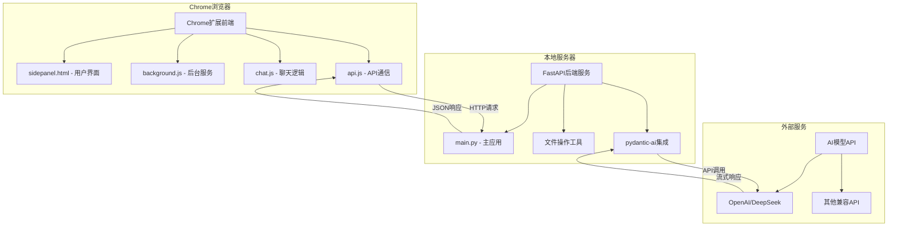
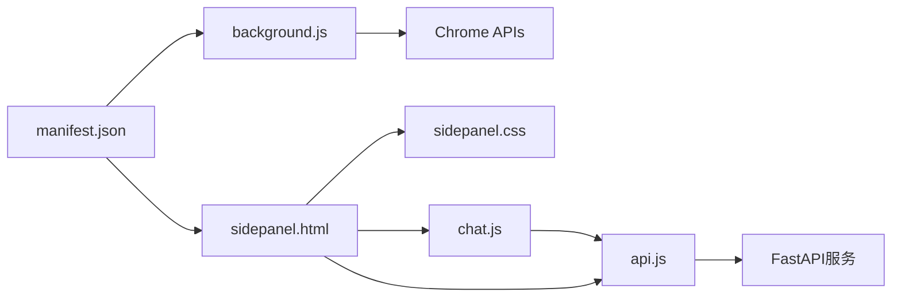
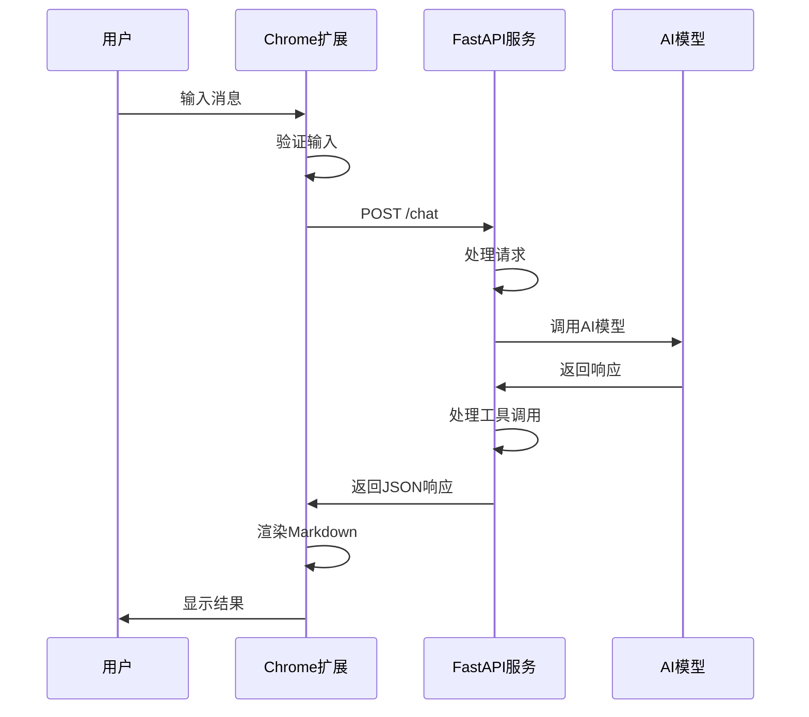
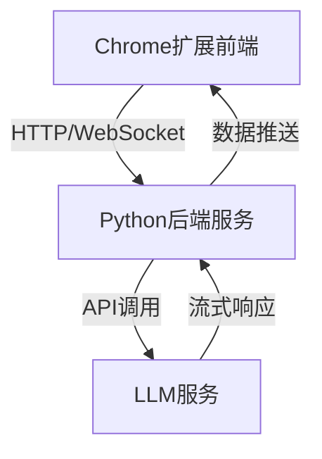
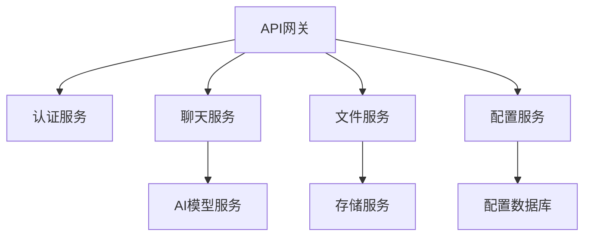

# Chrome扩展AI助手 - 开发者完整指南

## 📋 目录

1. [项目架构设计](#1-项目架构设计)
2. [开发环境安装指南](#2-开发环境安装指南)
3. [部署和使用说明](#3-部署和使用说明)
4. [开发者指南](#4-开发者指南)
5. [升级和维护指南](#5-升级和维护指南)
6. [FastAPI迁移说明](#6-fastapi迁移说明)
7. [技术债务和改进建议](#7-技术债务和改进建议)

---

## 1. 项目架构设计

### 1.1 整体系统架构



### 1.2 前端Chrome扩展架构

#### 文件结构
```
chrome_plus/
├── manifest.json           # 扩展配置文件
├── sidepanel.html          # 侧边栏主界面
├── sidepanel.css           # 侧边栏样式
├── background.js           # 后台服务脚本
├── chat.js                 # 聊天界面逻辑
├── api.js                  # API通信封装
├── images/                 # 图标资源
│   ├── icon-16.png
│   ├── icon-48.png
│   └── icon-128.png
└── server/                 # 后端服务
    ├── main.py             # FastAPI主应用
    ├── config.py           # 配置文件
    ├── start_server.py     # 启动脚本
    └── test/               # 沙箱目录
```

#### 核心组件关系


### 1.3 后端FastAPI服务架构

#### 核心模块
- **main.py**: 主应用入口，包含路由定义
- **工具函数**: 文件操作、系统信息等功能
- **pydantic-ai集成**: AI模型调用和工具使用
- **配置管理**: 环境变量和设置管理

#### API设计
```python
# 主要端点
POST /chat
- 请求: {"message": "用户消息"}
- 响应: {"response": "AI回复"}

GET /docs
- Swagger UI文档

GET /redoc
- ReDoc文档
```

### 1.4 数据流和通信机制

#### 用户交互流程


#### 通信协议
- **协议**: HTTP/1.1
- **数据格式**: JSON
- **认证**: 基于API密钥
- **错误处理**: HTTP状态码 + 详细错误信息

### 1.5 LLM聊天程序设计

#### 架构概览


#### 核心组件
- **Chrome扩展改造**:
  - `chat.js`: 处理聊天界面交互逻辑
  - `api.js`: 封装与Python后端的通信

- **Python后端服务**:
  - 使用FastAPI暴露API端点
  - 处理跨域请求(CORS)
  - 实现请求限流

#### 通信协议设计
| 要素 | 前端 | 后端 |
|------|------|------|
| 协议 | HTTP/WebSocket | REST API |
| 数据格式 | JSON | JSON |
| 认证 | API密钥 | JWT令牌 |

---

## 2. 开发环境安装指南

### 2.1 系统要求

#### 必需软件
- **Chrome浏览器**: 版本 88+ (支持Manifest V3)
- **Python**: 3.10+
- **uv**: Python包管理器
- **Git**: 版本控制

#### 推荐工具
- **VS Code**: 代码编辑器
- **Chrome DevTools**: 调试工具
- **Postman**: API测试

### 2.2 环境安装步骤

#### 步骤1: 安装Python和uv
```bash
# macOS (使用Homebrew)
brew install python@3.10
curl -LsSf https://astral.sh/uv/install.sh | sh

# Windows (使用Chocolatey)
choco install python
powershell -c "irm https://astral.sh/uv/install.ps1 | iex"

# Linux (Ubuntu/Debian)
sudo apt update
sudo apt install python3.10 python3.10-venv
curl -LsSf https://astral.sh/uv/install.sh | sh
```

#### 步骤2: 克隆项目
```bash
git clone <repository-url>
cd chrome_plus
```

#### 步骤3: 安装后端依赖
```bash
cd server
uv sync
```

#### 步骤4: 配置环境变量
```bash
# 创建.env文件
cp .env.example .env

# 编辑.env文件，添加API密钥
DEEPSEEK_API_KEY=your_deepseek_api_key_here
TAVILY_API_KEY=your_tavily_api_key_here  # 可选
```

### 2.3 开发工具配置

#### VS Code配置
```json
// .vscode/settings.json
{
  "python.defaultInterpreterPath": "./server/.venv/bin/python",
  "python.linting.enabled": true,
  "python.linting.pylintEnabled": true,
  "files.associations": {
    "*.js": "javascript"
  }
}
```

#### Chrome扩展开发者模式
1. 打开Chrome浏览器
2. 访问 `chrome://extensions/`
3. 开启"开发者模式"
4. 点击"加载已解压的扩展程序"
5. 选择项目根目录

---

## 3. 部署和使用说明

### 3.1 Chrome扩展安装

#### 开发模式安装
```bash
# 1. 打开Chrome扩展管理页面
chrome://extensions/

# 2. 开启开发者模式
# 3. 点击"加载已解压的扩展程序"
# 4. 选择chrome_plus目录
# 5. 确认安装
```

#### 生产模式打包
```bash
# 创建发布包
zip -r chrome_plus_v1.0.zip . -x "server/*" "*.md" ".git/*"
```

### 3.2 FastAPI服务器启动

#### 开发模式启动
```bash
cd server
uv run python start_server.py
```

#### 生产模式启动
```bash
cd server
uv run uvicorn main:app --host 0.0.0.0 --port 5001
```

#### 服务验证
```bash
# 测试API端点
curl -X POST "http://127.0.0.1:5001/chat" \
  -H "Content-Type: application/json" \
  -d '{"message": "你好"}'

# 访问API文档
open http://127.0.0.1:5001/docs
```

### 3.3 环境变量配置

#### 必需配置
```bash
# .env文件
DEEPSEEK_API_KEY=sk-xxxxxxxxxxxxxxxx  # DeepSeek API密钥
```

#### 可选配置
```bash
# 可选的环境变量
TAVILY_API_KEY=tvly-xxxxxxxxxxxxxxxx  # 网络搜索API
SERVER_HOST=127.0.0.1                # 服务器地址
SERVER_PORT=5001                     # 服务器端口
DEBUG=true                           # 调试模式
```

#### API密钥获取
1. **DeepSeek API**: 访问 [DeepSeek官网](https://platform.deepseek.com/) 注册获取
2. **Tavily API**: 访问 [Tavily官网](https://tavily.com/) 注册获取（可选）

---

## 4. 开发者指南

### 4.1 代码结构说明

#### 前端文件组织
```javascript
// manifest.json - 扩展配置
{
  "manifest_version": 3,
  "permissions": ["sidePanel", "storage"],
  "host_permissions": ["http://localhost:5001/*"]
}

// background.js - 后台服务
chrome.runtime.onInstalled.addListener(() => {
  chrome.sidePanel.setPanelBehavior({openPanelOnActionClick: true});
});

// chat.js - 聊天逻辑
class ChatManager {
  constructor() {
    this.initializeEventListeners();
  }
  
  async sendMessage(message) {
    // 发送消息逻辑
  }
}

// api.js - API通信
class APIClient {
  constructor(baseURL = 'http://localhost:5001') {
    this.baseURL = baseURL;
  }
  
  async post(endpoint, data) {
    // HTTP请求封装
  }
}
```

#### 后端文件组织
```python
# main.py - 主应用
from fastapi import FastAPI, HTTPException
from pydantic import BaseModel

app = FastAPI()

class ChatRequest(BaseModel):
    message: str

@app.post("/chat")
async def chat(request: ChatRequest):
    # 聊天处理逻辑
    pass
```

### 4.2 关键功能模块实现

#### 消息处理流程
```javascript
// chat.js中的消息处理
async function handleUserMessage(message) {
  try {
    // 1. 验证输入
    if (!message.trim()) {
      throw new Error('消息不能为空');
    }

    // 2. 显示用户消息
    appendMessage('user', message);

    // 3. 发送到后端
    const response = await apiClient.post('/chat', {message});

    // 4. 处理响应
    if (response.response) {
      appendMessage('assistant', response.response);
    }
  } catch (error) {
    appendMessage('error', `错误: ${error.message}`);
  }
}
```

#### Markdown渲染
```javascript
// 渲染Markdown内容
function renderMarkdown(content) {
  // 使用marked.js渲染
  const html = marked.parse(content);

  // 应用代码高亮
  const tempDiv = document.createElement('div');
  tempDiv.innerHTML = html;

  tempDiv.querySelectorAll('pre code').forEach((block) => {
    hljs.highlightElement(block);
  });

  return tempDiv.innerHTML;
}
```

### 4.3 添加新功能

#### 添加新的API端点
```python
# 在main.py中添加新端点
@app.post("/new-feature")
async def new_feature(request: NewFeatureRequest):
    # 实现新功能逻辑
    return {"result": "success"}
```

#### 添加新的前端功能
```javascript
// 在chat.js中添加新功能
class ChatManager {
  addNewFeature() {
    // 添加新功能按钮
    const button = document.createElement('button');
    button.textContent = '新功能';
    button.onclick = this.handleNewFeature.bind(this);

    document.getElementById('header-buttons').appendChild(button);
  }

  async handleNewFeature() {
    // 处理新功能逻辑
  }
}
```

### 4.4 调试和测试方法

#### Chrome扩展调试
```javascript
// 在代码中添加调试信息
console.log('Debug info:', data);

// 使用Chrome DevTools
// 1. 右键点击扩展图标 -> "检查弹出内容"
// 2. 或访问 chrome://extensions/ -> 点击"背景页"
```

#### 后端API测试
```bash
# 使用pytest运行测试
cd server
uv run python -m pytest test_fastapi.py -v

# 手动测试
uv run python test_manual.py
```

#### 集成测试
```javascript
// 端到端测试示例
async function testChatFlow() {
  const testMessage = "测试消息";

  // 模拟用户输入
  document.getElementById('message-input').value = testMessage;
  document.getElementById('send-button').click();

  // 等待响应
  await new Promise(resolve => setTimeout(resolve, 2000));

  // 验证结果
  const messages = document.querySelectorAll('.message');
  console.assert(messages.length >= 2, '应该有用户消息和AI回复');
}
```

---

## 5. 升级和维护指南

### 5.1 版本管理策略

#### 语义化版本控制
```
主版本号.次版本号.修订号 (MAJOR.MINOR.PATCH)

例如: 1.2.3
- 1: 主版本号 (不兼容的API修改)
- 2: 次版本号 (向下兼容的功能性新增)
- 3: 修订号 (向下兼容的问题修正)
```

#### 发布流程
```bash
# 1. 更新版本号
# 修改manifest.json中的version字段
# 修改pyproject.toml中的version字段

# 2. 更新CHANGELOG.md
# 记录本次更新的内容

# 3. 创建Git标签
git tag -a v1.2.3 -m "Release version 1.2.3"
git push origin v1.2.3

# 4. 打包发布
./scripts/build.sh
```

### 5.2 依赖更新和兼容性

#### Python依赖更新
```bash
# 查看过期的包
cd server
uv pip list --outdated

# 更新特定包
uv add "fastapi>=0.104.0"

# 更新所有包
uv sync --upgrade
```

#### 前端依赖更新
```html
<!-- 更新CDN链接到最新版本 -->
<script src="https://cdn.jsdelivr.net/npm/marked@latest/marked.min.js"></script>
<link rel="stylesheet" href="https://cdnjs.cloudflare.com/ajax/libs/highlight.js/latest/styles/github-dark.min.css">
```

#### 兼容性检查清单
- [ ] Chrome扩展API兼容性
- [ ] Python版本兼容性
- [ ] FastAPI版本兼容性
- [ ] 第三方库兼容性
- [ ] 浏览器兼容性测试

### 5.3 常见问题排查

#### Chrome扩展问题
```javascript
// 问题1: 扩展无法加载
// 解决方案: 检查manifest.json语法
// 使用JSON验证器验证文件格式

// 问题2: 侧边栏无法打开
// 解决方案: 检查权限配置
if (!chrome.sidePanel) {
  console.error('sidePanel API不可用，请检查权限配置');
}

// 问题3: API请求失败
// 解决方案: 检查CORS和权限
fetch('http://localhost:5001/chat', {
  method: 'POST',
  headers: {'Content-Type': 'application/json'},
  body: JSON.stringify({message: 'test'})
}).catch(error => {
  console.error('API请求失败:', error);
  // 检查服务器是否运行
  // 检查host_permissions配置
});
```

#### 后端服务问题
```python
# 问题1: 服务启动失败
# 解决方案: 检查端口占用和依赖
import socket

def check_port(port):
    sock = socket.socket(socket.AF_INET, socket.SOCK_STREAM)
    result = sock.connect_ex(('127.0.0.1', port))
    sock.close()
    return result == 0

# 问题2: API密钥无效
# 解决方案: 验证环境变量
import os
from dotenv import load_dotenv

load_dotenv()
api_key = os.getenv('DEEPSEEK_API_KEY')
if not api_key:
    raise ValueError('DEEPSEEK_API_KEY未设置')

# 问题3: 异步事件循环冲突
# 解决方案: 使用线程池
import asyncio
import concurrent.futures

async def run_sync_in_thread(func, *args):
    loop = asyncio.get_event_loop()
    with concurrent.futures.ThreadPoolExecutor() as executor:
        return await loop.run_in_executor(executor, func, *args)
```

---

## 6. FastAPI迁移说明

### 6.1 迁移概述

本项目已成功从Flask迁移到FastAPI，保持了所有原有功能的同时，增加了以下优势：

- ✅ 自动API文档生成 (Swagger UI)
- ✅ 类型提示和自动验证
- ✅ 更好的性能
- ✅ 现代异步支持
- ✅ 更清晰的错误处理

### 6.2 主要变更

#### 依赖变更
- **移除**: Flask, Flask-CORS
- **添加**: FastAPI, uvicorn

#### 代码变更
- 路由装饰器: `@app.route()` → `@app.post()`
- 请求处理: `request.get_json()` → Pydantic模型
- 响应处理: `jsonify()` → 直接返回Pydantic模型
- 错误处理: 自定义错误响应 → `HTTPException`

#### 新增功能
- 自动API文档: `/docs` 和 `/redoc`
- OpenAPI模式: `/openapi.json`
- 请求/响应模型验证
- 更好的错误信息

### 6.3 运行指南

#### 方法1: 直接运行主文件
```bash
cd server
python main.py
```

#### 方法2: 使用启动脚本 (推荐)
```bash
cd server
python start_server.py
```

#### 方法3: 使用uvicorn命令
```bash
cd server
uvicorn main:app --host 127.0.0.1 --port 5001 --reload
```

### 6.4 API文档

启动服务器后，可以访问以下地址：

- **交互式API文档**: http://127.0.0.1:5001/docs
- **ReDoc文档**: http://127.0.0.1:5001/redoc
- **OpenAPI模式**: http://127.0.0.1:5001/openapi.json

### 6.5 与原Flask版本的兼容性

#### API端点保持不变
- `POST /chat` - 聊天API端点

#### 请求格式保持不变
```json
{
  "message": "用户消息"
}
```

#### 响应格式保持不变
```json
{
  "response": "AI回复"
}
```

#### 错误响应格式略有变化
**Flask版本**:
```json
{
  "error": "错误信息"
}
```

**FastAPI版本**:
```json
{
  "detail": "错误信息"
}
```

---

## 7. 技术债务和改进建议

### 7.1 当前技术债务

#### 代码质量
- [ ] 添加更多单元测试覆盖
- [ ] 实现代码质量检查工具 (pylint, eslint)
- [ ] 添加类型注解覆盖率检查
- [ ] 实现自动化代码格式化

#### 性能优化
- [ ] 实现响应缓存机制
- [ ] 优化大文件处理性能
- [ ] 添加请求限流和防护
- [ ] 实现连接池管理

#### 安全加固
- [ ] 实现更严格的输入验证
- [ ] 添加API访问日志记录
- [ ] 实现安全头部设置
- [ ] 添加敏感信息脱敏

### 7.2 架构改进建议

#### 微服务化


#### 数据库集成
- 添加用户会话管理
- 实现聊天历史持久化
- 添加用户偏好设置存储
- 实现使用统计和分析

#### 监控和日志
```python
# 结构化日志示例
import structlog

logger = structlog.get_logger()

@app.middleware("http")
async def log_requests(request: Request, call_next):
    start_time = time.time()

    response = await call_next(request)

    process_time = time.time() - start_time
    logger.info(
        "request_processed",
        method=request.method,
        url=str(request.url),
        status_code=response.status_code,
        process_time=process_time
    )

    return response
```

### 7.3 功能扩展建议

#### 高级功能
- [ ] 多模态支持 (图片、音频)
- [ ] 实时协作功能
- [ ] 插件系统架构
- [ ] 自定义工作流

#### 用户体验
- [ ] 离线模式支持
- [ ] 主题自定义
- [ ] 快捷键支持
- [ ] 语音交互

#### 集成扩展
- [ ] 第三方服务集成
- [ ] 企业级SSO支持
- [ ] API密钥管理服务
- [ ] 云端同步功能

### 7.4 部署和运维

#### 容器化部署
```dockerfile
# Dockerfile示例
FROM python:3.10-slim

WORKDIR /app

COPY requirements.txt .
RUN pip install -r requirements.txt

COPY . .

EXPOSE 5001

CMD ["uvicorn", "main:app", "--host", "0.0.0.0", "--port", "5001"]
```

#### CI/CD流水线
```yaml
# .github/workflows/ci.yml
name: CI/CD Pipeline

on:
  push:
    branches: [ main ]
  pull_request:
    branches: [ main ]

jobs:
  test:
    runs-on: ubuntu-latest
    steps:
    - uses: actions/checkout@v2
    - name: Set up Python
      uses: actions/setup-python@v2
      with:
        python-version: 3.10
    - name: Install dependencies
      run: |
        pip install uv
        uv sync
    - name: Run tests
      run: |
        uv run pytest
    - name: Build extension
      run: |
        ./scripts/build-extension.sh
```

#### 监控和告警
- 实现健康检查端点
- 添加性能指标收集
- 设置错误率告警
- 实现日志聚合分析

---

## 📚 附录

### A. 开发工具推荐

#### 代码编辑器插件
- **VS Code**:
  - Python Extension Pack
  - Chrome Extension Developer Tools
  - GitLens
  - Prettier
  - ESLint

#### 调试工具
- **Chrome DevTools**: 前端调试
- **Postman**: API测试
- **pytest**: Python测试框架
- **Chrome Extension Source Viewer**: 扩展源码查看

### B. 相关文档链接

#### 官方文档
- [Chrome扩展开发文档](https://developer.chrome.com/docs/extensions/)
- [Manifest V3迁移指南](https://developer.chrome.com/docs/extensions/migrating/)
- [FastAPI官方文档](https://fastapi.tiangolo.com/)
- [pydantic-ai文档](https://ai.pydantic.dev/)
- [uv包管理器文档](https://docs.astral.sh/uv/)

#### 社区资源
- [Chrome扩展开发社区](https://groups.google.com/a/chromium.org/g/chromium-extensions)
- [FastAPI GitHub](https://github.com/tiangolo/fastapi)
- [Chrome扩展示例](https://github.com/GoogleChrome/chrome-extensions-samples)

### C. 许可证和贡献

#### 许可证
本项目采用 MIT 许可证，详见 LICENSE 文件。

#### 贡献指南
1. Fork 项目
2. 创建功能分支 (`git checkout -b feature/AmazingFeature`)
3. 提交更改 (`git commit -m 'Add some AmazingFeature'`)
4. 推送到分支 (`git push origin feature/AmazingFeature`)
5. 开启 Pull Request

#### 代码规范
- JavaScript: 使用 ESLint 和 Prettier
- Python: 使用 Black 和 isort
- 提交信息: 遵循 Conventional Commits

---

*最后更新: 2024年12月*
*版本: 2.0.0*
