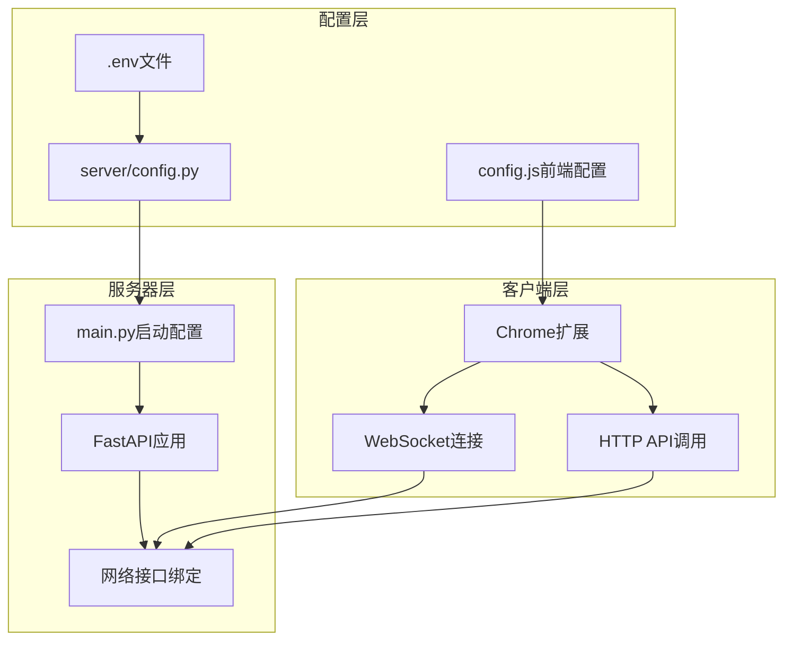

# Chrome Plus V2.1.1 服务器主机配置指南

## 📋 文档信息

| 项目名称 | Chrome Plus V2.1.1 服务器配置指南 |
|---------|--------------------------------|
| 版本 | 2.1.1 |
| 文档类型 | 技术配置指南 |
| 目标受众 | 开发人员、运维人员 |
| 最后更新 | 2025-01-04 |
| 用途 | 服务器网络配置、故障排除 |

## 🎯 配置变更概述

本文档详细说明了Chrome Plus V2.1.1中`SERVER_HOST=0.0.0.0`配置的实现原理、修改内容和使用方法。

### 变更背景

**问题描述**：
- 默认配置下，服务器只监听`127.0.0.1`（localhost）
- 无法接受来自其他网络接口的连接
- 在Docker容器或网络部署中存在连接限制

**解决目标**：
- 支持服务器监听所有网络接口（0.0.0.0）
- 保持Chrome扩展的正常连接
- 提供灵活的配置选项
- 确保安全性和兼容性

## 🔧 技术实现方案

### 架构设计



### 配置流程

1. **环境变量设置** → 2. **配置文件读取** → 3. **服务器启动** → 4. **客户端连接**

## 📁 修改文件详情

### 1. 环境变量配置

**文件**: `server/.env`
```bash
# 新增配置项
SERVER_HOST=0.0.0.0

# 现有配置保持不变
DEEPSEEK_API_KEY='your-api-key'
TAVILY_API_KEY='your-api-key'
```

**说明**：
- `0.0.0.0`: 监听所有网络接口
- `127.0.0.1`: 仅监听本地回环接口
- `192.168.1.100`: 监听指定IP地址

### 2. 服务器配置读取

**文件**: `server/config.py`
```python
# 修改前
HOST: str = "127.0.0.1"

# 修改后
HOST: str = os.getenv("SERVER_HOST", "127.0.0.1")
```

**变更说明**：
- 优先读取环境变量`SERVER_HOST`
- 默认值保持为`127.0.0.1`确保向后兼容
- 支持动态配置不同的监听地址

### 3. 服务器启动配置

**文件**: `server/main.py`
```python
# 修改前
host = "127.0.0.1" if ENVIRONMENT == 'development' else "0.0.0.0"
uvicorn.run("__main__:app", host=host, port=5001, ...)

# 修改后
from config import settings
uvicorn.run("__main__:app", host=settings.HOST, port=settings.PORT, ...)
```

**变更说明**：
- 移除硬编码的主机地址逻辑
- 统一使用配置文件中的设置
- 支持灵活的端口配置

### 4. 前端配置文件

**新增文件**: `config.js`
```javascript
const CONFIG = {
    SERVER: {
        HOST: 'localhost',  // Chrome扩展连接地址
        PORT: 5001,
        get HTTP_URL() { return `http://${this.HOST}:${this.PORT}`; },
        get WS_URL() { return `ws://${this.HOST}:${this.PORT}/ws`; }
    }
};
```

**设计理念**：
- 前后端配置分离
- 服务器可监听0.0.0.0，客户端仍连接localhost
- 支持不同部署场景的灵活配置

### 5. 前端API客户端更新

**文件**: `api.js`
```javascript
// 修改前
const API_BASE_URL = 'http://localhost:5001';

// 修改后
const API_BASE_URL = CONFIG?.SERVER?.HTTP_URL || 'http://localhost:5001';
```

**文件**: `websocket-api.js`
```javascript
// 修改前
const wsUrl = 'ws://localhost:5001/ws';

// 修改后
const wsUrl = CONFIG?.SERVER?.WS_URL || 'ws://localhost:5001/ws';
```

### 6. Docker配置优化

**文件**: `docker-compose.yml`
```yaml
# 修改健康检查
healthcheck:
  test: ["CMD", "curl", "-f", "http://0.0.0.0:5001/health"]
```

## 🚀 使用方法

### 场景一：本地开发（推荐）

```bash
# .env配置
SERVER_HOST=127.0.0.1

# config.js配置
HOST: 'localhost'
```

**特点**：
- ✅ 最高安全性
- ✅ 最佳兼容性
- ✅ 适合日常开发

### 场景二：容器部署

```bash
# .env配置
SERVER_HOST=0.0.0.0

# config.js配置
HOST: 'localhost'  # 或容器IP
```

**特点**：
- ✅ 支持容器间通信
- ✅ 支持外部访问
- ✅ 适合生产部署

### 场景三：网络部署

```bash
# .env配置
SERVER_HOST=0.0.0.0

# config.js配置
HOST: '192.168.1.100'  # 实际服务器IP
```

**特点**：
- ✅ 支持远程访问
- ✅ 支持多客户端
- ⚠️ 需要网络安全配置

## 🔍 故障排除

### 常见问题

#### 1. 连接错误：[Errno -2] Name or service not known

**原因**：Chrome扩展无法解析服务器地址

**解决方案**：
```javascript
// 检查config.js中的HOST配置
SERVER: {
    HOST: 'localhost',  // 确保地址可访问
    PORT: 5001
}
```

#### 2. 服务器启动失败：Address already in use

**原因**：端口被占用

**解决方案**：
```bash
# 查找占用进程
lsof -i :5001

# 终止进程
kill -9 <PID>

# 或更换端口
SERVER_PORT=5002
```

#### 3. Chrome扩展连接超时

**原因**：网络配置或防火墙阻止

**解决方案**：
```bash
# 检查服务器是否正常启动
curl http://localhost:5001/health

# 检查防火墙设置
sudo ufw allow 5001

# 检查Docker网络
docker network ls
```

### 调试方法

#### 1. 服务器端调试

```bash
# 启动服务器并查看日志
cd server
python main.py

# 预期输出
INFO:     Uvicorn running on http://0.0.0.0:5001
```

#### 2. 客户端调试

```javascript
// 在Chrome扩展控制台中检查
console.log('API Base URL:', API_BASE_URL);
console.log('WebSocket URL:', wsUrl);
```

#### 3. 网络连通性测试

```bash
# 测试HTTP连接
curl -v http://localhost:5001/health

# 测试WebSocket连接
wscat -c ws://localhost:5001/ws
```

## 🛡️ 安全注意事项

### 网络安全

1. **生产环境建议**：
   - 使用HTTPS/WSS加密连接
   - 配置防火墙限制访问
   - 启用API认证机制

2. **Docker部署安全**：
   - 限制容器网络访问
   - 使用非root用户运行
   - 定期更新基础镜像

3. **开发环境安全**：
   - 避免在公网暴露开发服务器
   - 使用VPN或内网访问
   - 定期更换API密钥

### 配置验证

```python
# 在main.py中添加安全检查
def validate_host_config():
    if settings.HOST == "0.0.0.0":
        logger.warning("服务器监听所有接口，请确保网络安全配置")
    if not settings.DEEPSEEK_API_KEY:
        logger.warning("未配置API密钥，功能受限")
```

## 📚 相关文档

- [开发设计文档](DEVELOPMENT_DESIGN_DOCUMENT.md)
- [用户使用指南](USER_GUIDE.md)
- [Docker部署指南](../docker-compose.yml)
- [API接口文档](DEVELOPMENT_DESIGN_DOCUMENT.md#api接口规范)

---

**配置指南版本**: V2.1.1  
**最后更新**: 2025-01-04  
**维护状态**: 活跃维护
