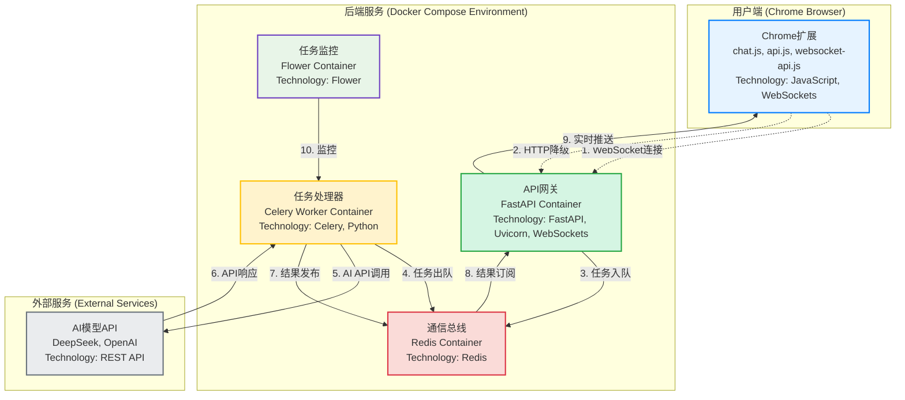
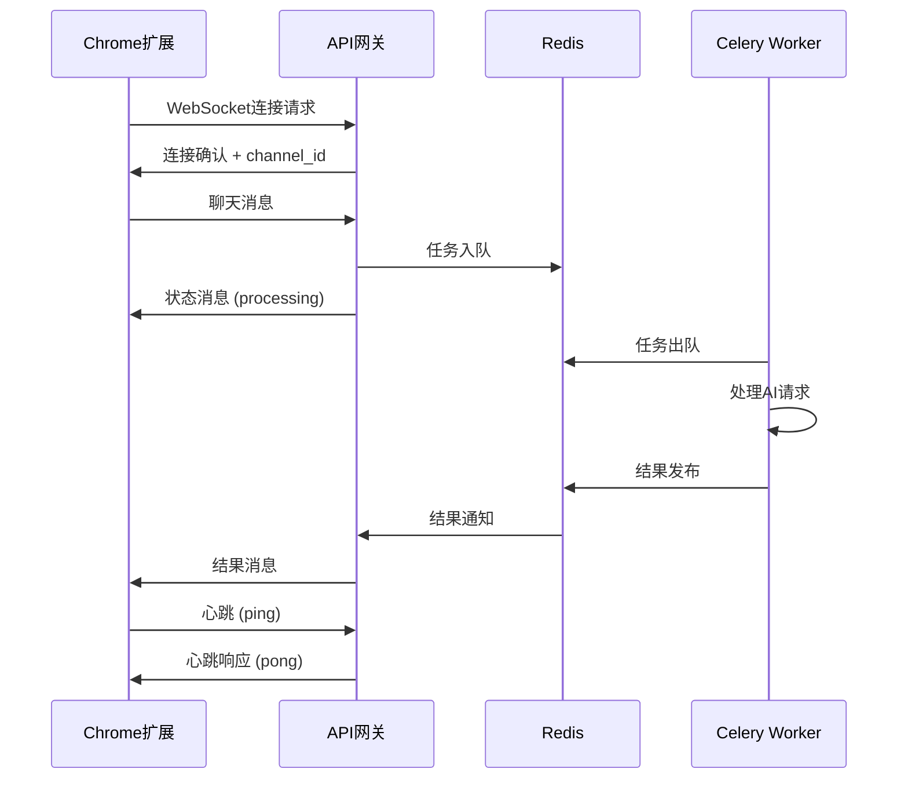
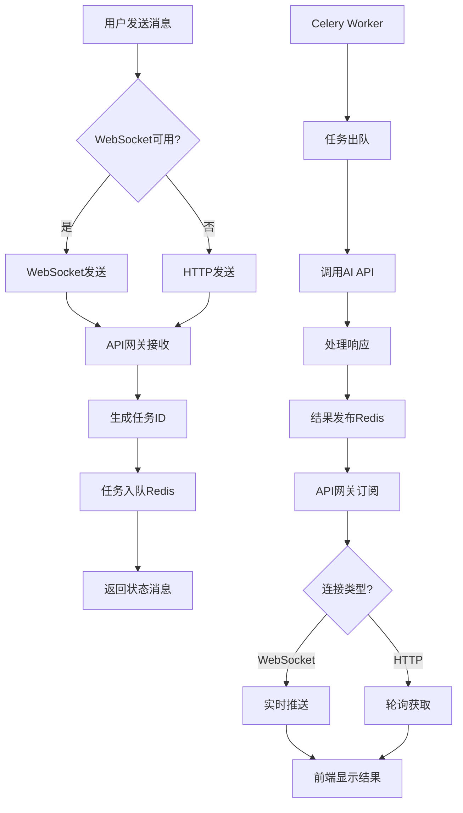

# Chrome Plus V2.0 技术设计报告

## 📋 文档信息

| 项目名称 | Chrome Plus V2.0 |
|---------|------------------|
| 版本 | 2.0.0 |
| 文档版本 | 1.0 |
| 目标受众 | 开发人员、测试工程师、运维人员 |
| 最后更新 | 2024-12 |

## 📖 目录

1. [系统架构设计](#1-系统架构设计)
2. [技术栈选型](#2-技术栈选型)
3. [API接口文档](#3-api接口文档)
4. [WebSocket通信协议](#4-websocket通信协议)
5. [数据流设计](#5-数据流设计)
6. [Celery任务处理机制](#6-celery任务处理机制)
7. [Redis消息队列设计](#7-redis消息队列设计)
8. [安全性设计](#8-安全性设计)
9. [性能优化策略](#9-性能优化策略)
10. [错误处理机制](#10-错误处理机制)
11. [测试策略](#11-测试策略)
12. [部署架构](#12-部署架构)
13. [监控和日志](#13-监控和日志)
14. [代码结构](#14-代码结构)
15. [开发规范](#15-开发规范)

## 1. 系统架构设计

### 1.1 整体架构

Chrome Plus V2.0采用现代化的微服务架构，从传统的HTTP同步模式升级为WebSocket实时通信和异步任务处理模式。



### 1.2 架构优势

| 特性 | V1.0 (旧架构) | V2.0 (新架构) |
|------|---------------|---------------|
| 通信方式 | HTTP同步请求 | WebSocket实时通信 + HTTP降级 |
| 任务处理 | 同步阻塞 | 异步非阻塞 |
| 扩展性 | 单体应用 | 微服务架构 |
| 并发能力 | 有限 | 高并发支持 |
| 实时性 | 轮询机制 | 实时推送 |
| 容错性 | 单点故障 | 服务隔离 |

### 1.3 核心组件

#### 1.3.1 Chrome扩展 (前端)
- **功能**: 用户界面和交互逻辑
- **技术**: Chrome Extension API (Manifest V3)
- **通信**: WebSocket客户端 + HTTP降级
- **特性**: 实时状态显示、自动重连、错误恢复

#### 1.3.2 API网关 (FastAPI)
- **功能**: WebSocket连接管理、HTTP API服务
- **技术**: FastAPI + Uvicorn + WebSockets
- **职责**: 连接管理、消息路由、任务分发
- **特性**: 高性能、自动文档生成、类型验证

#### 1.3.3 任务处理器 (Celery Worker)
- **功能**: 异步任务执行
- **技术**: Celery + Python
- **职责**: AI API调用、文件操作、长时间任务
- **特性**: 水平扩展、任务重试、状态跟踪

#### 1.3.4 消息总线 (Redis)
- **功能**: 消息队列和发布/订阅
- **技术**: Redis
- **职责**: 任务队列、结果缓存、实时通信
- **特性**: 高性能、持久化、集群支持

## 2. 技术栈选型

### 2.1 前端技术栈

| 技术 | 版本 | 用途 | 选型理由 |
|------|------|------|----------|
| Chrome Extension API | Manifest V3 | 扩展框架 | 官方标准，安全性强 |
| JavaScript | ES6+ | 编程语言 | 原生支持，性能优秀 |
| WebSocket API | 标准 | 实时通信 | 双向通信，低延迟 |
| marked.js | 最新 | Markdown渲染 | 轻量级，功能完整 |
| highlight.js | 最新 | 代码高亮 | 多语言支持 |

### 2.2 后端技术栈

| 技术 | 版本 | 用途 | 选型理由 |
|------|------|------|----------|
| FastAPI | 0.104+ | Web框架 | 高性能，自动文档，类型安全 |
| Uvicorn | 0.34.2 | ASGI服务器 | 异步支持，WebSocket兼容 |
| Celery | 5.3+ | 任务队列 | 成熟稳定，分布式支持 |
| Redis | 5.0+ | 消息代理 | 高性能，多数据结构 |
| Pydantic | 2.11+ | 数据验证 | 类型安全，自动验证 |
| aiohttp | 3.11+ | HTTP客户端 | 异步支持，性能优秀 |

### 2.3 容器化技术栈

| 技术 | 版本 | 用途 | 选型理由 |
|------|------|------|----------|
| Docker | 最新 | 容器化 | 标准化部署，环境一致性 |
| Docker Compose | 3.8 | 服务编排 | 多服务管理，开发便利 |
| Alpine Linux | 最新 | 基础镜像 | 轻量级，安全性好 |

## 3. API接口文档

### 3.1 HTTP API接口

#### 3.1.1 健康检查接口

```http
GET /health
```

**响应示例:**
```json
{
  "status": "healthy",
  "version": "2.0.0",
  "timestamp": "2024-12-XX 10:00:00",
  "services": {
    "redis": "connected",
    "celery": "running"
  }
}
```

#### 3.1.2 聊天接口 (HTTP降级)

```http
POST /chat
Content-Type: application/json
```

**请求体:**
```json
{
  "message": "用户消息内容",
  "proxy_config": {
    "enabled": false,
    "host": "127.0.0.1",
    "port": 7890
  },
  "api_config": {
    "model": "deepseek-chat",
    "temperature": 0.7,
    "max_tokens": 4000
  }
}
```

**响应体:**
```json
{
  "success": true,
  "response": "AI助手回复内容",
  "timestamp": "2024-12-XX 10:00:00",
  "model_used": "deepseek-chat",
  "tokens_used": 150
}
```

#### 3.1.3 文件操作接口

```http
POST /files/create
Content-Type: application/json
```

**请求体:**
```json
{
  "filename": "test.txt",
  "content": "文件内容",
  "encoding": "utf-8"
}
```

### 3.2 WebSocket API接口

#### 3.2.1 连接端点

```
ws://localhost:5001/ws
```

#### 3.2.2 消息格式规范

**基础消息结构:**
```json
{
  "type": "message_type",
  "data": {},
  "timestamp": "2024-12-XX 10:00:00",
  "channel_id": "unique_channel_id"
}
```

## 4. WebSocket通信协议

### 4.1 连接生命周期



### 4.2 消息类型定义

#### 4.2.1 连接消息
```json
{
  "type": "connection",
  "data": {
    "status": "connected",
    "channel_id": "uuid-string",
    "message": "WebSocket连接已建立"
  },
  "timestamp": "2024-12-XX 10:00:00"
}
```

#### 4.2.2 聊天消息
```json
{
  "type": "chat",
  "data": {
    "message": "用户输入的消息",
    "user_id": "chrome_extension_user",
    "proxy_config": null,
    "api_config": null
  },
  "timestamp": "2024-12-XX 10:00:00"
}
```

#### 4.2.3 状态消息
```json
{
  "type": "status",
  "data": {
    "status": "processing",
    "message": "正在处理AI请求...",
    "progress": 50
  },
  "timestamp": "2024-12-XX 10:00:00"
}
```

#### 4.2.4 结果消息
```json
{
  "type": "result",
  "data": {
    "success": true,
    "response": "AI助手的回复内容",
    "model_used": "deepseek-chat",
    "tokens_used": 150
  },
  "timestamp": "2024-12-XX 10:00:00"
}
```

#### 4.2.5 错误消息
```json
{
  "type": "error",
  "data": {
    "message": "错误描述",
    "code": "ERROR_CODE",
    "details": "详细错误信息"
  },
  "timestamp": "2024-12-XX 10:00:00"
}
```

#### 4.2.6 心跳消息
```json
{
  "type": "ping",
  "data": {},
  "timestamp": "2024-12-XX 10:00:00"
}
```

```json
{
  "type": "pong",
  "data": {
    "timestamp": "2024-12-XX 10:00:00"
  },
  "timestamp": "2024-12-XX 10:00:00"
}
```

### 4.3 连接管理机制

#### 4.3.1 连接建立
1. 客户端发起WebSocket连接请求
2. 服务器验证连接并分配唯一channel_id
3. 发送连接确认消息
4. 启动心跳检测机制

#### 4.3.2 重连机制
- **最大重连次数**: 5次
- **重连间隔**: 1秒 (指数退避)
- **重连触发**: 连接断开、网络错误
- **降级策略**: 重连失败后切换到HTTP模式

## 5. 数据流设计

### 5.1 典型用户交互流程



### 5.2 数据存储设计

#### 5.2.1 Redis数据结构

**任务队列:**
```
celery:task_queue
├── task_id_1: {task_data}
├── task_id_2: {task_data}
└── ...
```

**结果存储:**
```
celery:result:task_id
├── status: "SUCCESS"
├── result: {response_data}
└── timestamp: "2024-12-XX 10:00:00"
```

**发布/订阅频道:**
```
channel:{channel_id}
├── message_type: "result"
├── data: {result_data}
└── timestamp: "2024-12-XX 10:00:00"
```

#### 5.2.2 Chrome Storage

**用户配置:**
```json
{
  "api_config": {
    "model": "deepseek-chat",
    "temperature": 0.7,
    "max_tokens": 4000
  },
  "proxy_config": {
    "enabled": false,
    "host": "127.0.0.1",
    "port": 7890
  },
  "ui_config": {
    "theme": "light",
    "auto_scroll": true
  }
}
```

## 6. Celery任务处理机制

### 6.1 任务定义

```python
@celery_app.task(bind=True, name='process_ai_message')
def process_ai_message(self, task_data: Dict[str, Any]) -> Dict[str, Any]:
    """处理AI消息的异步任务"""
    try:
        # 解析任务数据
        request = TaskRequest(**task_data)
        task_id = self.request.id

        # 更新任务状态
        self.update_state(
            state='PROGRESS',
            meta={'status': '正在处理AI请求...', 'progress': 10}
        )

        # 调用AI API
        response = _call_ai_api(request.message, request.api_config, request.proxy_config)

        # 构建结果
        result = TaskResult(
            success=True,
            response=response,
            task_id=task_id,
            channel_id=request.channel_id
        )

        # 发布结果到Redis频道
        _publish_result(request.channel_id, result.dict())

        return result.dict()

    except Exception as e:
        # 错误处理
        error_result = TaskResult(
            success=False,
            response="",
            error=str(e),
            task_id=self.request.id,
            channel_id=task_data.get('channel_id', '')
        )

        _publish_result(task_data.get('channel_id', ''), error_result.dict())
        raise
```

### 6.2 任务配置

```python
celery_app.conf.update(
    task_serializer='json',
    accept_content=['json'],
    result_serializer='json',
    timezone='UTC',
    enable_utc=True,
    task_track_started=True,
    task_time_limit=300,  # 5分钟超时
    task_soft_time_limit=240,  # 4分钟软超时
    worker_prefetch_multiplier=1,
    worker_max_tasks_per_child=1000,
)
```

### 6.3 任务监控

- **Flower监控界面**: http://localhost:5555
- **任务状态跟踪**: PENDING → PROGRESS → SUCCESS/FAILURE
- **性能指标**: 任务执行时间、成功率、错误率
- **资源监控**: CPU使用率、内存占用、队列长度

## 7. Redis消息队列设计

### 7.1 架构角色

Redis在系统中承担三个关键角色：

1. **消息代理 (Broker)**: Celery任务队列
2. **结果后端 (Result Backend)**: 任务结果存储
3. **发布/订阅 (Pub/Sub)**: 实时消息通信

### 7.2 队列配置

```python
# Redis连接配置
REDIS_URL = 'redis://localhost:6379/0'
CELERY_BROKER_URL = REDIS_URL
CELERY_RESULT_BACKEND = REDIS_URL

# 队列设置
CELERY_TASK_ROUTES = {
    'process_ai_message': {'queue': 'ai_tasks'},
    'file_operation': {'queue': 'file_tasks'},
    'health_check': {'queue': 'system_tasks'}
}
```

### 7.3 发布/订阅机制

```python
# 结果发布
def _publish_result(channel_id: str, result_data: Dict[str, Any]):
    """发布任务结果到指定频道"""
    redis_client.publish(f"channel:{channel_id}", json.dumps(result_data))

# 结果订阅
async def subscribe_to_results(channel_id: str):
    """订阅任务结果"""
    pubsub = redis_client.pubsub()
    await pubsub.subscribe(f"channel:{channel_id}")

    async for message in pubsub.listen():
        if message['type'] == 'message':
            result = json.loads(message['data'])
            await handle_result(result)

## 8. 安全性设计

### 8.1 Chrome扩展安全

#### 8.1.1 Manifest V3安全特性
- **Service Worker**: 替代后台页面，提高安全性
- **声明式权限**: 明确声明所需权限
- **内容安全策略**: 防止XSS攻击

```json
{
  "content_security_policy": {
    "extension_pages": "script-src 'self'; object-src 'self'; connect-src 'self' ws://localhost:5001 http://localhost:5001 https://api.openai.com https://api.deepseek.com;"
  }
}
```

#### 8.1.2 权限控制
```json
{
  "permissions": [
    "sidePanel",
    "storage",
    "activeTab"
  ],
  "host_permissions": [
    "http://localhost:5001/*",
    "ws://localhost:5001/*",
    "https://api.openai.com/*",
    "https://api.deepseek.com/*"
  ]
}
```

### 8.2 API安全

#### 8.2.1 CORS配置
```python
app.add_middleware(
    CORSMiddleware,
    allow_origins=["chrome-extension://*", "http://localhost:*"],
    allow_credentials=True,
    allow_methods=["*"],
    allow_headers=["*"],
)
```

#### 8.2.2 输入验证
```python
class ChatRequest(BaseModel):
    message: str = Field(..., min_length=1, max_length=10000)
    proxy_config: Optional[ProxyConfig] = None
    api_config: Optional[Dict[str, Any]] = None

    @validator('message')
    def validate_message(cls, v):
        # 过滤恶意内容
        if any(keyword in v.lower() for keyword in BLOCKED_KEYWORDS):
            raise ValueError("消息包含不允许的内容")
        return v
```

#### 8.2.3 文件操作安全
```python
# 沙箱目录限制
BASE_DIR = Path(__file__).parent.resolve() / "test"

def validate_file_path(file_path: str) -> Path:
    """验证文件路径安全性"""
    full_path = BASE_DIR / file_path

    # 防止路径遍历攻击
    if not str(full_path.resolve()).startswith(str(BASE_DIR.resolve())):
        raise ValueError("不允许访问沙箱目录外的文件")

    return full_path
```

### 8.3 网络安全

#### 8.3.1 WebSocket安全
- **连接验证**: 验证连接来源
- **消息验证**: 验证消息格式和内容
- **频率限制**: 防止消息洪水攻击

#### 8.3.2 API密钥管理
```python
# 环境变量存储
DEEPSEEK_API_KEY = os.getenv('DEEPSEEK_API_KEY', '')
OPENAI_API_KEY = os.getenv('OPENAI_API_KEY', '')

# 密钥验证
def validate_api_key(api_key: str) -> bool:
    """验证API密钥格式"""
    if not api_key or len(api_key) < 10:
        return False
    return True
```

## 9. 性能优化策略

### 9.1 前端优化

#### 9.1.1 连接管理
- **连接复用**: 单一WebSocket连接处理所有通信
- **自动重连**: 智能重连机制，避免频繁连接
- **连接池**: HTTP请求连接池复用

#### 9.1.2 消息优化
- **消息压缩**: 大消息自动压缩传输
- **批量处理**: 合并小消息减少网络开销
- **缓存机制**: 缓存常用响应和配置

### 9.2 后端优化

#### 9.2.1 异步处理
```python
# 异步WebSocket处理
@app.websocket("/ws")
async def websocket_endpoint(websocket: WebSocket):
    channel_id = await manager.connect(websocket)

    # 异步消息处理
    async for message in websocket.iter_json():
        asyncio.create_task(handle_message(message, channel_id))
```

#### 9.2.2 任务优化
- **任务优先级**: 重要任务优先处理
- **批量处理**: 合并相似任务减少开销
- **结果缓存**: 缓存常见查询结果

#### 9.2.3 数据库优化
```python
# Redis连接池
redis_pool = redis.ConnectionPool.from_url(
    REDIS_URL,
    max_connections=20,
    retry_on_timeout=True
)
redis_client = redis.Redis(connection_pool=redis_pool)
```

### 9.3 系统优化

#### 9.3.1 容器优化
```dockerfile
# 多阶段构建减少镜像大小
FROM python:3.11-alpine as builder
COPY requirements.txt .
RUN pip install --user -r requirements.txt

FROM python:3.11-alpine
COPY --from=builder /root/.local /root/.local
```

#### 9.3.2 监控优化
- **性能指标**: 响应时间、吞吐量、错误率
- **资源监控**: CPU、内存、网络使用率
- **告警机制**: 异常情况自动告警

## 10. 错误处理机制

### 10.1 分层错误处理

#### 10.1.1 前端错误处理
```javascript
class WebSocketAPIClient {
    async connect() {
        try {
            this.ws = new WebSocket(wsUrl);
            // 连接成功处理
        } catch (error) {
            console.error('WebSocket连接失败:', error);
            // 自动降级到HTTP模式
            await this.fallbackToHTTP();
        }
    }

    async fallbackToHTTP() {
        console.log('切换到HTTP模式');
        this.useHTTPMode = true;
        // 通知用户连接状态变化
        this.notifyConnectionChange('HTTP');
    }
}
```

#### 10.1.2 后端错误处理
```python
@app.exception_handler(Exception)
async def global_exception_handler(request: Request, exc: Exception):
    """全局异常处理器"""
    logger.error(f"未处理的异常: {exc}", exc_info=True)

    return JSONResponse(
        status_code=500,
        content={
            "success": false,
            "error": "服务器内部错误",
            "timestamp": datetime.now().isoformat()
        }
    )
```

### 10.2 任务错误处理

#### 10.2.1 重试机制
```python
@celery_app.task(bind=True, autoretry_for=(Exception,), retry_kwargs={'max_retries': 3})
def process_ai_message(self, task_data):
    try:
        # 任务处理逻辑
        return process_message(task_data)
    except APIException as e:
        # API异常，可重试
        logger.warning(f"API调用失败，准备重试: {e}")
        raise self.retry(countdown=60)
    except ValidationError as e:
        # 验证错误，不可重试
        logger.error(f"数据验证失败: {e}")
        raise
```

### 10.3 错误分类和处理策略

| 错误类型 | 处理策略 | 用户提示 |
|----------|----------|----------|
| 网络连接错误 | 自动重试 + 降级 | "连接不稳定，已切换到备用模式" |
| API调用错误 | 重试 + 缓存 | "AI服务暂时不可用，请稍后重试" |
| 数据验证错误 | 立即返回 | "输入格式不正确，请检查后重试" |
| 系统资源错误 | 限流 + 告警 | "系统繁忙，请稍后重试" |
| 权限错误 | 立即拒绝 | "权限不足，无法执行此操作" |

## 11. 测试策略

### 11.1 测试层次

#### 11.1.1 单元测试
```python
# 测试任务处理逻辑
def test_process_ai_message():
    task_data = {
        "message": "测试消息",
        "channel_id": "test_channel",
        "user_id": "test_user"
    }

    result = process_ai_message.apply(args=[task_data])

    assert result.successful()
    assert result.result['success'] is True
    assert 'response' in result.result
```

#### 11.1.2 集成测试
```python
# 测试WebSocket通信
async def test_websocket_communication():
    async with websockets.connect("ws://localhost:5001/ws") as websocket:
        # 发送测试消息
        test_message = {
            "type": "chat",
            "data": {"message": "测试消息"}
        }
        await websocket.send(json.dumps(test_message))

        # 验证响应
        response = await websocket.recv()
        data = json.loads(response)

        assert data['type'] in ['status', 'result']
```

#### 11.1.3 端到端测试
```python
# Chrome扩展功能测试
def test_chrome_extension_e2e():
    # 启动服务
    start_services()

    # 模拟用户操作
    driver = webdriver.Chrome()
    driver.get("chrome-extension://extension-id/sidepanel.html")

    # 发送消息
    message_input = driver.find_element(By.ID, "message-input")
    message_input.send_keys("测试消息")

    send_button = driver.find_element(By.ID, "send-button")
    send_button.click()

    # 验证响应
    WebDriverWait(driver, 10).until(
        EC.presence_of_element_located((By.CLASS_NAME, "ai-response"))
    )

    response = driver.find_element(By.CLASS_NAME, "ai-response")
    assert response.text != ""
```

### 11.2 测试覆盖范围

| 测试类型 | 覆盖范围 | 工具 | 目标覆盖率 |
|----------|----------|------|------------|
| 单元测试 | 核心业务逻辑 | pytest | 90%+ |
| 集成测试 | API接口 | pytest + httpx | 85%+ |
| WebSocket测试 | 实时通信 | websockets | 80%+ |
| 性能测试 | 并发处理 | locust | - |
| 安全测试 | 输入验证 | 自定义脚本 | - |

### 11.3 自动化测试

#### 11.3.1 CI/CD集成
```yaml
# .github/workflows/test.yml
name: 测试流水线

on: [push, pull_request]

jobs:
  test:
    runs-on: ubuntu-latest

    services:
      redis:
        image: redis:7-alpine
        ports:
          - 6379:6379

    steps:
      - uses: actions/checkout@v3

      - name: 设置Python环境
        uses: actions/setup-python@v4
        with:
          python-version: '3.11'

      - name: 安装依赖
        run: |
          pip install -r server/requirements.txt
          pip install pytest pytest-cov

      - name: 运行测试
        run: |
          cd server
          pytest --cov=. --cov-report=xml

      - name: 上传覆盖率报告
        uses: codecov/codecov-action@v3
```

## 12. 部署架构

### 12.1 容器化部署

#### 12.1.1 Docker Compose配置
```yaml
version: '3.8'

services:
  # Redis - 消息总线
  redis:
    image: redis:7-alpine
    container_name: chrome_plus_redis
    ports:
      - "6379:6379"
    volumes:
      - redis_data:/data
    command: redis-server --appendonly yes
    healthcheck:
      test: ["CMD", "redis-cli", "ping"]
      interval: 10s
      timeout: 5s
      retries: 3

  # FastAPI 后端服务
  backend:
    build:
      context: ./server
      dockerfile: Dockerfile
    container_name: chrome_plus_backend
    ports:
      - "5001:5001"
    environment:
      - REDIS_URL=redis://redis:6379/0
      - CELERY_BROKER_URL=redis://redis:6379/0
    depends_on:
      redis:
        condition: service_healthy
    healthcheck:
      test: ["CMD", "curl", "-f", "http://localhost:5001/health"]
      interval: 30s
      timeout: 10s
      retries: 3

  # Celery Worker
  worker:
    build:
      context: ./server
      dockerfile: Dockerfile
    container_name: chrome_plus_worker
    command: celery -A tasks worker --loglevel=info --concurrency=4
    environment:
      - REDIS_URL=redis://redis:6379/0
      - CELERY_BROKER_URL=redis://redis:6379/0
    depends_on:
      redis:
        condition: service_healthy
      backend:
        condition: service_healthy

  # Flower 监控
  flower:
    build:
      context: ./server
      dockerfile: Dockerfile
    container_name: chrome_plus_flower
    command: celery -A tasks flower --port=5555
    ports:
      - "5555:5555"
    environment:
      - REDIS_URL=redis://redis:6379/0
    depends_on:
      - redis
      - worker

volumes:
  redis_data:
    driver: local

networks:
  default:
    driver: bridge
```

#### 12.1.2 Dockerfile优化
```dockerfile
# 多阶段构建
FROM python:3.11-alpine as builder

# 安装构建依赖
RUN apk add --no-cache gcc musl-dev libffi-dev

# 安装Python依赖
COPY requirements.txt .
RUN pip install --user --no-cache-dir -r requirements.txt

# 运行时镜像
FROM python:3.11-alpine

# 安装运行时依赖
RUN apk add --no-cache curl

# 复制Python包
COPY --from=builder /root/.local /root/.local

# 设置工作目录
WORKDIR /app

# 复制应用代码
COPY . .

# 设置环境变量
ENV PATH=/root/.local/bin:$PATH
ENV PYTHONPATH=/app

# 健康检查
HEALTHCHECK --interval=30s --timeout=10s --start-period=5s --retries=3 \
  CMD curl -f http://localhost:5001/health || exit 1

# 启动命令
CMD ["uvicorn", "main:app", "--host", "0.0.0.0", "--port", "5001"]
```

### 12.2 生产环境部署

#### 12.2.1 环境配置
```bash
# 生产环境变量
export ENVIRONMENT=production
export REDIS_URL=redis://redis-cluster:6379/0
export CELERY_BROKER_URL=redis://redis-cluster:6379/0
export DEEPSEEK_API_KEY=your_api_key_here

# 性能调优
export CELERY_WORKER_CONCURRENCY=8
export UVICORN_WORKERS=4
export REDIS_MAX_CONNECTIONS=100
```

#### 12.2.2 负载均衡
```nginx
# Nginx配置
upstream chrome_plus_backend {
    server backend1:5001;
    server backend2:5001;
    server backend3:5001;
}

server {
    listen 80;
    server_name api.chromeplus.com;

    location / {
        proxy_pass http://chrome_plus_backend;
        proxy_set_header Host $host;
        proxy_set_header X-Real-IP $remote_addr;
    }

    location /ws {
        proxy_pass http://chrome_plus_backend;
        proxy_http_version 1.1;
        proxy_set_header Upgrade $http_upgrade;
        proxy_set_header Connection "upgrade";
    }
}
```

### 12.3 扩展策略

#### 12.3.1 水平扩展
- **API网关**: 多实例负载均衡
- **Celery Worker**: 动态扩展Worker数量
- **Redis**: 集群模式支持

#### 12.3.2 垂直扩展
- **CPU**: 增加核心数提高并发处理能力
- **内存**: 增加内存支持更多连接和缓存
- **存储**: SSD提高I/O性能

## 13. 监控和日志

### 13.1 监控体系

#### 13.1.1 应用监控
```python
# Prometheus指标收集
from prometheus_client import Counter, Histogram, Gauge

# 定义指标
REQUEST_COUNT = Counter('http_requests_total', 'HTTP请求总数', ['method', 'endpoint'])
REQUEST_DURATION = Histogram('http_request_duration_seconds', 'HTTP请求耗时')
ACTIVE_CONNECTIONS = Gauge('websocket_connections_active', 'WebSocket活跃连接数')

# 指标收集
@app.middleware("http")
async def metrics_middleware(request: Request, call_next):
    start_time = time.time()

    response = await call_next(request)

    REQUEST_COUNT.labels(method=request.method, endpoint=request.url.path).inc()
    REQUEST_DURATION.observe(time.time() - start_time)

    return response
```

#### 13.1.2 系统监控
- **CPU使用率**: 监控服务器负载
- **内存使用率**: 防止内存泄漏
- **磁盘I/O**: 监控存储性能
- **网络流量**: 监控带宽使用

#### 13.1.3 业务监控
- **任务处理速度**: 平均处理时间
- **成功率**: 任务成功/失败比例
- **用户活跃度**: 连接数和消息量
- **错误率**: 各类错误的发生频率

### 13.2 日志系统

#### 13.2.1 日志配置
```python
import logging
from logging.handlers import RotatingFileHandler

# 配置日志格式
logging.basicConfig(
    level=logging.INFO,
    format='%(asctime)s - %(name)s - %(levelname)s - %(message)s',
    handlers=[
        RotatingFileHandler('app.log', maxBytes=10*1024*1024, backupCount=5),
        logging.StreamHandler()
    ]
)

logger = logging.getLogger(__name__)
```

#### 13.2.2 结构化日志
```python
import structlog

# 配置结构化日志
structlog.configure(
    processors=[
        structlog.stdlib.filter_by_level,
        structlog.stdlib.add_logger_name,
        structlog.stdlib.add_log_level,
        structlog.stdlib.PositionalArgumentsFormatter(),
        structlog.processors.TimeStamper(fmt="iso"),
        structlog.processors.StackInfoRenderer(),
        structlog.processors.format_exc_info,
        structlog.processors.UnicodeDecoder(),
        structlog.processors.JSONRenderer()
    ],
    context_class=dict,
    logger_factory=structlog.stdlib.LoggerFactory(),
    wrapper_class=structlog.stdlib.BoundLogger,
    cache_logger_on_first_use=True,
)

logger = structlog.get_logger()

# 使用示例
logger.info("WebSocket连接建立",
           channel_id=channel_id,
           user_id=user_id,
           timestamp=datetime.now().isoformat())
```

### 13.3 告警机制

#### 13.3.1 告警规则
```yaml
# Prometheus告警规则
groups:
  - name: chrome_plus_alerts
    rules:
      - alert: HighErrorRate
        expr: rate(http_requests_total{status=~"5.."}[5m]) > 0.1
        for: 2m
        labels:
          severity: warning
        annotations:
          summary: "HTTP错误率过高"
          description: "5分钟内HTTP 5xx错误率超过10%"

      - alert: HighMemoryUsage
        expr: (node_memory_MemTotal_bytes - node_memory_MemAvailable_bytes) / node_memory_MemTotal_bytes > 0.9
        for: 5m
        labels:
          severity: critical
        annotations:
          summary: "内存使用率过高"
          description: "内存使用率超过90%"

## 14. 代码结构

### 14.1 项目目录结构

```
chrome_plus/
├── 📄 manifest.json              # Chrome扩展配置
├── 🎨 sidepanel.html             # 主界面
├── 💅 sidepanel.css              # 样式文件
├── ⚙️ background.js              # 后台服务
├── 💬 chat.js                    # 聊天逻辑
├── 🔌 api.js                     # API通信层
├── 🌐 websocket-api.js           # WebSocket客户端
├── 🖼️ images/                    # 图标资源
│   ├── icon-16.png
│   ├── icon-48.png
│   └── icon-128.png
├── 🚀 scripts/                   # 构建脚本
│   ├── docker-dev.sh             # Docker开发脚本
│   └── build-extension.sh        # 扩展打包脚本
├── 🐳 docker-compose.yml         # 服务编排配置
├── 🚀 start-v2.sh                # V2.0启动脚本
├── 🧪 quick_test.py              # 快速验证脚本
├── 🧪 test_chrome_plus_v2.py     # 综合测试脚本
├── 📚 docs/                      # 文档目录
│   ├── TECHNICAL_DESIGN_REPORT.md
│   ├── USER_MANUAL.md
│   ├── DEVELOPMENT_GUIDE.md
│   └── DEPLOYMENT_GUIDE.md
└── 🖥️ server/                    # 后端服务
    ├── 📄 Dockerfile             # 容器配置
    ├── 🐍 main.py                # FastAPI主应用
    ├── 📋 tasks.py               # Celery任务定义
    ├── ⚙️ config.py              # 配置文件
    ├── 📦 pyproject.toml         # 依赖管理
    ├── 🔧 requirements.txt       # 依赖列表
    ├── 🌍 .env.example           # 环境变量示例
    └── 🧪 test/                  # 测试目录
        ├── test_api.py
        ├── test_websocket.py
        └── test_tasks.py
```

### 14.2 模块设计

#### 14.2.1 前端模块

**websocket-api.js** - WebSocket客户端
```javascript
class WebSocketAPIClient {
    // 连接管理
    async connect()
    async disconnect()
    async reconnect()

    // 消息处理
    async sendMessage(type, data)
    async sendChatMessage(message, options)
    onMessageType(type, handler)

    // 状态管理
    getConnectionStatus()
    isConnected()
}
```

**api.js** - API通信层
```javascript
// 通信模式管理
async function checkWebSocketAvailability()
async function initializeAPIClient()

// HTTP API调用
async function sendChatMessage(message, options)
async function getHealth()

// 配置管理
function getConnectionStatus()
function setProxyConfig(config)
```

**chat.js** - 聊天逻辑
```javascript
// 消息处理
function sendMessage()
function displayMessage(message, isUser)
function displayAIResponse(response)

// UI管理
function updateConnectionStatus(status)
function showTypingIndicator()
function hideTypingIndicator()

// 配置管理
function loadSettings()
function saveSettings()
```

#### 14.2.2 后端模块

**main.py** - FastAPI主应用
```python
# 应用配置
app = FastAPI(title="Chrome Plus V2.0 API")

# WebSocket管理
class ConnectionManager:
    async def connect(websocket: WebSocket) -> str
    async def disconnect(channel_id: str)
    async def send_personal_message(message: dict, channel_id: str)

# API端点
@app.get("/health")
@app.post("/chat")
@app.websocket("/ws")

# 生命周期管理
@asynccontextmanager
async def lifespan(app: FastAPI)
```

**tasks.py** - Celery任务
```python
# 任务定义
@celery_app.task(bind=True, name='process_ai_message')
def process_ai_message(self, task_data: Dict[str, Any])

@celery_app.task(name='health_check')
def health_check()

# 辅助函数
def _call_ai_api(message: str, api_config: dict, proxy_config: dict)
def _publish_result(channel_id: str, result_data: dict)
```

### 14.3 数据模型

#### 14.3.1 请求/响应模型
```python
# WebSocket消息模型
class WebSocketMessage(BaseModel):
    type: str
    data: Dict[str, Any]
    timestamp: Optional[str] = None
    channel_id: Optional[str] = None

# 聊天请求模型
class ChatWebSocketRequest(BaseModel):
    message: str
    user_id: Optional[str] = None
    proxy_config: Optional[ProxyConfig] = None
    api_config: Optional[Dict[str, Any]] = None

# 任务结果模型
class TaskResult(BaseModel):
    success: bool
    response: str
    error: Optional[str] = None
    task_id: str
    channel_id: str
```

#### 14.3.2 配置模型
```python
# 代理配置
class ProxyConfig(BaseModel):
    enabled: bool = False
    host: str = "127.0.0.1"
    port: int = 7890
    username: Optional[str] = None
    password: Optional[str] = None

# API配置
class APIConfig(BaseModel):
    model: str = "deepseek-chat"
    temperature: float = 0.7
    max_tokens: int = 4000
    stream: bool = False
```

## 15. 开发规范

### 15.1 代码规范

#### 15.1.1 Python代码规范
```python
# 遵循PEP 8规范
# 使用类型注解
def process_message(message: str, config: Dict[str, Any]) -> Dict[str, Any]:
    """
    处理消息的函数

    Args:
        message: 用户输入的消息
        config: 配置参数

    Returns:
        处理结果字典

    Raises:
        ValueError: 当消息格式不正确时
    """
    pass

# 使用dataclass或Pydantic模型
from pydantic import BaseModel, Field

class UserMessage(BaseModel):
    content: str = Field(..., min_length=1, max_length=10000)
    timestamp: datetime = Field(default_factory=datetime.now)
    user_id: str = Field(..., regex=r'^[a-zA-Z0-9_]+$')
```

#### 15.1.2 JavaScript代码规范
```javascript
// 使用ES6+语法
// 使用async/await处理异步操作
class APIClient {
    /**
     * 发送聊天消息
     * @param {string} message - 消息内容
     * @param {Object} options - 配置选项
     * @returns {Promise<Object>} 响应结果
     */
    async sendChatMessage(message, options = {}) {
        try {
            const response = await this.makeRequest('POST', '/chat', {
                message,
                ...options
            });
            return response;
        } catch (error) {
            console.error('发送消息失败:', error);
            throw error;
        }
    }
}

// 使用常量定义配置
const CONFIG = {
    API_BASE_URL: 'http://localhost:5001',
    WEBSOCKET_URL: 'ws://localhost:5001/ws',
    RECONNECT_ATTEMPTS: 5,
    HEARTBEAT_INTERVAL: 30000
};
```

### 15.2 Git工作流

#### 15.2.1 分支策略
```
main (生产分支)
├── develop (开发分支)
│   ├── feature/websocket-optimization
│   ├── feature/new-ai-model
│   └── feature/ui-improvements
├── release/v2.1.0 (发布分支)
└── hotfix/critical-bug-fix (热修复分支)
```

#### 15.2.2 提交规范
```bash
# 提交消息格式
<type>(<scope>): <subject>

<body>

<footer>

# 示例
feat(websocket): 添加自动重连机制

- 实现指数退避重连策略
- 添加连接状态指示器
- 优化错误处理逻辑

Closes #123
```

#### 15.2.3 提交类型
- **feat**: 新功能
- **fix**: 错误修复
- **docs**: 文档更新
- **style**: 代码格式调整
- **refactor**: 代码重构
- **test**: 测试相关
- **chore**: 构建过程或辅助工具的变动

### 15.3 代码审查

#### 15.3.1 审查清单
- [ ] 代码符合项目规范
- [ ] 功能实现正确
- [ ] 错误处理完善
- [ ] 性能考虑合理
- [ ] 安全性检查通过
- [ ] 测试覆盖充分
- [ ] 文档更新及时

#### 15.3.2 审查流程
1. **开发者自检**: 提交前自我审查
2. **同行审查**: 至少一名同事审查
3. **技术负责人审查**: 重要功能需技术负责人审查
4. **自动化检查**: CI/CD流水线自动检查
5. **合并**: 审查通过后合并到目标分支

### 15.4 文档规范

#### 15.4.1 API文档
- 使用OpenAPI/Swagger规范
- 包含请求/响应示例
- 详细的错误码说明
- 认证和权限说明

#### 15.4.2 代码文档
- 函数和类的docstring
- 复杂逻辑的行内注释
- README文件的维护
- 变更日志的更新

### 15.5 发布流程

#### 15.5.1 版本号规范
遵循语义化版本控制 (Semantic Versioning):
- **主版本号**: 不兼容的API修改
- **次版本号**: 向下兼容的功能性新增
- **修订号**: 向下兼容的问题修正

#### 15.5.2 发布步骤
1. **代码冻结**: 停止新功能开发
2. **测试验证**: 完整的测试流程
3. **文档更新**: 更新用户文档和API文档
4. **版本标记**: 创建Git标签
5. **构建发布**: 构建生产版本
6. **部署验证**: 生产环境验证
7. **发布公告**: 发布版本说明

---

## 📝 总结

Chrome Plus V2.0采用现代化的微服务架构，通过WebSocket实现实时通信，使用Celery处理异步任务，Redis作为消息总线，Docker容器化部署。整个系统具有高性能、高可用、易扩展的特点，为用户提供了优秀的AI助手体验。

本技术设计报告详细描述了系统的各个方面，为开发、测试、运维团队提供了完整的技术参考。在实际开发过程中，应严格遵循本文档中的设计原则和开发规范，确保系统的稳定性和可维护性。
```
```